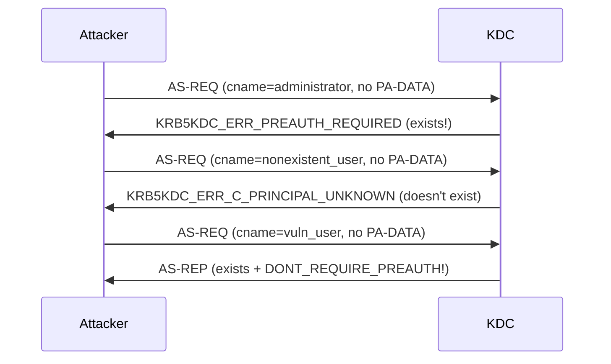

# User Enumeration via Kerberos

Kerberos user enumeration exploits the different error codes the KDC returns for valid and invalid principal names. An attacker with nothing more than network access to the domain controller on port 88 can determine which usernames exist in the domain -- no credentials, no LDAP bind, no domain membership required.

## How It Works

When the KDC receives an AS-REQ, it must look up the requested client principal (`cname`) in the Active Directory database before it can process the request. The KDC's response varies depending on whether the account exists and how it is configured:

| AS-REQ Scenario | KDC Response | Error Code |
|----------------|-------------|------------|
| Principal **does not exist** | `KRB5KDC_ERR_C_PRINCIPAL_UNKNOWN` | 6 |
| Principal **exists**, pre-auth required | `KRB5KDC_ERR_PREAUTH_REQUIRED` | 25 |
| Principal **exists**, pre-auth not required | Full AS-REP (TGT returned) | N/A |
| Principal **exists**, account disabled, locked, or expired | `KDC_ERR_CLIENT_REVOKED` | 18 |

The attacker sends AS-REQs **without any pre-authentication data**. For a non-existent principal, the KDC returns error 6 immediately. For an existing principal that requires pre-authentication (the default), the KDC returns error 25 -- telling the client to come back with pre-auth data. The difference between error 6 and error 25 reveals whether the username is valid.



### Bonus: AS-REP Roasting Discovery

When the KDC returns a full AS-REP (no error), the account exists **and** has `DONT_REQUIRE_PREAUTH` set. This simultaneously discovers the username and produces a crackable hash -- effectively combining user enumeration with [AS-REP Roasting](../roasting/asrep-roasting.md) in a single request.

!!! tip "Use TCP transport for reliable results"
    Kerberos user enumeration over UDP may return `KRB_ERR_RESPONSE_TOO_BIG` for accounts without pre-authentication, because the full AS-REP exceeds the UDP datagram limit (~1470 bytes). Use TCP transport (`--transport tcp`) for reliable results.

### Speed and Stealth

Kerberos enumeration is significantly faster and quieter than alternatives:

| Method | Auth Required | Port | Typical Speed | Logs Generated |
|--------|---------------|------|---------------|----------------|
| Kerberos AS-REQ | No | 88 | Thousands/sec | 4768 per attempt |
| LDAP bind | Yes (anonymous or authed) | 389 | Hundreds/sec | Directory access logs |
| SMB session | No (null session, if allowed) | 445 | Slow | 4625 per attempt |
| RPC/SAMR | Yes | 135+ | Moderate | Object access logs |

Kerberos enumeration generates Event ID 4768 entries, but in environments with thousands of legitimate TGT requests per minute, the enumeration traffic blends in more easily than SMB logon failures.

---

## Defend

### This Cannot Be Fully Prevented

User enumeration through Kerberos error codes is fundamental protocol behavior. The KDC **must** distinguish between "principal not found" and "pre-auth required" to function correctly. There is no configuration that makes the KDC return the same error for both cases.

!!! info "This is a known limitation acknowledged in [RFC 4120 &sect;7.5.1]: the KDC error messages inherently reveal information about the principal database. The RFC recommends rate limiting as a mitigation."

### Network-Level Rate Limiting

Since the protocol cannot be changed, the primary defense is limiting the rate at which an attacker can send AS-REQs:

- **Firewall rate limiting**: restrict the number of new connections to port 88 per source IP per time window
- **Network segmentation**: ensure that only authorized network segments can reach DCs on port 88
- **IDS/IPS signatures**: detect rapid-fire AS-REQ patterns from a single source

### Monitor for Enumeration Patterns

Even if enumeration cannot be prevented, it can be detected (see the Detect section below). Early detection allows incident response before the attacker uses the validated usernames for further attacks like [password spraying](../credential-theft/password-spraying.md).

### Reduce Information Leakage

While the core enumeration cannot be prevented, you can reduce its value:

- **Use unpredictable username formats**: `first.last` is easily guessed from public information; formats like `flast` + department code or employee ID are harder to enumerate
- **Avoid publishing employee directories**: limit exposure of full name lists that can be converted to username patterns

---

## Detect

### Event ID 4768 with Failure Code 6

The most direct signal is a burst of Event ID 4768 entries with failure status `0x6` (principal unknown) from a single source IP. Legitimate clients almost never trigger this error because they know their own username.

```text
index=security EventCode=4768 Status=0x6
| bin span=5m _time
| stats count, dc(TargetUserName) as unique_names by IpAddress, _time
| where unique_names > 50
```

### Mixed Success/Failure Pattern

During enumeration, the attacker hits both valid and invalid usernames. Look for a single source producing a mix of:

- Status `0x6` (principal unknown) -- invalid usernames
- Status `0x19` (preauth required, logged as failure in some configurations) -- valid usernames
- Successful 4768 events (for no-preauth accounts) -- valid usernames

```text
index=security EventCode=4768
| bin span=5m _time
| stats dc(TargetUserName) as unique_users,
        sum(eval(if(Status="0x6",1,0))) as not_found,
        sum(eval(if(Status="0x0" OR Status="0x19",1,0))) as found
  by IpAddress, _time
| where unique_users > 30 AND not_found > 10
```

### SIEM Correlation Rule

A practical detection rule: alert when more than 50 unique usernames are attempted from a single source IP within 5 minutes, with at least some returning error code 6.

### Honeypot Usernames

If you know common username patterns that attackers generate from wordlists (e.g., `admin`, `test`, `backup`, `scanner`), create disabled accounts with these names. Any 4768 event for these accounts indicates enumeration activity. Since the accounts are disabled, the KDC returns `KDC_ERR_CLIENT_REVOKED` (error 18) rather than error 25, but the attempt is still logged.

---

## Exploit

### 1. Generate a Username Wordlist

Build a list of potential usernames based on the target organization's naming convention. Common patterns:

| Format | Example | Source |
|--------|---------|--------|
| `first.last` | `john.smith` | LinkedIn, company website |
| `flast` | `jsmith` | Common corporate format |
| `firstl` | `johns` | Less common but used |
| `first_last` | `john_smith` | Some organizations |
| Standard accounts | `administrator`, `krbtgt`, `guest` | Always present |

Tools for generating username lists from names:

```bash title="Generate first.last username list from a names file"
# Simple first.last generation from a names file
awk '{print tolower($1"."$2)}' names.txt > usernames.txt
```

### 2. Send AS-REQ for Each Username

For each username in the list, send an AS-REQ with:

- `cname` set to the target username
- `sname` set to `krbtgt/<REALM>`
- **No `PA-DATA`** (no pre-authentication data)
- The `etype` field can contain any supported types; it does not affect enumeration

The AS-REQ is small and the KDC's error response is immediate, so this can be performed at high speed.

### 3. Classify Responses

| Error Code | Classification | Next Steps |
|-----------|---------------|------------|
| 6 (`C_PRINCIPAL_UNKNOWN`) | Does not exist | Discard |
| 25 (`PREAUTH_REQUIRED`) | **Exists** (normal account) | Add to validated list |
| 18 (`CLIENT_REVOKED`) | **Exists** (disabled, locked, or expired) | Note status, may still be useful |
| No error (AS-REP) | **Exists** + no pre-auth | Add to validated list **and** extract AS-REP hash |

### 4. Use the Validated List

The validated username list feeds directly into subsequent attacks:

- **[Password Spraying](../credential-theft/password-spraying.md)**: spray common passwords against confirmed accounts
- **[AS-REP Roasting](../roasting/asrep-roasting.md)**: any accounts that returned a full AS-REP are immediately roastable
- **Targeted phishing**: knowing exact usernames improves spear-phishing success rates
- **OSINT correlation**: map validated usernames back to real employees for social engineering

---

## Tools

### kerbwolf

kerbwolf does not include a dedicated user enumeration tool. The `kw-asrep` command performs AS-REQ requests and will implicitly enumerate users (accounts that require pre-auth are "silently skipped"), but it does not report the error code distinction between "exists with pre-auth" and "does not exist."

### Dedicated Enumeration Tools

#### CredWolf (Python)

[CredWolf](https://github.com/StrongWind1/CredWolf) is a dual-protocol (Kerberos + NTLM) credential validation tool with a dedicated `userenum` subcommand. It automatically classifies KDC responses into specific account statuses (valid, disabled, expired, locked, non-existent) and flags ASREProastable accounts during enumeration.

```bash
# Enumerate from a user list
credwolf -d CORP.LOCAL userenum --kdc-ip 10.0.0.1 -U users.txt

# Single user check
credwolf -d CORP.LOCAL userenum --kdc-ip 10.0.0.1 -u administrator

# Write valid usernames to a file
credwolf -d CORP.LOCAL -o valid_users.txt userenum --kdc-ip 10.0.0.1 -U users.txt

# Use TCP transport instead of UDP (default)
credwolf -d CORP.LOCAL userenum --kdc-ip 10.0.0.1 -U users.txt --transport tcp

# Rate-limit requests to avoid IDS detection
credwolf -d CORP.LOCAL userenum --kdc-ip 10.0.0.1 -U users.txt --delay 2 --jitter 0.5
```

Key features for enumeration:

- **Automatic ASREProastable detection**: accounts with `DONT_REQUIRE_PREAUTH` are flagged as `no_preauth (ASREProastable)` during the enumeration pass -- no separate AS-REP roasting step needed
- **Full account status detection**: distinguishes between disabled, expired, locked, and non-existent accounts based on KDC error codes, rather than just "exists" vs "doesn't exist"
- **UDP and TCP transport**: UDP by default for speed, TCP with `--transport tcp` when needed
- **Rate limiting**: `--delay` (seconds between requests) and `--jitter` (random additional delay) to control request rate
- **Output to file**: `-o` writes valid usernames to a file for piping into subsequent attacks

#### kerbrute (Go)

The most widely used Kerberos enumeration tool. Fast, cross-platform, and handles the error code classification automatically.

```bash
# Enumerate users from a wordlist
kerbrute userenum -d CORP.LOCAL --dc 10.0.0.1 usernames.txt

# Output shows which users exist and which returned AS-REPs
# [+] VALID USERNAME:    administrator@CORP.LOCAL
# [+] VALID USERNAME:    jsmith@CORP.LOCAL
# [+] jsmith@CORP.LOCAL has no pre auth required. Dumping hash...
```

#### nmap krb5-enum-users

The `krb5-enum-users` NSE script performs Kerberos enumeration during an nmap scan:

```bash
nmap -p 88 --script krb5-enum-users --script-args krb5-enum-users.realm='CORP.LOCAL',userdb=users.txt 10.0.0.1
```

#### Rubeus brute

Rubeus can enumerate users as part of its brute-force mode by observing KDC error codes:

```powershell
.\Rubeus.exe brute /users:users.txt /domain:CORP.LOCAL /dc:10.0.0.1 /noticket
```

### Tool Comparison

| Tool | Platform | Protocols | Speed | ASREProastable Detection | Account Status Detection | AES Support | Output Format |
|------|----------|-----------|-------|--------------------------|--------------------------|-------------|---------------|
| CredWolf | Cross-platform (Python) | Kerberos + NTLM | Fast | Yes (automatic) | Yes (disabled/expired/locked/non-existent) | Yes | Text, file (`-o`) |
| kerbrute | Cross-platform (Go) | Kerberos | Very fast (concurrent) | Yes | Partial (exists vs not found) | No | Text, JSON |
| nmap NSE | Cross-platform | Kerberos | Moderate | No | No | No | nmap XML/text |
| Rubeus | Windows (.NET) | Kerberos | Fast | Yes (with `/hashfile`) | Partial | No | Console/file |
