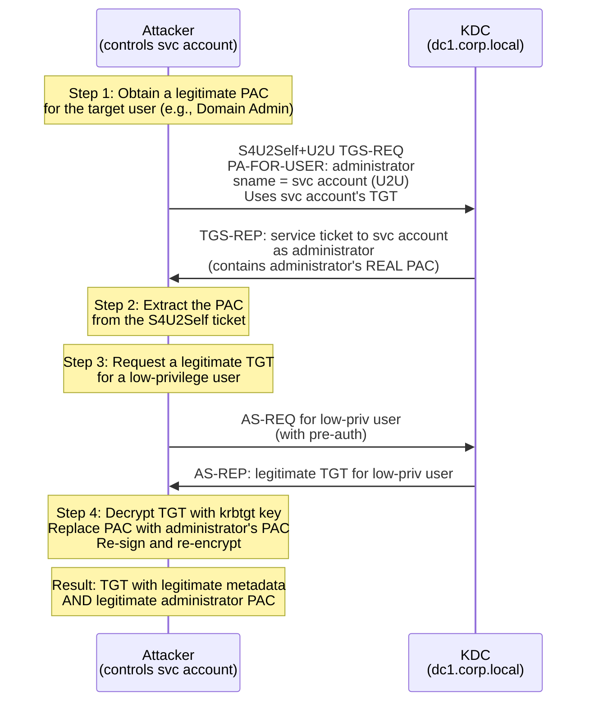

---
---

# Sapphire Ticket

The stealthiest forged ticket: combining S4U2Self, U2U, and PAC transplant.

A Sapphire Ticket takes the [Diamond Ticket](diamond-ticket.md) concept one step further.
Instead of modifying a legitimate ticket's PAC to add fabricated group memberships, the Sapphire
Ticket replaces the entire PAC with a **legitimate PAC** obtained from the real KDC via
[S4U2Self+U2U](../../protocol/s4u.md#s4u2self-u2u-user-to-user). Because the PAC was generated
by Active Directory, it contains real SIDs, real group memberships, and real account metadata --
making it the hardest forged ticket variant to detect.

---

## How It Works

### The Detection Problem with Diamond Tickets

A [Diamond Ticket](diamond-ticket.md) modifies a legitimate TGT's PAC to inject privileged
group SIDs (e.g., Domain Admins). While the ticket metadata is legitimate, the **PAC contents
are fabricated**: the user is not actually a member of the groups claimed in the PAC. Advanced
detection tools (such as Microsoft Defender for Identity) can cross-reference PAC group SIDs
against Active Directory and flag discrepancies.

A Sapphire Ticket eliminates this discrepancy entirely.

### Attack Flow

The attacker needs:

- The **`krbtgt` key** (NT hash or AES key) -- same as Golden/Diamond Tickets
- Control of a **computer account or user service account** (any account with an SPN)



**Step by step:**

1. **Obtain a legitimate PAC via S4U2Self+U2U** -- The attacker uses their controlled service
   account to perform an S4U2Self request on behalf of a high-privilege user (e.g.,
   `administrator`). The U2U (User-to-User) variant is used so the resulting ticket is encrypted
   with the service's TGT session key (which the attacker knows) rather than the service's
   long-term key. The KDC looks up `administrator` in Active Directory, builds a real PAC with
   the administrator's actual group memberships, and returns the ticket.

2. **Extract the PAC** -- The attacker decrypts the S4U2Self+U2U ticket (using the TGT session
   key) and extracts the PAC. This PAC contains:
    - The administrator's real SID
    - Real group memberships (Domain Admins, Enterprise Admins, etc.)
    - Real `LogonDomainId`, `LogonTime`, and other fields
    - All values generated by the actual KDC from the actual AD database

3. **Request a legitimate TGT** -- The attacker authenticates as a low-privilege user through
   a standard [AS Exchange](../../protocol/as-exchange.md). This produces a TGT with legitimate
   metadata (valid `authtime`, correct lifetime, proper flags, Event 4768 logged).

4. **Decrypt, transplant PAC, re-encrypt** -- Using the `krbtgt` key, the attacker:
    - Decrypts the TGT's `EncTicketPart`
    - Replaces the PAC with the administrator's PAC from step 2
    - Recomputes both PAC signatures (`PAC_SERVER_CHECKSUM` and `PAC_PRIVSVR_CHECKSUM`) with
      the `krbtgt` key
    - Re-encrypts the `EncTicketPart`

5. **Use the Sapphire Ticket** -- The resulting TGT has:
    - Legitimate ticket metadata (from the real AS Exchange)
    - Legitimate PAC contents (from the real S4U2Self+U2U response)
    - Valid `krbtgt` encryption and PAC signatures

### Why It Evades Detection

| Detection Method | Golden | Diamond | Sapphire |
|---|---|---|---|
| Missing Event 4768 | Detectable | Clean | Clean |
| Anomalous ticket lifetime | Detectable | Clean | Clean |
| Unusual ticket flags | Detectable | Clean | Clean |
| PAC group SIDs vs. AD membership | Detectable | **Detectable** | **Clean** |
| PAC KDC signature validation | Clean (valid sig) | Clean (valid sig) | Clean (valid sig) |

The critical improvement over Diamond Tickets is the fourth row: cross-referencing PAC claims
against Active Directory will not flag a Sapphire Ticket because the PAC **was generated by
Active Directory**. The groups in the PAC match the user's actual group memberships.

!!! danger "Same prerequisites, maximum stealth"
    A Sapphire Ticket requires the `krbtgt` key (full domain compromise) plus a controlled
    SPN-bearing account. The purpose is not initial access -- it is the stealthiest possible
    persistence mechanism, evading even PAC content validation that catches Diamond Tickets.

---

## Defend

### KRBTGT Password Rotation

Same as Golden and Diamond Tickets -- rotate the `krbtgt` password **twice** with a full
replication cycle between changes. Without the `krbtgt` key, the attacker cannot decrypt or
re-encrypt TGTs.

### Restrict DCSync Privileges

Prevent the `krbtgt` hash from being compromised in the first place. Audit
`Replicating Directory Changes All` permissions and restrict them to Domain Controllers and
required accounts.

### Tiered Administration

Prevent `krbtgt` key compromise by ensuring Tier 0 credentials are never exposed on lower-tier
systems.

### PAC_REQUESTOR SID Validation (CVE-2021-42287 Patch)

Microsoft's patch for CVE-2021-42287 (KB5008380) introduced the `PAC_REQUESTOR` structure in
TGT PACs. This structure records the SID of the account that originally requested the TGT. When
the patched KDC processes a TGS-REQ, it verifies that the `PAC_REQUESTOR` SID matches a valid
account.

If the attacker transplants an administrator's PAC into a low-privilege user's TGT, the
`PAC_REQUESTOR` SID (from the original TGT) may not match the PAC's claimed identity. In fully
patched environments with enforcement enabled, this can cause `KDC_ERR_TGT_REVOKED` errors.

!!! info "Tooling has adapted"
    Offensive tools like impacket and Rubeus have been updated to handle the `PAC_REQUESTOR` and
    `PAC_ATTRIBUTES_INFO` structures. The attacker can set the `PAC_REQUESTOR` SID to match the
    transplanted PAC's user SID, bypassing this check if they have the `krbtgt` key (which they
    need anyway for the attack).

### Monitor S4U2Self Activity

The S4U2Self+U2U step (obtaining the legitimate PAC) generates KDC logs. Monitor for S4U2Self
requests that target high-privilege accounts from SPN-bearing accounts that have no legitimate
delegation need.

---

## Detect

Sapphire Tickets are the hardest forged tickets to detect. The ticket metadata is legitimate,
the PAC contents match Active Directory, and all signatures are valid.

### S4U2Self+U2U Activity

The PAC acquisition step (S4U2Self+U2U) is the most visible part of the attack. Look for:

- S4U2Self requests targeting high-privilege accounts (Domain Admins, Enterprise Admins)
  from SPN-bearing accounts that are not configured for delegation
- Event 4769 with `Transited Services` populated, indicating S4U activity, from unexpected
  SPN-bearing accounts

```text
index=security EventCode=4769
| where isnotnull(TransitedServices) AND TransitedServices!=""
| stats count by ServiceName, TargetUserName, IpAddress
```

### Behavioral Analytics

Since the ticket itself is nearly undetectable, focus on behavioral indicators:

- A user suddenly accessing resources far beyond their normal pattern
- Administrative actions performed by accounts that have never performed them before
- Lateral movement patterns inconsistent with the account's role

### Advanced Correlation

| Signal | Description |
|---|---|
| S4U2Self for privileged users | SPN-bearing accounts requesting tickets on behalf of Domain Admins without delegation configured |
| Account behavior change | Low-privilege account performing high-privilege operations |
| Cross-session anomalies | TGT session activity that does not match the original authentication source |
| Defender for Identity | Microsoft's tool may detect PAC-related anomalies even with legitimate PAC contents |

!!! warning "Detection is extremely difficult"
    In most environments, a Sapphire Ticket will not be detected through standard SIEM rules or
    event log monitoring. Detection requires advanced behavioral analytics, S4U2Self monitoring,
    or endpoint detection during the `krbtgt` key extraction phase.

---

## Exploit

### Prerequisites

1. **KRBTGT hash** (NT hash or AES key)
2. **Domain name** and **Domain SID**
3. **Controlled user service account or computer account** (any account with an SPN that the attacker
   can authenticate as)
4. **Target high-privilege user** to impersonate (e.g., `administrator`)

### Step-by-Step

1. **Obtain the KRBTGT key**:

    ```
    mimikatz # lsadump::dcsync /user:krbtgt
    ```

2. **Create a Sapphire Ticket with impacket**:

    ```bash title="Create Sapphire Ticket: S4U2Self+U2U PAC acquisition and TGT forging with PAC transplant"
    ticketer.py -request -impersonate administrator \
      -domain CORP.LOCAL -user controlleduser -password 'Password1!' \
      -nthash <krbtgt_nthash> -aesKey <krbtgt_aes_key> \
      -user-id 1115 -domain-sid S-1-5-21-... \
      baduser
    ```

    The `-request` flag tells ticketer to perform the S4U2Self+U2U request to obtain the
    real PAC for `administrator`. The `-impersonate` flag specifies the high-privilege user
    whose PAC to obtain. The positional argument (`baduser`) is the username in the resulting
    ticket (it will be overwritten by the transplanted PAC's data).

3. **Use the Sapphire Ticket**:

    ```bash title="Use the Sapphire Ticket ccache to execute commands as administrator"
    export KRB5CCNAME=baduser.ccache
    psexec.py -k -no-pass CORP.LOCAL/administrator@dc01.corp.local
    ```

---

## Tools

!!! info "kerbwolf does not implement Sapphire Tickets"
    Sapphire Ticket creation requires the `krbtgt` key, PAC manipulation, and S4U2Self+U2U.
    kerbwolf focuses on the Kerberos authentication exchanges, not ticket forging.

| Tool | Command | Notes |
|---|---|---|
| impacket `ticketer.py` | `ticketer.py -request -impersonate administrator -domain CORP.LOCAL -nthash <hash> -aesKey <key> -domain-sid S-1-5-21-... baduser` | Full flow: S4U2Self+U2U PAC acquisition, TGT forging with PAC transplant |
| Rubeus | `Rubeus.exe diamond /krbkey:<key> /ticketuser:administrator /groups:512 /ptt` | Rubeus diamond with S4U PAC retrieval (requires specific build with sapphire support) |
