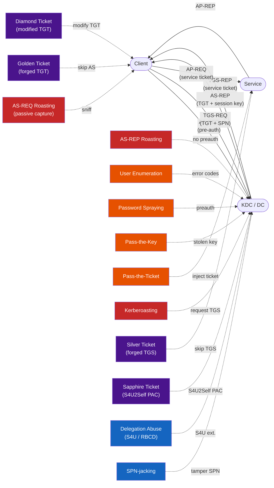

# Kerberos Attacks

This section covers the most common attacks against Kerberos authentication in Active Directory. Each page assumes familiarity with the [Protocol](../protocol/index.md) section (particularly the [AS](../protocol/as-exchange.md), [TGS](../protocol/tgs-exchange.md), and [AP](../protocol/ap-exchange.md) exchanges) and the [Security](../security/index.md) section (encryption types, key derivation, and hardening options).

!!! warning "Scope: key-based (symmetric) authentication only"
    Every attack in this section targets the password-derived secret keys (DES, RC4, AES) used in
    standard Kerberos exchanges -- the symmetric pre-authentication flow, the encrypted ticket
    fields, and the key material derived from passwords and hashes.  For background on the three
    authentication methods Kerberos supports, see
    [Authentication Methods](../protocol/index.md#authentication-methods).

    Certificate-based attacks (PKINIT abuse, shadow credentials, UnPAC the Hash,
    pass-the-certificate, AD CS ESC1--ESC13) are out of scope and will be covered in a separate
    guide.

---

## Attack Taxonomy

Attacks in this section are organized into four categories based on what the attacker does with the Kerberos protocol.

### Roasting (Offline Credential Cracking)

These attacks extract encrypted material from Kerberos messages and crack it offline to recover passwords or key material. No interaction with the target service is required after the initial request.

| Attack | Target Exchange | Description |
|--------|-----------------|-------------|
| [Kerberoasting](roasting/kerberoasting.md) | TGS-REP | Crack user service account passwords from service ticket `enc-part` |
| [AS-REP Roasting](roasting/asrep-roasting.md) | AS-REP | Crack passwords of accounts that skip pre-authentication |
| [AS-REQ Roasting](roasting/asreq-roasting.md) | AS-REQ (passive) | Crack passwords from captured pre-authentication timestamps |

### Credential Theft & Reconnaissance

These attacks use Kerberos as an oracle to discover information, test credentials, or replay stolen key material -- without cracking anything offline.

| Attack | Technique | Auth Required |
|--------|-----------|---------------|
| [Pass-the-Ticket](credential-theft/pass-the-ticket.md) | Inject stolen TGT/TGS into session | Stolen ticket (ccache/kirbi) |
| [Pass-the-Key](credential-theft/pass-the-key.md) | AS-REQ with stolen key material | Stolen hash or AES key |
| [Password Spraying](credential-theft/password-spraying.md) | AS-REQ with pre-auth | None (network access only) |
| [User Enumeration](credential-theft/user-enumeration.md) | AS-REQ error code analysis | None (network access only) |

### Ticket Forgery

With knowledge of the right key material, an attacker can forge Kerberos tickets without involving the KDC -- or modify legitimate tickets to escalate privileges.

| Attack | Forged Artifact | Key Required |
|--------|----------------|--------------|
| [Golden Ticket](forgery/golden-ticket.md) | TGT | `krbtgt` NTLM hash or AES key |
| [Silver Ticket](forgery/silver-ticket.md) | Service ticket (TGS) | Target account NTLM hash or AES key |
| [Diamond Ticket](forgery/diamond-ticket.md) | Modified legitimate TGT | `krbtgt` key (modifies PAC in real TGT) |
| [Sapphire Ticket](forgery/sapphire-ticket.md) | TGT with PAC from S4U2Self | `krbtgt` key + S4U2Self to build PAC |

### Delegation Abuse

Kerberos delegation allows services to act on behalf of users. Misconfigured delegation enables privilege escalation and lateral movement.

| Attack | Delegation Type | Prerequisite |
|--------|----------------|--------------|
| [Delegation Attacks](delegation/delegation-attacks.md) | Unconstrained / Constrained / RBCD | Access to delegating account or write access to `msDS-AllowedToActOnBehalfOfOtherIdentity` |
| [S4U2Self Abuse](delegation/s4u2self-abuse.md) | S4U2Self | Compromise of account with SPN |
| [SPN-jacking](delegation/spn-jacking.md) | SPN manipulation | Write access to `servicePrincipalName` on target account |

---

## Prerequisites

Before working through this section, you should understand:

- **AS Exchange**: how pre-authentication works, what the KDC returns in AS-REP, and which fields are encrypted with which keys ([AS Exchange](../protocol/as-exchange.md))
- **TGS Exchange**: how service tickets are requested and which key encrypts the ticket's `enc-part` ([TGS Exchange](../protocol/tgs-exchange.md))
- **Encryption types**: the difference between RC4-HMAC (etype 23), AES128 (etype 17), and AES256 (etype 18), and why RC4 is dramatically weaker ([Encryption Types](../protocol/encryption.md))
- **Key derivation**: how passwords become Kerberos keys, including the salt used for AES vs. the saltless MD4 hash used for RC4 ([Algorithms & Keys](../security/algorithms.md))
- **msDS-SupportedEncryptionTypes**: how this attribute controls which encryption the KDC selects for service tickets ([msDS-SupportedEncryptionTypes](../security/msds-supported.md))
- **Delegation**: how unconstrained, constrained, and resource-based constrained delegation work at the protocol level ([Delegation](../protocol/delegation.md))

---

## Page Structure

Every attack page follows the same five-part format:

1. **How It Works** -- protocol-level explanation of the vulnerability and why the attack is possible
2. **Defend** -- configuration changes that eliminate or mitigate the attack surface
3. **Detect** -- event log IDs, SIEM queries, and honeypot strategies
4. **Exploit** -- step-by-step theory of the attack procedure
5. **Tools** -- how [kerbwolf](https://github.com/StrongWind1/KerbWolf) and [impacket](https://github.com/fortra/impacket) implement the attack, with command-line examples. See [Tools Setup](tools.md) for installation.

---

## Attack Overview

| Attack | Exchange | Auth Required | kerbwolf Tool | Hashcat Mode |
|--------|----------|---------------|---------------|--------------|
| [Kerberoasting](roasting/kerberoasting.md) | TGS-REP | Domain user (or no-preauth account) | `kw-roast` | 13100 (RC4), 19600 (AES128), 19700 (AES256) |
| [AS-REP Roasting](roasting/asrep-roasting.md) | AS-REP | None | `kw-asrep` | 18200 (RC4), 32100 (AES128), 32200 (AES256) |
| [AS-REQ Roasting](roasting/asreq-roasting.md) | AS-REQ | Network position | `kw-extract` | 7500 (RC4), 19800 (AES128), 19900 (AES256) |
| [Pass-the-Ticket](credential-theft/pass-the-ticket.md) | AP-REQ | Stolen ticket | `kw-tgt` | N/A |
| [Pass-the-Key](credential-theft/pass-the-key.md) | AS-REQ | Stolen key | `kw-tgt` | N/A |
| [Password Spraying](credential-theft/password-spraying.md) | AS-REQ | None | `kw-tgt` | N/A |
| [User Enumeration](credential-theft/user-enumeration.md) | AS-REQ | None | N/A | N/A |
| [Golden Ticket](forgery/golden-ticket.md) | Forged TGT | `krbtgt` hash | N/A | N/A |
| [Silver Ticket](forgery/silver-ticket.md) | Forged TGS | Service hash | N/A | N/A |
| [Diamond Ticket](forgery/diamond-ticket.md) | Modified TGT | `krbtgt` hash | N/A | N/A |
| [Sapphire Ticket](forgery/sapphire-ticket.md) | Modified TGT | `krbtgt` hash | N/A | N/A |
| [Delegation Attacks](delegation/delegation-attacks.md) | TGS-REQ (S4U) | Delegating account | N/A | N/A |
| [S4U2Self Abuse](delegation/s4u2self-abuse.md) | TGS-REQ (S4U2Self) | Account with SPN | N/A | N/A |
| [SPN-jacking](delegation/spn-jacking.md) | TGS-REQ | Write access to SPN | N/A | N/A |

---

## Attacks Mapped to Protocol Exchanges

The following diagram shows where each attack intercepts or abuses the Kerberos protocol flow. Roasting attacks (red) target encrypted data in protocol messages for offline cracking. Forgery attacks (purple) bypass the KDC or service entirely. Reconnaissance and credential theft attacks (orange) use error codes, pre-auth responses, or stolen material. Delegation attacks (blue) abuse the S4U extensions in TGS-REQ.

!!! info "Color Legend"
    **Red** -- Roasting attacks that extract encrypted material for offline cracking.
    **Orange** -- Credential theft and reconnaissance attacks that use error codes, pre-auth, or stolen material.
    **Purple** -- Ticket forgery attacks that bypass the KDC or service.
    **Blue** -- Delegation abuse attacks that exploit S4U extensions and SPN manipulation.
