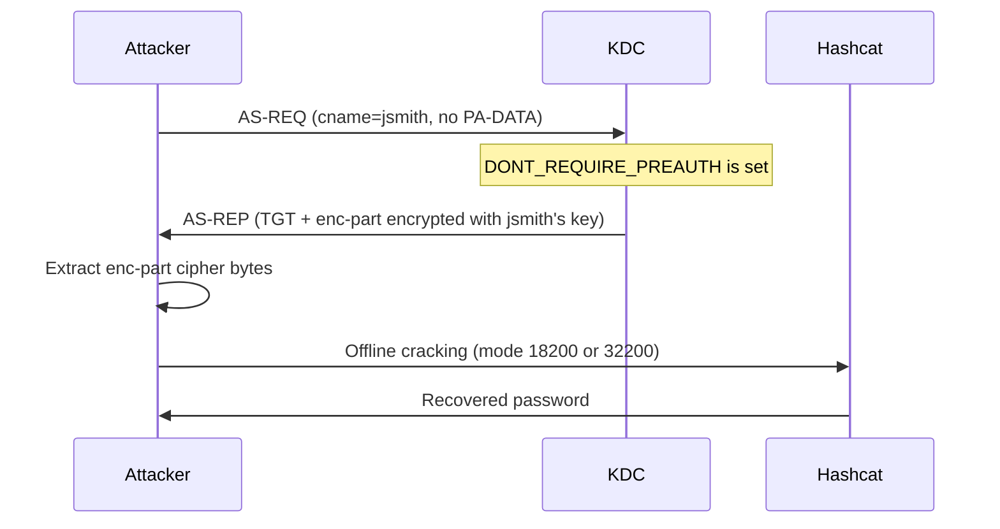

# AS-REP Roasting

AS-REP Roasting targets Active Directory accounts that have Kerberos pre-authentication disabled. The attacker can request a TGT for these accounts without providing any credentials, and the KDC's response contains encrypted material that can be cracked offline to recover the account's password.

## How It Works

In a standard [AS Exchange](../../protocol/as-exchange.md), the client must prove knowledge of its password by encrypting a timestamp with its long-term key (the `PA-ENC-TIMESTAMP` pre-authentication data). The KDC decrypts this timestamp to verify the client's identity before issuing a TGT.

However, when an account has the `DONT_REQUIRE_PREAUTH` flag set (UserAccountControl bit `0x400000`), the KDC skips this verification. It accepts a bare AS-REQ -- one with no pre-authentication data -- and returns a full AS-REP containing:

- A **TGT** encrypted with the krbtgt key (not useful for cracking)
- An **enc-part** outside the ticket, encrypted with the target user's long-term key

This outer `enc-part` contains the TGS session key and other data, encrypted with a key derived from the user's password. The attacker extracts this encrypted blob and cracks it offline.



### Key Differences from Kerberoasting

| Property | Kerberoasting | AS-REP Roasting |
|----------|---------------|-----------------|
| **Exchange** | TGS-REP | AS-REP |
| **Auth required** | Domain user | None |
| **Encrypted with** | Target account key | Target user key |
| **Target** | Accounts with SPNs | Accounts with `DONT_REQUIRE_PREAUTH` |
| **Prerequisite** | TGT (or no-preauth account) | Just the username |

### Encryption Type Downgrade

When sending the AS-REQ, the attacker controls the `etype` field and can request RC4-HMAC (etype 23) as the only supported type. The KDC encrypts the AS-REP `enc-part` using the strongest etype from the **client's list** that the account has a key for -- and since AD always generates RC4 keys on password change, an RC4 key almost always exists.  Unlike TGS-REP (where `msDS-SupportedEncryptionTypes` controls the ticket etype), **the AS-REP `enc-part` etype is driven by the client's request and the account's available keys, not by `msDS-SupportedEncryptionTypes`.**  Setting `msDS-SupportedEncryptionTypes = 0x18` on the account does not prevent RC4 AS-REP roasting.

This is true even for accounts in the Protected Users group -- Protected Users enforces AES only for pre-authentication, but since there is no pre-authentication step for these accounts, the protection does not apply to the AS-REP `enc-part`. The November 2022 update (CVE-2022-37966) changed session key negotiation behavior but did not add Protected Users enforcement for no-preauth AS-REPs; DCs patched with that update and later still allow RC4 AS-REP encryption for `DONT_REQUIRE_PREAUTH` accounts regardless of Protected Users membership.

### LDAP Discovery

Accounts vulnerable to AS-REP Roasting can be found with this LDAP filter:

```text
(&(UserAccountControl:1.2.840.113556.1.4.803:=4194304)(!(UserAccountControl:1.2.840.113556.1.4.803:=2))(!(objectCategory=computer)))
```

This finds all enabled user accounts (excluding computers) with the `DONT_REQUIRE_PREAUTH` bit set. LDAP discovery requires existing domain credentials; without them, the attacker must guess or obtain usernames through other means (see [User Enumeration](../credential-theft/user-enumeration.md)).

---

## Defend

### Audit for DONT_REQUIRE_PREAUTH Accounts

Regularly search for accounts that have pre-authentication disabled:

```powershell title="Find all accounts with DONT_REQUIRE_PREAUTH set"
Get-ADUser -Filter 'DoesNotRequirePreAuth -eq $true' -Properties DoesNotRequirePreAuth |
  Select-Object Name, DistinguishedName, Enabled
```

### Remove DONT_REQUIRE_PREAUTH from All Accounts

There is almost never a legitimate reason for this flag in a modern environment. The original use case was compatibility with legacy clients that could not perform pre-authentication. Remove it from every account:

```powershell title="Remove DONT_REQUIRE_PREAUTH from all accounts"
Get-ADUser -Filter 'DoesNotRequirePreAuth -eq $true' |
  Set-ADAccountControl -DoesNotRequirePreAuth $false
```

!!! danger "Some legacy applications or service configurations may break if pre-authentication is re-enabled. Test in a staging environment first, but the security risk of leaving this flag set almost always outweighs compatibility concerns."

### Strong Passwords on Any Remaining Accounts

If an account absolutely must have pre-authentication disabled (extremely rare), enforce a password of at least 25 random characters. This makes offline cracking infeasible regardless of encryption type.

### Monitor for the Flag Being Set

Detect when someone sets the `DONT_REQUIRE_PREAUTH` flag via Event ID 4738 (A user account was changed). Alert on changes to the `UserAccountControl` property where bit `0x400000` is added.

```text
index=security EventCode=4738
| where match(UserAccountControl, "DONT_REQUIRE_PREAUTH")
```

### Why `msDS-SupportedEncryptionTypes` Does Not Help

!!! warning "`msDS-SupportedEncryptionTypes` does NOT prevent RC4 AS-REP roasting"
    Unlike TGS-REP (where the KDC enforces the target account's `msDS-SupportedEncryptionTypes`
    for ticket encryption), AS-REP encryption follows the **client's requested etype** intersected
    with the account's **available keys**.  Since AD generates RC4 keys on every password change,
    an RC4 key almost always exists.  An attacker requesting RC4 will receive an RC4-encrypted
    AS-REP regardless of the account's `msDS-SupportedEncryptionTypes` value.

    The only effective mitigations are: (1) remove `DONT_REQUIRE_PREAUTH`, or (2) use a 25+
    character random password that resists offline cracking at any etype speed.

---

## Detect

### Event ID 4768 with No Pre-Authentication

The primary detection signal is Event ID 4768 (TGT requested) where `Pre-Authentication Type = 0` (no pre-auth). In a healthy environment, this value should almost never appear.

```text
index=security EventCode=4768 PreAuthType=0
| stats count by TargetUserName, IpAddress
```

### Volume-Based Detection

A burst of AS-REQs without pre-authentication from a single source IP, targeting multiple accounts, is a strong indicator of AS-REP Roasting. Legitimate no-preauth accounts (if they exist) authenticate from known, predictable sources.

### Honeypot Account

Create a dedicated account with `DONT_REQUIRE_PREAUTH` set and a long, complex password. This account should never legitimately authenticate. Any 4768 event for this account is a guaranteed indicator of AS-REP Roasting activity.

!!! tip "Give the honeypot a realistic name like `svc_legacy_app` and add a description referencing a decommissioned system. Place it in an OU that LDAP enumeration tools will naturally scan."

### Watch for UAC Changes

Monitor Event ID 4738 for changes that add the `DONT_REQUIRE_PREAUTH` bit. An attacker with write access to user objects may set this flag on a high-value target, perform AS-REP Roasting, then remove the flag.

---

## Exploit

### 1. Enumerate Vulnerable Accounts

**With domain credentials (LDAP):**

Query LDAP with the filter above to find all accounts with `DONT_REQUIRE_PREAUTH` set.

**Without credentials (blind):**

Send AS-REQs for a list of potential usernames. The KDC's response reveals account status:

- **KDC_ERR_C_PRINCIPAL_UNKNOWN** (error 6): username does not exist
- **KDC_ERR_PREAUTH_REQUIRED** (error 25): account exists but requires pre-auth (not vulnerable)
- **Full AS-REP returned**: account exists and does not require pre-auth (vulnerable)

This blind approach doubles as [user enumeration](../credential-theft/user-enumeration.md).

### 2. Send AS-REQ Without Pre-Authentication

For each vulnerable account, construct an AS-REQ with:

- `cname` set to the target username
- `sname` set to `krbtgt/<REALM>`
- No `PA-DATA` (no pre-authentication)
- `etype` list containing only RC4 (etype 23) to maximize cracking speed

### 3. Extract Encrypted Material

Parse the AS-REP and extract the outer `enc-part` -- the portion encrypted with the user's key. This is distinct from the TGT itself (which is encrypted with the krbtgt key and not crackable).

### 4. Format and Crack

| Encryption Type | Hashcat Mode | Hash Format |
|-----------------|-------------|-------------|
| RC4-HMAC (etype 23) | 18200 | `$krb5asrep$23$user@realm:<first16hex>$<remaininghex>` |
| AES128 (etype 17) | 32100 | `$krb5asrep$17$user$realm$<checksum>$<edata>` |
| AES256 (etype 18) | 32200 | `$krb5asrep$18$user$realm$<checksum>$<edata>` |

```bash title="Crack AS-REP hashes with wordlist and rules"
# Crack RC4 AS-REP hashes
hashcat -m 18200 hashes.txt wordlist.txt -r rules/best64.rule

# Crack AES256 AS-REP hashes (much slower)
hashcat -m 32200 hashes.txt wordlist.txt -r rules/best64.rule
```

---

## Tools

### kerbwolf: kw-asrep

`kw-asrep` automates AS-REP Roasting with support for manual targets, username lists, and LDAP-based discovery.

#### Single Target (No Credentials Needed)

```bash
kw-asrep -d CORP.LOCAL --dc-ip 10.0.0.1 -t jsmith -o hashes.txt
```

Sends an AS-REQ for `jsmith` without pre-authentication. If the account has `DONT_REQUIRE_PREAUTH`, the hash is extracted and written to the output file. If pre-auth is required, the account is silently skipped.

#### LDAP Discovery (Requires Credentials)

```bash
kw-asrep -d CORP.LOCAL --dc-ip 10.0.0.1 -u admin -p pass --ldap
```

Authenticates to LDAP, queries for all accounts with `DONT_REQUIRE_PREAUTH` set, and roasts each one. Domain credentials are only needed for the LDAP query -- the actual AS-REQ attack requires no credentials.

#### Username List with RC4 Request

```bash
kw-asrep -d CORP.LOCAL --dc-ip 10.0.0.1 -T users.txt -e rc4
```

Reads usernames from `users.txt`, sends AS-REQs requesting RC4 encryption, and outputs hashes for any accounts that respond without requiring pre-auth.

#### Kerberos Authentication for LDAP

```bash
kw-asrep -k -c admin.ccache --ldap
```

Uses a TGT from a ccache file for LDAP authentication. Domain is auto-detected from the ccache.

### Other Tools

| Tool | Platform | Notes |
|------|----------|-------|
| Impacket `GetNPUsers.py` | Linux | The original AS-REP Roasting tool |
| Rubeus `asreproast` | Windows | .NET, can request specific etypes |
| kerbrute `--downgrade` | Cross-platform | Go-based, fast for large username lists |
