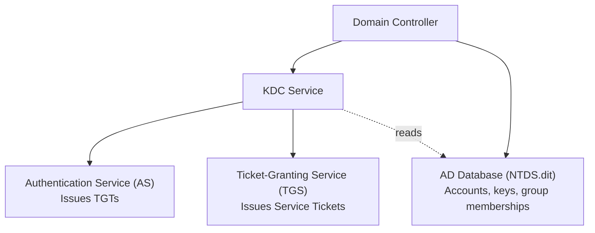

# Active Directory Components

Before diving into the Kerberos protocol itself, you need to understand the Active Directory infrastructure it runs on. Kerberos in Windows does not exist in isolation -- it is deeply integrated into Active Directory Domain Services (AD DS). This page covers the AD building blocks that matter for Kerberos authentication.

---

## Domains

A **domain** is a logical grouping of objects -- users, computers, groups, and other resources -- that share a common directory database and security policies.

Every domain has two names:

DNS domain name
:   The fully qualified name used in network communication. Example: `corp.local` or `engineering.contoso.com`. Each label is limited to 63 characters; the full FQDN can be up to 255 characters.

NetBIOS domain name
:   The short, pre-Windows 2000 name used for backward compatibility. Example: `CORP` or `ENGINEERING`. Maximum length is 15 characters. You see this in the `DOMAIN\username` login format.

!!! info "Domains and Kerberos Realms"
    In Active Directory, a domain maps directly to a **Kerberos realm**. The realm name is the DNS domain name in uppercase: domain `corp.local` becomes realm `CORP.LOCAL`. This is covered in detail on the [Principals and Realms](principals.md) page.

---

## Trees

A **tree** is a hierarchy of domains that share a contiguous DNS namespace. The first domain created in a tree is the **tree root domain**. Child domains are created beneath it and inherit the parent's namespace.

For example:

```
contoso.com              (tree root domain)
├── engineering.contoso.com   (child domain)
└── sales.contoso.com         (child domain)
```

Each domain in the tree has its own AD database and its own set of Domain Controllers. Parent-child domains are connected by an **automatic, bidirectional, transitive trust** -- meaning `engineering.contoso.com` trusts `sales.contoso.com` through the parent `contoso.com`, without any manual configuration.

---

## Forests

A **forest** is the top-level container in Active Directory. It is a collection of one or more trees that share:

- A common **AD schema** (the definition of what object types and attributes can exist)
- A common **configuration partition** (site topology, replication settings)
- A **Global Catalog** (cross-domain object index)

The first domain created in a forest is the **forest root domain**. It holds the `Enterprise Admins` and `Schema Admins` groups.

```
contoso.com              (forest root domain / tree root)
├── engineering.contoso.com
└── sales.contoso.com

fabrikam.com             (second tree root)
└── dev.fabrikam.com
```

In this example, `contoso.com` and `fabrikam.com` are two separate trees within the same forest. They have different DNS namespaces but share the same schema and Global Catalog.

!!! warning "Forest = Trust Boundary"
    The forest, not the domain, is the ultimate security boundary in Active Directory. Administrators in the forest root domain have the ability to take control of any domain in the forest. When you see "cross-realm authentication" in Kerberos, it is often crossing domain boundaries within a single forest -- which works automatically because of transitive trusts.

---

## Domain Controllers

A **Domain Controller (DC)** is a server running AD DS. It stores a writable copy of the domain's directory database and handles authentication requests. In production environments, each domain has at least two DCs for redundancy.

Key responsibilities of a Domain Controller:

- Store and replicate the AD database (users, groups, computer accounts, passwords, GPOs)
- Authenticate users and computers via Kerberos (and NTLM as fallback)
- Host the **KDC service** for Kerberos authentication
- Enforce Group Policy
- Provide LDAP directory services on ports 389 (LDAP) and 636 (LDAPS)

---

## Key Distribution Center (KDC)

The **KDC** is the Kerberos authentication engine. In Active Directory, the KDC is not a separate server -- it is **integrated into every Domain Controller**. The KDC service (`Kdcsvc.dll`) starts automatically when a DC boots and runs as part of the Local Security Authority Subsystem (LSASS).

The KDC contains two logical services:

Authentication Service (AS)
:   Handles the initial login. The client proves its identity (typically with a password-derived key), and the AS issues a **Ticket-Granting Ticket (TGT)**. Per [RFC 4120 &sect;3.1], this is the AS exchange.

Ticket-Granting Service (TGS)
:   Accepts a valid TGT and issues **service tickets** for specific target services. Per [RFC 4120 &sect;3.3], this is the TGS exchange.

The KDC reads account information -- passwords, group memberships, account flags -- directly from the AD database. This is why Active Directory is a prerequisite for Kerberos in Windows: without AD, there is no account database for the KDC to query.



!!! tip "Every DC is a KDC"
    Because the KDC runs on every Domain Controller, there is no single point of failure for authentication -- as long as the client can reach at least one DC in its domain.

---

## Trust Relationships

Trusts allow users in one domain to authenticate to resources in another domain. The KDC in the user's domain issues a **referral ticket** that the KDC in the target domain accepts, based on a shared inter-realm key.

| Trust Type | Created | Direction | Transitive | Description |
|-----------|---------|-----------|------------|-------------|
| **Parent-child** | Automatic | Bidirectional | Yes | Created when a child domain is added to a tree. |
| **Tree-root** | Automatic | Bidirectional | Yes | Created when a new tree is added to an existing forest. Links the new tree root to the forest root. |
| **Shortcut** | Manual | One-way or bidirectional | Yes | Shortens the authentication path between two domains in the same forest that are far apart in the hierarchy. |
| **Forest** | Manual | One-way or bidirectional | Yes | Links the root domains of two separate forests. Enables cross-forest authentication. |
| **External** | Manual | One-way or bidirectional | No | A non-transitive trust to a domain outside the forest, often to a legacy NT4 domain. |

In a multi-domain forest, Kerberos referrals follow the trust path. If `alice@ENGINEERING.CONTOSO.COM` requests a service ticket for a resource in `SALES.CONTOSO.COM`, the referral travels from her domain to the parent `CONTOSO.COM` and then down to `SALES.CONTOSO.COM`. A shortcut trust between the two child domains would eliminate the hop through the parent.

---

## DNS Integration

Kerberos in Active Directory depends heavily on DNS. Clients locate Domain Controllers and KDCs by querying **SRV records** registered by the Netlogon service on each DC at startup.

Key SRV records for Kerberos:

| SRV Record | Purpose |
|-----------|---------|
| `_kerberos._tcp.dc._msdcs.<DnsDomainName>` | Locate a Microsoft Kerberos KDC in the domain |
| `_kerberos._tcp.<SiteName>._sites.dc._msdcs.<DnsDomainName>` | Locate a KDC in a specific AD site (prefers local DCs) |
| `_ldap._tcp.dc._msdcs.<DnsDomainName>` | Locate a Microsoft LDAP-capable DC |
| `_kpasswd._tcp.<DnsDomainName>` | Locate the Kerberos password change service |

For example, in the domain `corp.local`, a Windows client locates a KDC by querying:

```
_kerberos._tcp.dc._msdcs.corp.local
```

The DNS server returns a list of DCs. The client sends an LDAP ping to each, and the first DC to respond -- preferably one in the same AD site -- is used for authentication.

!!! warning "DNS failures break Kerberos"
    If DNS is unavailable or misconfigured, clients cannot locate a KDC, and Kerberos authentication fails entirely. The system falls back to NTLM (if permitted) or the user cannot log in. A healthy DNS infrastructure is a hard prerequisite for Kerberos.

---

## Global Catalog

The **Global Catalog (GC)** is a distributed index that contains a partial, read-only copy of every object in every domain in the forest. It stores a subset of each object's attributes -- enough to locate the object and determine which domain holds the full record.

| Port | Protocol | Description |
|------|----------|-------------|
| 3268 | LDAP | Global Catalog queries (unencrypted) |
| 3269 | LDAPS | Global Catalog queries (TLS encrypted) |

The Global Catalog is important for Kerberos in several scenarios:

- **UPN login resolution**: When a user logs in with a User Principal Name (e.g., `alice@corp.local`) and the UPN suffix does not match the local domain, the DC queries the Global Catalog to find which domain the account belongs to and issues a referral.
- **Universal group membership**: The PAC in a Kerberos ticket includes the user's group SIDs. Universal group memberships are resolved through the Global Catalog because these groups can span multiple domains.
- **Cross-domain SPN lookup**: If a Service Principal Name (SPN) is not found in the local domain, the KDC may consult the Global Catalog.

At least one DC in every domain must be designated as a Global Catalog server. In most deployments, every DC holds the Global Catalog role.
