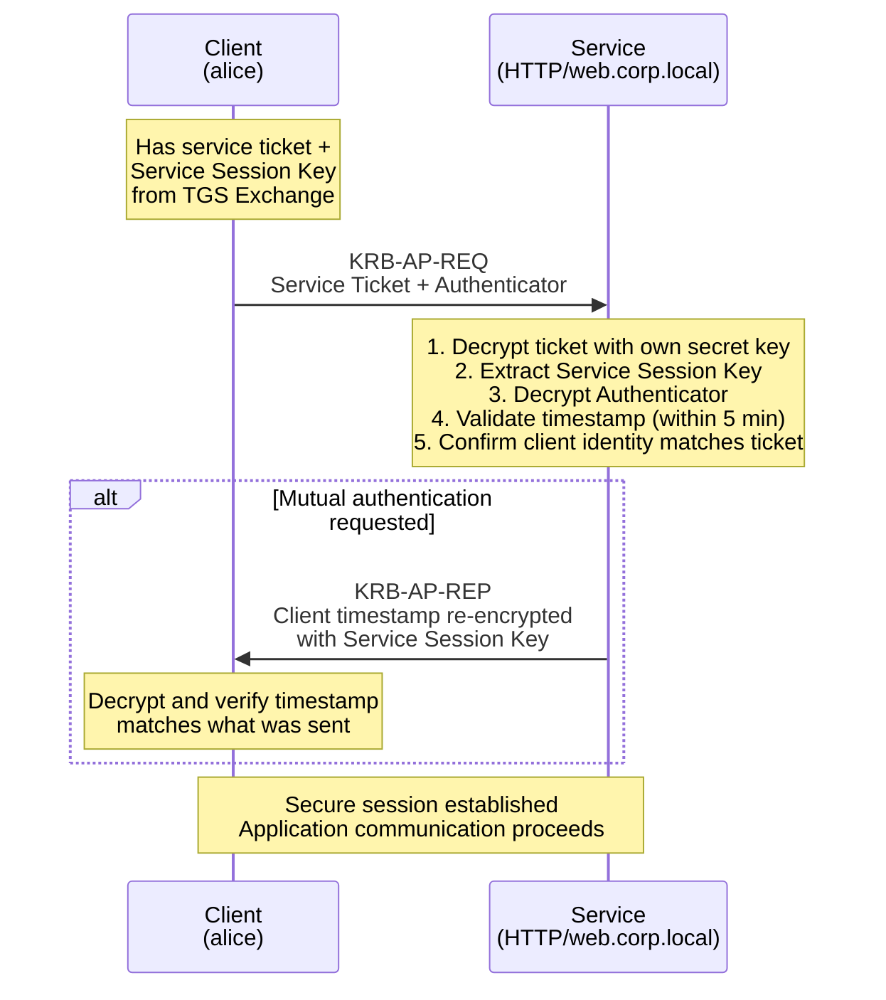
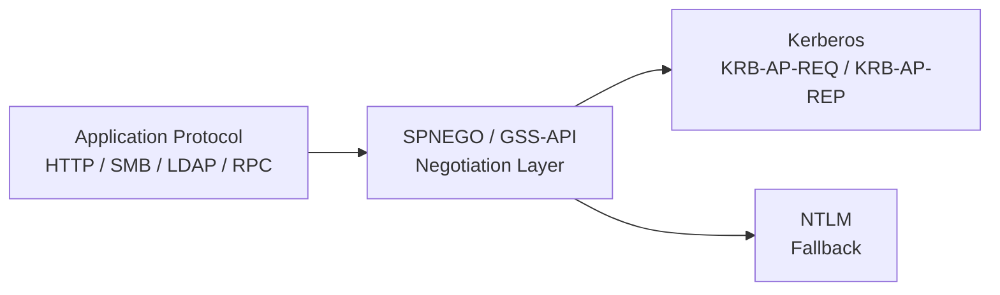

# AP Exchange

How clients authenticate to services using service tickets.

After the client obtains a service ticket through the [TGS Exchange](tgs-exchange.md), it can
authenticate directly to the target service. This is the **AP Exchange** (Application Protocol
Exchange) -- the final step in the Kerberos authentication flow.

The critical thing to understand: **no domain controller is involved**. The service validates the
ticket entirely on its own, using only its own secret key.

---

## How It Works

The AP Exchange has two messages:

1. **KRB-AP-REQ** (message type 14) -- client to service
2. **KRB-AP-REP** (message type 15) -- service to client (only if mutual authentication is requested)

Per [RFC 4120 &sect;3.2], the client/server exchange is designed to allow the service to authenticate
the client without contacting the KDC.

### Step-by-Step Flow

### Step 1 -- Client Sends KRB-AP-REQ

The client constructs a `KRB-AP-REQ` message containing two parts:

Service Ticket
:   The encrypted ticket received from the TGS in the [TGS Exchange](tgs-exchange.md). The client
    cannot read or modify this -- it is encrypted with the service's secret key. The client passes
    it along unchanged.

Authenticator
:   A freshly created structure encrypted with the **Service Session Key** (which the client
    received in the TGS-REP). The Authenticator contains:

    - Client name and realm (`cname`, `crealm`)
    - Current timestamp (`ctime`, `cusec`)
    - Optional checksum of application data
    - Optional sub-session key (for establishing a new key for the application session)

The Authenticator proves the client actually possesses the Service Session Key. Without it, a
stolen ticket could be replayed by anyone.

### Step 2 -- Service Decrypts the Ticket

The service receives the `KRB-AP-REQ` and:

1. **Decrypts the Service Ticket** using its own secret key (long-term key). This reveals the
   `EncTicketPart`, which contains the Service Session Key, client identity, ticket flags,
   timestamps, and authorization data (including the [PAC](tickets.md#pac)).
2. **Extracts the Service Session Key** from the decrypted ticket.

### Step 3 -- Service Validates the Authenticator

Using the extracted Service Session Key, the service:

1. **Decrypts the Authenticator** from the `KRB-AP-REQ`.
2. **Validates the timestamp** -- it must be within the acceptable clock skew window (default:
   **5 minutes**). Per [RFC 4120 &sect;3.2.3], the acceptable clock skew is typically
   5 minutes.
3. **Checks for replay** -- the service keeps a cache of recently seen `(client name, timestamp,
   microsecond)` tuples. If this exact combination was already seen, the request is rejected.
4. **Confirms the client identity** in the Authenticator matches the `cname` and `crealm` in the
   decrypted ticket.

If all checks pass, the client is authenticated.

### Step 4 -- Mutual Authentication (Optional)

If the client set the `mutual-required` flag in the AP-REQ options, the service must prove its
own identity by sending a `KRB-AP-REP` message. This message contains:

- The client's timestamp from the Authenticator, encrypted with the Service Session Key

The client decrypts this and verifies the timestamp matches what it originally sent. If it does,
the client knows the service was able to decrypt the ticket (and therefore possesses the correct
secret key).

!!! warning "Why mutual authentication matters"
    Without mutual authentication, the client has no proof that the service is genuine. An attacker
    could stand up a rogue service that simply accepts any ticket. The client would send data to
    the attacker believing it was the real service.

    In Active Directory environments, mutual authentication is enabled by default for most
    protocols.

### Step 5 -- Session Established

After a successful AP Exchange, the client and service share the Service Session Key (or a
sub-session key if one was negotiated in the Authenticator). Application-level communication
proceeds using this key for message integrity and optional encryption.

---

## No Domain Controller Needed

This is the most important architectural point of the AP Exchange:

!!! info "The service validates the ticket locally"
    The service never contacts the KDC during the AP Exchange. It decrypts the ticket with its own
    key, extracts the session key, and validates the Authenticator. This is what makes Kerberos
    scalable -- the KDC is only involved during ticket issuance, not during every service access.

This means a service can authenticate clients even when the domain controller is temporarily
unreachable, as long as the client already has a valid service ticket cached.

It also means the service trusts whatever is inside the ticket. If the ticket says the user is
`alice@CORP.LOCAL` and is a member of `Domain Admins`, the service accepts that at face value.
The [PAC](tickets.md#pac) signatures provide integrity protection, but by default, services only
validate the server signature -- not the KDC signature.

---

## Application Wrapping

Kerberos AP Exchange messages do not travel on the network by themselves. They are always wrapped
inside an application protocol. The wrapping layer is typically **SPNEGO** (Simple and Protected
GSSAPI Negotiation Mechanism) or **GSS-API** (Generic Security Service API).

Per [MS-KILE &sect;1.4], AP Exchange messages are carried within other application protocols and
never exist independently on the network.

### How SPNEGO Works

SPNEGO sits between the application protocol and Kerberos. It negotiates which authentication
mechanism to use (Kerberos or NTLM) and then wraps the chosen mechanism's tokens.

### Protocol-Specific Examples

| Application Protocol | How Kerberos Tokens Are Carried |
|---|---|
| **HTTP** | `Authorization: Negotiate <base64-token>` header. The token is a SPNEGO wrapper around the KRB-AP-REQ. The server responds with `WWW-Authenticate: Negotiate <base64-token>` containing the KRB-AP-REP. |
| **SMB** | Session Setup request carries the SPNEGO token in the Security Buffer field. Used for file shares, printers, and named pipes. |
| **LDAP** | SASL GSSAPI bind. The client sends the SPNEGO token in a SASL bind request. Used for Active Directory queries. |
| **RPC** | The authentication token is carried in the RPC bind or alter-context PDU. Used for remote management, DCOM, and WMI. |
| **MS-SQL** | SSPI authentication during the login sequence. The TDS protocol carries the SPNEGO token. |

!!! tip "The Negotiate header"
    When you see `Authorization: Negotiate` in HTTP traffic, it does not always mean Kerberos.
    SPNEGO negotiates between Kerberos and NTLM. If Kerberos fails (for example, the client cannot
    reach the KDC or the SPN is not found), SPNEGO falls back to NTLM silently.

    To confirm Kerberos is being used, decode the base64 token. A Kerberos token starts with OID
    `1.2.840.113554.1.2.2`. An NTLM token starts with `NTLMSSP`.

!!! warning "SSPI / GSS-API interoperability"
    When building cross-platform Kerberos deployments that mix Windows SSPI clients with
    GSSAPI-based services (or vice versa), the message protection APIs do **not** map cleanly:

    - `EncryptMessage` / `DecryptMessage` (SSPI) corresponds to `GSS_Wrap` / `GSS_Unwrap`
      (GSSAPI) for both integrity and confidentiality. Use `KERB_WRAP_NO_ENCRYPT` in
      `EncryptMessage` for signature-only mode, which interoperates with `GSS_Unwrap` when
      `conf_flag = 0`.
    - `MakeSignature` / `VerifySignature` (SSPI) is **not compatible** with `GSS_Wrap` when
      `conf_flag = 0`, even though both nominally perform "signature only." Do not mix them.
    - If the protocol spec calls for `gss_get_mic` / `gss_verify_mic`, the correct SSPI
      counterparts are `MakeSignature` / `VerifySignature`. But if the spec calls for
      `GSS_Wrap` / `GSS_Unwrap`, always use `EncryptMessage` / `DecryptMessage` on the SSPI
      side -- never `MakeSignature` / `VerifySignature`.

---

## AP Exchange Message Structure

### KRB-AP-REQ Fields

| Field | Description |
|---|---|
| `pvno` | Protocol version (always `5`) |
| `msg-type` | Message type (`14` for AP-REQ) |
| `ap-options` | Bit flags: `mutual-required` (bit 2), `use-session-key` (bit 1, for user-to-user auth) |
| `ticket` | The service ticket from the TGS Exchange |
| `authenticator` | Encrypted with the Service Session Key (key usage 11) |

### KRB-AP-REP Fields

| Field | Description |
|---|---|
| `pvno` | Protocol version (always `5`) |
| `msg-type` | Message type (`15` for AP-REP) |
| `enc-part` | Contains the client's timestamp (`ctime`, `cusec`), optional sub-session key, and optional sequence number. Encrypted with the Service Session Key (key usage 12). |

---

## Practical Example

Here is a concrete walkthrough of `alice@CORP.LOCAL` accessing a web application at
`https://portal.corp.local`:

1. Alice's browser connects to `portal.corp.local` and receives an HTTP 401 response with the
   header `WWW-Authenticate: Negotiate`.
2. The browser asks the Windows credential manager for a Kerberos ticket for
   `HTTP/portal.corp.local`.
3. If no cached ticket exists, the client performs a [TGS Exchange](tgs-exchange.md) to get one.
4. The browser wraps the service ticket and a fresh Authenticator into a SPNEGO token, base64
   encodes it, and sends it in the `Authorization: Negotiate <token>` header.
5. The web server decrypts the service ticket with its secret key (from its keytab file or machine
   account), validates the Authenticator, and reads the [PAC](tickets.md#pac) to determine Alice's
   group memberships.
6. If mutual authentication was requested, the server sends a `WWW-Authenticate: Negotiate
   <token>` response containing the KRB-AP-REP.
7. The browser validates the server's response. Authentication is complete.

!!! info "Keytab files"
    On Linux/Unix services (Apache, Nginx, Samba), the service's secret key is stored in a
    **keytab file** rather than being derived from the computer account password in Active Directory.
    The keytab is generated during service registration (typically with `ktpass` or `msktutil`)
    and must be kept secure -- anyone with the keytab can decrypt service tickets.

---

## What Can Go Wrong

| Error | Meaning |
|---|---|
| `KRB_AP_ERR_TKT_EXPIRED` | The service ticket has expired. The client needs to request a new one from the TGS. |
| `KRB_AP_ERR_TKT_NYV` | Ticket not yet valid (future start time). Clock skew issue. |
| `KRB_AP_ERR_REPEAT` | The Authenticator was already used (replay detected). |
| `KRB_AP_ERR_SKEW` | Timestamp in the Authenticator is outside the 5-minute window. Synchronize clocks with NTP. |
| `KRB_AP_ERR_BADMATCH` | Client name in the Authenticator does not match the client name in the ticket. |
| `KRB_AP_ERR_MODIFIED` | The service could not decrypt the ticket. Usually means the service's key has changed since the ticket was issued (password rotation, keytab mismatch). |

---

## Summary

The AP Exchange is where authentication actually happens between the client and the service.
The [AS Exchange](as-exchange.md) and [TGS Exchange](tgs-exchange.md) are about getting tickets;
the AP Exchange is about using them.

Key takeaways:

- The service ticket proves the client's identity to the service
- The Authenticator proves the client actually possesses the session key (not just a stolen ticket)
- Mutual authentication proves the service is genuine to the client
- No domain controller is contacted -- the service validates everything locally
- AP Exchange messages are always wrapped in application protocols via SPNEGO/GSS-API
