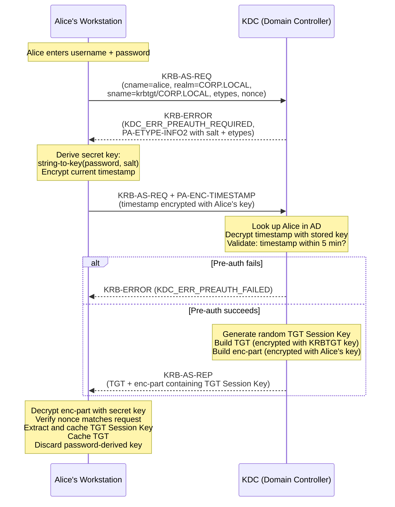

# AS Exchange (Authentication Service)

The AS exchange is the first step in Kerberos authentication. It is how a client proves its identity to the KDC and obtains a **Ticket-Granting Ticket (TGT)** -- the credential that unlocks access to everything else. This exchange typically happens once per login session.

Per [RFC 4120 &sect;3.1]: "The Authentication Service (AS) Exchange between the client and the Kerberos Authentication Server is initiated by a client when it wishes to obtain authentication credentials for a given server but currently holds no credentials."

---

## Purpose

The AS exchange accomplishes two things:

1. **The client proves it knows the password** (or more precisely, the secret key derived from the password) without sending it over the network.
2. **The KDC issues a TGT and a TGT Session Key** that the client will use for all subsequent TGS requests.

After this exchange, the password-derived key is no longer needed until the TGT expires. This is the foundation of Single Sign-On: type your password once, then use the TGT for hours.

---

## Step-by-Step: AS Exchange with Pre-Authentication

In Active Directory, pre-authentication is **required by default** for all accounts. This prevents an attacker from requesting a TGT for any username and attempting to crack the response offline. The following walkthrough uses Alice (`alice@CORP.LOCAL`) as the client.

### Step 1: Initial AS-REQ (no pre-auth data)

When Alice types her password and hits Enter, the workstation sends a `KRB-AS-REQ` message to the KDC on port 88. This initial request contains:

| Field | Value | Description |
|-------|-------|-------------|
| `cname` | `alice` | Client principal name (sAMAccountName) |
| `realm` | `CORP.LOCAL` | The Kerberos realm |
| `sname` | `krbtgt/CORP.LOCAL` | The service being requested -- always the TGS for the AS exchange |
| `etype` | `[18, 17, 23, ...]` | List of encryption types the client supports, in preference order |
| `nonce` | (random) | A random number to match the request with the response |

No password or key material is included at this point. The request is essentially: "I am Alice, and I would like a TGT."

### Step 2: KRB-ERROR (pre-authentication required)

The KDC finds Alice's account in Active Directory and sees that pre-authentication is required (the default). Since the request did not include pre-authentication data, the KDC responds with an error:

| Field | Value | Description |
|-------|-------|-------------|
| `error-code` | `KDC_ERR_PREAUTH_REQUIRED` (25) | Pre-authentication is needed |
| `e-data` | PA-ETYPE-INFO2 | Tells the client which encryption types the KDC accepts and provides the **salt** for key derivation |

The salt is critical. For AES encryption types in Active Directory, the salt is typically `CORP.LOCALalice` (realm + sAMAccountName). The client needs this salt to correctly derive the secret key from the password. Per [RFC 4120 &sect;3.1.3], the KDC sends PA-ETYPE-INFO2 to provide the salt and encryption type parameters.

!!! info "Why the salt matters"
    The salt ensures that two users with the same password end up with different secret keys. Without a salt, identical passwords would produce identical keys, making dictionary attacks easier. For the RC4-HMAC encryption type, no salt is used -- the key is simply `MD4(password)` -- which is one reason RC4 is considered weaker. See the [Encryption Types](encryption.md) page for details.

### Step 3: Client derives secret key and encrypts timestamp

The workstation now has the information it needs. It:

1. Takes Alice's plaintext password
2. Combines it with the salt received from the KDC
3. Runs the **string-to-key** function (per [RFC 3961]) for the selected encryption type to produce the **secret key**
4. Encrypts the current timestamp using this key, producing the `PA-ENC-TIMESTAMP` pre-authentication data

### Step 4: Second AS-REQ (with pre-authentication)

The client sends a new `KRB-AS-REQ`, identical to the first but with the pre-authentication data added:

| Field | Value | Description |
|-------|-------|-------------|
| `padata` | `PA-ENC-TIMESTAMP` | Current timestamp encrypted with Alice's secret key |
| `cname` | `alice` | Same as before |
| `realm` | `CORP.LOCAL` | Same as before |
| `sname` | `krbtgt/CORP.LOCAL` | Same as before |
| `etype` | `[18, 17, 23, ...]` | Same as before |
| `nonce` | (random) | A new random nonce |

### Step 5: KDC validates pre-authentication

The KDC retrieves Alice's stored secret key from the AD database and attempts to decrypt the `PA-ENC-TIMESTAMP`. Two checks must pass:

1. **Decryption succeeds**: This proves Alice knows the correct password (since only the correct key can produce a valid decryption).
2. **Timestamp is within the clock skew window**: The decrypted timestamp must be within 5 minutes of the KDC's clock. This prevents replay of old pre-authentication data.

If decryption fails, the KDC returns `KDC_ERR_PREAUTH_FAILED`. If the timestamp is outside the skew window, the KDC returns `KRB_AP_ERR_SKEW`.

### Step 6: KDC generates the TGT Session Key

If pre-authentication passes, the KDC generates a random **TGT Session Key**. This is a short-lived symmetric key that the client and KDC will share for all subsequent TGS exchanges. Per [RFC 4120 &sect;3.1.3], this key should be generated from a cryptographically strong random number source.

### Step 7: KDC builds the TGT

The KDC constructs the **Ticket-Granting Ticket (TGT)**, which contains:

| TGT Field | Value | Description |
|-----------|-------|-------------|
| `tkt-vno` | `5` | Ticket format version |
| `realm` | `CORP.LOCAL` | The issuing realm |
| `sname` | `krbtgt/CORP.LOCAL` | The TGS principal |
| `enc-part` | (encrypted blob) | All fields below, encrypted with the **KRBTGT key** |
| &nbsp;&nbsp;`flags` | `forwardable`, `renewable`, `initial`, `pre-authent` | Ticket flags |
| &nbsp;&nbsp;`key` | TGT Session Key | The session key for client-KDC communication |
| &nbsp;&nbsp;`crealm` | `CORP.LOCAL` | Client's realm |
| &nbsp;&nbsp;`cname` | `alice` | Client's principal name |
| &nbsp;&nbsp;`authtime` | `2026-04-03T08:00:00Z` | Time of initial authentication |
| &nbsp;&nbsp;`starttime` | `2026-04-03T08:00:00Z` | When the ticket becomes valid |
| &nbsp;&nbsp;`endtime` | `2026-04-03T18:00:00Z` | When the ticket expires (default 10 hours) |
| &nbsp;&nbsp;`renew-till` | `2026-04-10T08:00:00Z` | Maximum renewal time (default 7 days) |
| &nbsp;&nbsp;`authorization-data` | PAC | Microsoft extension: contains SIDs, group memberships, user info |

The entire encrypted part of the TGT is encrypted with the **KRBTGT key** -- the secret key of the `krbtgt` account. Only the KDC knows this key, so no client, service, or attacker can decrypt or modify the TGT.

!!! warning "The KRBTGT key protects every TGT"
    If an attacker compromises the KRBTGT key (by dumping it from a Domain Controller), they can forge TGTs for any user -- a **Golden Ticket** attack. The krbtgt account password should be rotated periodically and protected as the most sensitive secret in the domain.

### Step 8: KDC sends KRB-AS-REP

The KDC sends the `KRB-AS-REP` message back to the client. It has two main parts:

| Part | Encrypted With | Contains |
|------|---------------|----------|
| **Ticket** (the TGT) | KRBTGT key | Client name, session key, timestamps, PAC, flags. The client **cannot** decrypt this. |
| **Encrypted part** (enc-part) | Alice's secret key | TGT Session Key, nonce (must match the request), timestamps, ticket flags. The client **can** decrypt this. |

The separation is deliberate:

- The **TGT** is a sealed envelope addressed to the KDC. The client carries it around but cannot open it.
- The **encrypted part** is addressed to the client. It contains the TGT Session Key the client needs for subsequent TGS requests.

### Step 9: Client processes the response

The workstation decrypts the encrypted part using Alice's secret key and extracts:

- The **TGT Session Key** (stored in memory for future use)
- The **nonce** (verified against the nonce in the original request to prevent replay)
- **Timestamps** (validated for sanity)

The client also verifies that the nonce in the response matches the nonce it sent. Per [RFC 4120 &sect;3.1.5], this is essential to ensure the response is not a replay of an old AS-REP.

The TGT itself is stored in the **ticket cache** (volatile memory). The workstation can now discard the password-derived secret key from memory -- it will not be needed again until the TGT expires or the user needs to re-authenticate.

---

## What the Client Can and Cannot See

This distinction is fundamental to Kerberos security:

| Data | Can the client see it? | Why |
|------|----------------------|-----|
| TGT Session Key | Yes | Encrypted with the client's own key in the AS-REP encrypted part |
| TGT contents (client name, flags, PAC, etc.) | No | Encrypted with the KRBTGT key, which only the KDC knows |
| Nonce and timestamps | Yes | Part of the AS-REP encrypted part |
| PAC (SIDs, group memberships) | No | Inside the TGT, which the client cannot decrypt |

The client is essentially carrying a sealed letter (the TGT) that it cannot read. When it needs a service ticket, it hands this sealed letter to the KDC along with proof that it is the rightful owner (via an Authenticator encrypted with the TGT Session Key).

---

## TGT Lifetime and Renewal

| Parameter | Default Value | Configurable Via |
|-----------|--------------|-----------------|
| TGT lifetime | **10 hours** | Group Policy: `Maximum lifetime for user ticket` |
| Maximum renewal period | **7 days** | Group Policy: `Maximum lifetime for user ticket renewal` |

When a TGT approaches expiration, the client can **renew** it by sending a TGS request with the `RENEW` option set, presenting the existing TGT. The KDC issues a new TGT with a fresh expiration time, as long as the current time is within the `renew-till` window. Renewal does not require the user to re-enter their password.

After the renewal window expires (7 days by default), the user must re-authenticate with their password through a new AS exchange.

---

## Sequence Diagram

---

## Key Takeaways

- The password is used **only on the workstation** to derive a secret key. It never leaves the machine.
- The KDC validates the client by decrypting a timestamp -- not by receiving the password.
- The TGT is encrypted with the KRBTGT key, making it **opaque to the client** and tamper-proof.
- After obtaining the TGT, the client no longer needs the password-derived key. This is what enables Single Sign-On.
- The TGT has a finite lifetime (default 10 hours). Once it expires, the user must re-authenticate or renew.

Next: the [TGS Exchange](tgs-exchange.md), where the client uses the TGT to obtain service tickets.
