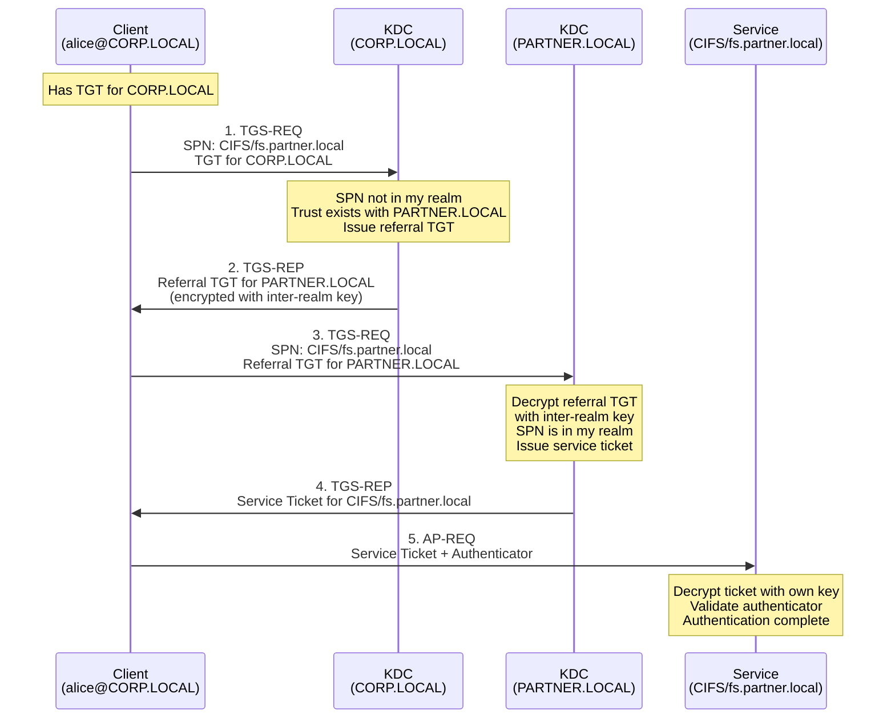
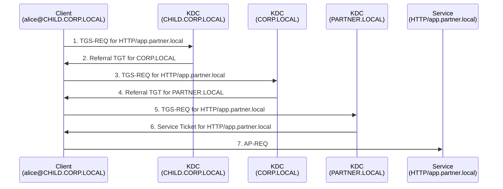

---
---

# Cross-Realm Authentication

How Kerberos works across domain and forest boundaries.

When a user in one domain needs to access a service in a different domain, the local KDC cannot
issue a service ticket for a foreign service -- it does not know the foreign service's secret key.
Kerberos solves this through **referrals**: the local KDC gives the client a special TGT for the
foreign realm's KDC, and the client uses that to request a service ticket from the foreign realm.

---

## When Cross-Realm Authentication Is Needed

A single Kerberos realm (Active Directory domain) has one KDC that knows all the secret keys for
accounts in that domain. The KDC can only issue service tickets for services registered in its own
domain, because it needs the service's secret key to encrypt the ticket.

Cross-realm authentication is required whenever:

- A user in `CORP.LOCAL` accesses a file share on a server in `PARTNER.LOCAL`
- A user in `CHILD.CORP.LOCAL` accesses a web application registered in `CORP.LOCAL`
- Any Kerberos client needs a service ticket for an SPN in a different realm

---

## How Referrals Work

Per [RFC 4120 &sect;1.2], when a KDC receives a TGS-REQ for a service in a foreign realm, it
returns a **referral TGT** -- a TGT for the foreign realm's KDC, encrypted with the **inter-realm
key** (the shared secret between the two domains' trust accounts).

### Basic Two-Domain Flow



### Step by Step

**Step 1** -- The client has a TGT for `CORP.LOCAL` and needs a service ticket for
`CIFS/fs.partner.local`. It sends a TGS-REQ to the `CORP.LOCAL` KDC with the foreign SPN.

**Step 2** -- The `CORP.LOCAL` KDC looks up the SPN and finds it is not in its domain. It checks
its trust relationships and finds a trust with `PARTNER.LOCAL`. The KDC issues a **referral TGT**:
a TGT with `sname = krbtgt/PARTNER.LOCAL@CORP.LOCAL`, encrypted with the **inter-realm key**
shared between the two domains.

**Step 3** -- The client presents the referral TGT to the `PARTNER.LOCAL` KDC in a new TGS-REQ.

**Step 4** -- The `PARTNER.LOCAL` KDC decrypts the referral TGT with its copy of the inter-realm
key, validates the request, and issues a service ticket for `CIFS/fs.partner.local` (encrypted
with the service's secret key).

**Step 5** -- The client performs the normal [AP Exchange](ap-exchange.md) with the service.

!!! info "The client drives the process"
    The client follows the referral chain automatically. When it receives a TGS-REP with a
    referral TGT instead of a service ticket, it knows to contact the referred realm's KDC next.
    The `NAME_CANONICALIZE` KDC option flag (bit 15) signals to the KDC that the client is
    prepared to follow referrals.

---

## Inter-Realm Keys

The trust between two Active Directory domains is backed by a shared secret -- the **inter-realm
key**. In Active Directory, this key is derived from the trust account password.

When you create a trust between `CORP.LOCAL` and `PARTNER.LOCAL`:

- `CORP.LOCAL` creates a trust account object for `PARTNER.LOCAL` (the `PARTNER$` trusted domain
  object)
- `PARTNER.LOCAL` creates a corresponding trust account object for `CORP.LOCAL`
- Both sides share a password, which is used to derive the inter-realm encryption key

The referral TGT is encrypted with this inter-realm key. Only the foreign realm's KDC can decrypt
it, because only the two domains know the trust password.

---

## Trust Path Traversal

When there is no direct trust between the client's domain and the service's domain, Kerberos
follows the **transitive trust chain** through intermediate realms.

### Example: Three-Hop Referral

Consider this forest structure:

```
                    CORP.LOCAL          (forest root)
                   /          \
      CHILD.CORP.LOCAL     PARTNER.LOCAL  (forest trust)
```

A user in `CHILD.CORP.LOCAL` wants to access a service in `PARTNER.LOCAL`. There is no direct
trust between `CHILD.CORP.LOCAL` and `PARTNER.LOCAL`, but the trust is transitive through
`CORP.LOCAL`.



Each hop in the chain requires a separate TGS exchange. The client follows the referrals
automatically:

1. `CHILD.CORP.LOCAL` KDC does not know `PARTNER.LOCAL` directly, but knows its parent
   `CORP.LOCAL`. It issues a referral TGT for `CORP.LOCAL`.
2. `CORP.LOCAL` KDC has a trust with `PARTNER.LOCAL`. It issues a referral TGT for
   `PARTNER.LOCAL`.
3. `PARTNER.LOCAL` KDC issues the final service ticket.

!!! tip "Shortcut trusts reduce hops"
    In large forests with deep domain hierarchies, referral chains can get long. A **shortcut
    trust** is a manually created trust between two domains in the same forest that bypasses the
    hierarchy. This reduces the number of referral hops and speeds up cross-realm authentication.

---

## Trust Types in Active Directory

Active Directory supports several types of trust relationships, each with different properties:

| Trust Type | Created | Direction | Transitive | Scope |
|---|---|---|---|---|
| **Parent-child** | Automatically when a child domain is created | Bidirectional | Yes | Between parent and child domains in the same tree |
| **Tree-root** | Automatically when a new tree joins the forest | Bidirectional | Yes | Between forest root and new tree root |
| **Forest** | Manually by administrators | Bidirectional or one-way | Yes | Between two separate forests (cross-forest) |
| **External** | Manually by administrators | Bidirectional or one-way | **No** | Between a specific domain and a domain in another forest |
| **Shortcut** | Manually by administrators | Bidirectional or one-way | Yes (within forest) | Between any two domains in the same forest to reduce referral hops |
| **Realm** | Manually by administrators | Bidirectional or one-way | Configurable | Between an AD domain and a non-Windows Kerberos realm (e.g., MIT Kerberos on Linux) |

### Transitive vs. Non-Transitive

Transitive trust
:   If domain A trusts domain B, and domain B trusts domain C, then domain A trusts domain C.
    All trusts within an Active Directory forest are transitive by default.

Non-transitive trust
:   Trust is limited to the two domains involved. External trusts are non-transitive -- if
    `CORP.LOCAL` has an external trust with `LEGACY.LOCAL`, and `LEGACY.LOCAL` trusts
    `OTHER.LOCAL`, `CORP.LOCAL` does **not** automatically trust `OTHER.LOCAL`.

### Trust Direction

Bidirectional
:   Users in either domain can access resources in the other. Both sides share inter-realm keys.

One-way
:   Only one direction works. In a one-way trust where `CORP.LOCAL` trusts `PARTNER.LOCAL`,
    users in `PARTNER.LOCAL` can access resources in `CORP.LOCAL`, but not the reverse.

---

## The Transited Field

Per [RFC 4120 &sect;2.7], the `transited` field in a ticket records which intermediate realms were
traversed during cross-realm authentication. Each time a KDC issues a referral TGT, the current
realm is added to the transited encoding.

The service receiving the final ticket can inspect the transited field to see the full path:

```
CHILD.CORP.LOCAL --> CORP.LOCAL --> PARTNER.LOCAL
```

### Transited Policy Checking

Per [RFC 4120 &sect;2.7], the KDC or the application server should check the transited field
against a policy to ensure all intermediate realms are trusted. If the KDC performs this check
and accepts the ticket, it sets the `TRANSITED-POLICY-CHECKED` flag (bit 12) in the ticket.

Application servers must either:

- Do their own transited-realm validation, **or**
- Reject cross-realm tickets that do not have the `TRANSITED-POLICY-CHECKED` flag set

In Active Directory environments, the KDC typically handles this check for all trusts within the
forest.

!!! warning "Untrusted realms in the path"
    If a trust path passes through a compromised intermediate realm, that realm's KDC could modify
    the PAC or issue tickets with elevated privileges. This is why trust topology matters -- only
    establish trusts with realms you actually trust. Forest trusts and external trusts limit the
    exposure by not being transitive beyond their defined scope.

---

## Cross-Realm Authentication and the PAC

When a ticket crosses realm boundaries, the PAC from the original TGT is carried forward into
each referral TGT and eventually into the final service ticket. However, additional authorization
data may be added:

- The foreign KDC may add **Extra SIDs** from the trust's SID filtering policy
- **SID filtering** (quarantine) can strip SIDs that do not belong to the trusted domain,
  preventing privilege escalation across trust boundaries
- The `KERB_VALIDATION_INFO` structure in the PAC includes an `ExtraSids` field specifically for
  SIDs from other domains

---

## Summary

- Cross-realm authentication uses referral TGTs to chain through trust relationships
- The inter-realm key (derived from the trust account password) encrypts referral TGTs
- Without a direct trust, the client follows the transitive trust path through intermediate
  realms automatically
- Active Directory supports multiple trust types: parent-child, tree-root, forest, external,
  shortcut, and realm trusts
- The transited field in tickets records which realms were traversed, enabling policy checks
- Shortcut trusts can reduce the number of referral hops in large forest hierarchies
