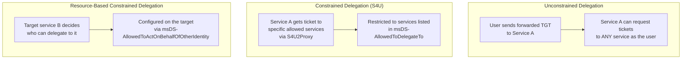
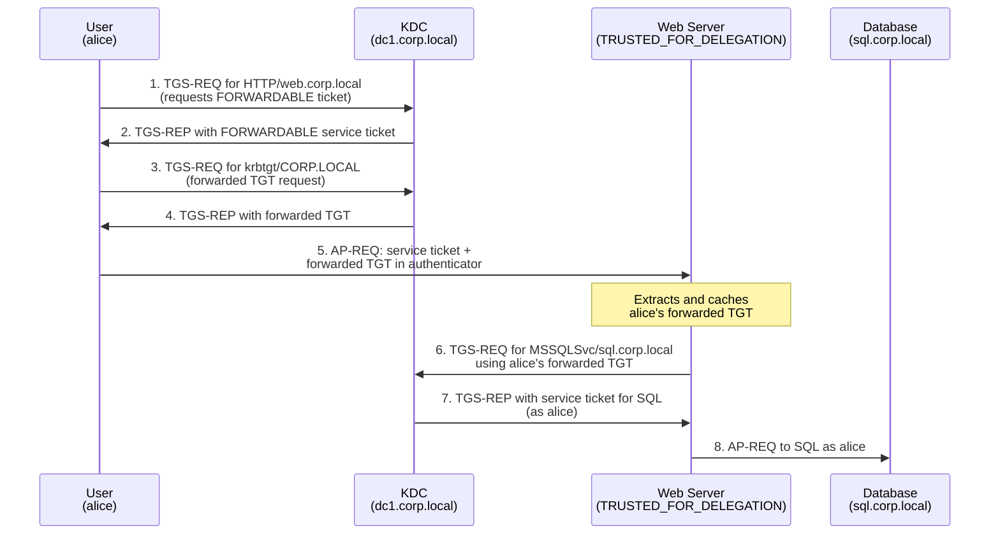
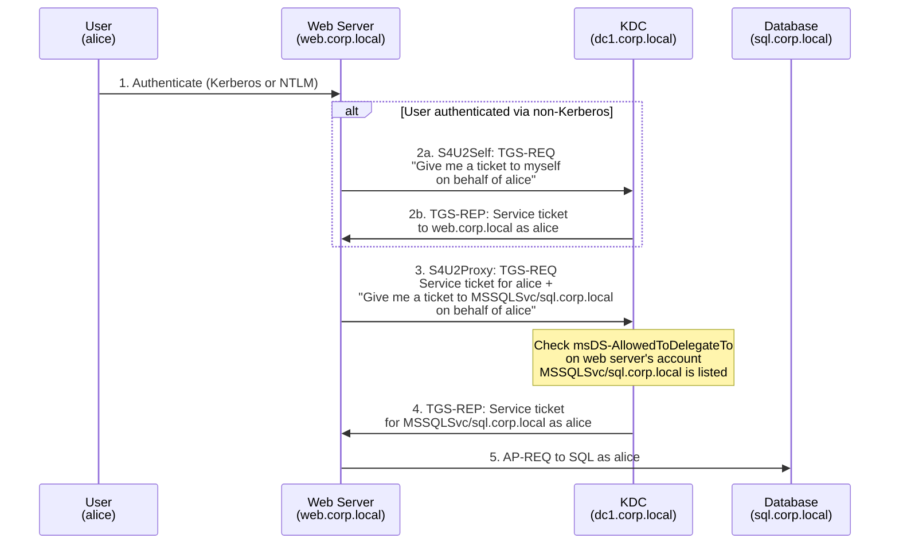
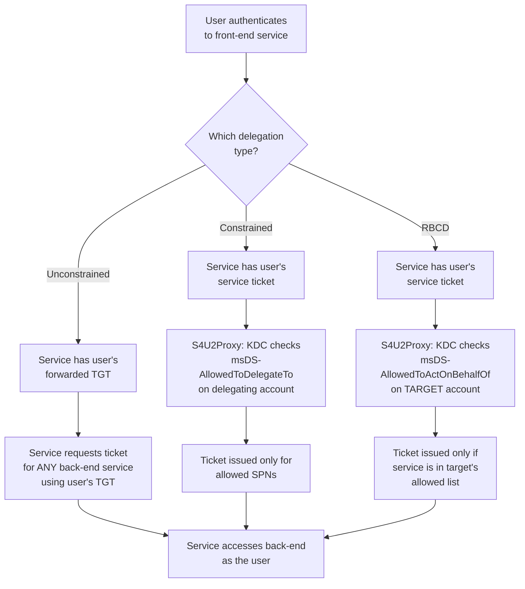

---
---

# Delegation

How services act on behalf of users to access other services.

Delegation solves a fundamental problem in multi-tier applications: a front-end service needs to
access a back-end service **as the user**, not as itself. For example, a web server receives a
request from Alice and needs to query a SQL database on Alice's behalf, using Alice's permissions.

The web server has a service ticket from Alice, which proves Alice authenticated to it. But that
ticket is only valid for the web server -- it cannot be used to access the database. And the web
server does not know Alice's password. So how does the web server get a ticket for the database
as Alice?

Active Directory provides three mechanisms, each with different security properties.

---

## The Three Delegation Types



---

## Unconstrained Delegation

Unconstrained delegation is the original delegation mechanism from Windows 2000. It gives the
service **complete access to the user's identity** by providing the user's forwarded TGT.

### How It Works



1. When the user requests a service ticket for the web server, the KDC checks whether the service
   has the `TRUSTED_FOR_DELEGATION` flag. If so, the KDC sets the `OK-AS-DELEGATE` flag in the
   service ticket.
2. The client sees the `OK-AS-DELEGATE` flag and knows the service is trusted for delegation. It
   requests a **forwarded TGT** from the KDC -- a copy of its TGT that has the `FORWARDED` flag
   set.
3. The client includes the forwarded TGT inside the authenticator of the AP-REQ to the service.
4. The service extracts the user's forwarded TGT and caches it.
5. The service can now use the user's TGT to request service tickets for **any service in the
   domain** on behalf of the user.

### Configuration

Unconstrained delegation is configured by setting the `TRUSTED_FOR_DELEGATION` bit (`0x80000`)
in the `userAccountControl` attribute of the delegating account.

In Active Directory Users and Computers, this is the Delegation tab option:

> **Trust this computer for delegation to any service (Kerberos only)**

!!! warning "Extremely dangerous"
    Any user who authenticates to a service with unconstrained delegation hands over their entire
    TGT. The service can impersonate that user to **any** service in the domain -- not just the
    one it needs.

    If an attacker compromises a server with unconstrained delegation, they can collect TGTs from
    every user who connects and use those TGTs to access any resource as those users. This includes
    domain administrators.

    In a properly hardened environment, **only domain controllers** should have unconstrained
    delegation. All other services should use constrained delegation or resource-based constrained
    delegation.

    See [Delegation Attacks](../attacks/delegation/delegation-attacks.md) for exploitation techniques.

---

## Constrained Delegation (S4U)

Constrained delegation was introduced in Windows Server 2003 to limit the scope of delegation.
Instead of giving the service a full TGT, the service can only obtain tickets for **specific
target services** listed in its `msDS-AllowedToDelegateTo` attribute.

Constrained delegation uses two sub-protocols defined in [MS-SFU]:

S4U2Self (Service for User to Self)
:   The service obtains a service ticket **to itself** on behalf of a user. This is used when the
    user authenticated via a non-Kerberos mechanism (NTLM, forms auth, certificates) and the
    service needs a Kerberos ticket to perform delegation. The resulting ticket has the user's
    identity but is for the service's own SPN.

S4U2Proxy (Service for User to Proxy)
:   The service forwards a service ticket (either from the user's Kerberos authentication or from
    S4U2Self) to the KDC to obtain a service ticket for an **allowed target service** on behalf
    of the user.

### How It Works



### Configuration

Constrained delegation is configured through two settings on the delegating account:

1. **`msDS-AllowedToDelegateTo`** -- a multi-valued attribute listing the SPNs the service is
   allowed to delegate to. For example: `MSSQLSvc/sql.corp.local`.

2. **Delegation mode** on the Delegation tab in ADUC:
   - **Use Kerberos only** -- the service can only delegate when the user authenticated via
     Kerberos. The service uses the user's Kerberos service ticket directly in S4U2Proxy.
   - **Use any authentication protocol** -- enables **protocol transition**. The service can use
     S4U2Self to get a Kerberos ticket on behalf of a user who authenticated via a non-Kerberos
     method (NTLM, forms, certificates), and then use S4U2Proxy to delegate.

!!! info "Protocol transition"
    "Use any authentication protocol" enables both S4U2Self and S4U2Proxy together. This is called
    **protocol transition** because it converts a non-Kerberos authentication into a Kerberos
    delegation chain.

    Without protocol transition ("Use Kerberos only"), the service can only use S4U2Proxy with a
    ticket the user actually obtained through Kerberos.

### Privilege Required

Configuring `msDS-AllowedToDelegateTo` requires the `SeEnableDelegationPrivilege` user right,
which by default is granted only to **Domain Admins** and **Enterprise Admins**. This means only
highly privileged administrators can set up constrained delegation.

### ADUC Delegation Tab Options

The Delegation tab in Active Directory Users and Computers (ADUC) presents four mutually
exclusive radio-button options.  Understanding which maps to which configuration is essential
for both setup and auditing:

| ADUC Option | What It Configures |
|---|---|
| **Do not trust this computer for delegation** | No delegation flags set.  Default for all accounts. |
| **Trust this computer for delegation to any service (Kerberos only)** | Sets `TRUSTED_FOR_DELEGATION` in `userAccountControl`.  This is **unconstrained delegation**. |
| **Trust this computer for delegation to specified services only** > **Use Kerberos only** | Populates `msDS-AllowedToDelegateTo` with allowed SPNs.  The service can only delegate when the user actually authenticated via Kerberos (no protocol transition). |
| **Trust this computer for delegation to specified services only** > **Use any authentication protocol** | Same as above, plus sets `TRUSTED_TO_AUTH_FOR_DELEGATION` in `userAccountControl`.  Enables **protocol transition** (S4U2Self + S4U2Proxy), allowing delegation even when the user authenticated via NTLM, forms, or certificates. |

!!! note "Delegation tab visibility"
    The Delegation tab only appears on an account after at least one SPN is registered to it.
    For computer accounts, HOST SPNs are created automatically.  For user accounts, you must
    register an SPN with `setspn` before the tab becomes available.

### "Account is sensitive and cannot be delegated"

The **"Account is sensitive and cannot be delegated"** flag (`NOT_DELEGATED`, bit 20 of
`userAccountControl`) is set on **user accounts**, not on delegating accounts.  When set, it
prevents that user's identity from being delegated through **any** delegation mechanism --
unconstrained, constrained, or RBCD.  The KDC will refuse to issue a forwarded TGT for the
user, and S4U2Proxy requests on behalf of that user will fail.

This flag should be set on all high-privilege accounts (Domain Admins, Enterprise Admins,
Schema Admins, Tier 0 accounts).  It is also automatically enforced for members of the
**Protected Users** security group.

### Limitations

- Constrained delegation only works **within a single domain**. The SPNs listed in
  `msDS-AllowedToDelegateTo` must be in the same domain as the delegating account.
- The delegating service's administrator controls the delegation scope, not the target service's
  administrator.

---

## Resource-Based Constrained Delegation (RBCD)

RBCD was introduced in Windows Server 2012 and inverts the control model. Instead of the
delegating service specifying which targets it can delegate to, the **target service** specifies
which services are allowed to delegate to it.

### How It Differs

| Aspect | Constrained Delegation | Resource-Based Constrained Delegation |
|---|---|---|
| **Who controls it** | Account of the delegating service | Account of the target service |
| **Attribute** | `msDS-AllowedToDelegateTo` on the delegating service | `msDS-AllowedToActOnBehalfOfOtherIdentity` on the target service |
| **Privilege required** | `SeEnableDelegationPrivilege` (Domain Admins) | Write access to the target's AD object (resource owner) |
| **Cross-domain** | No -- single domain only | Yes -- works across domain boundaries |
| **Risk** | Moderate -- controlled by domain admins | Variable -- depends on who has write access to the target account |

### Configuration

RBCD is configured by setting the `msDS-AllowedToActOnBehalfOfOtherIdentity` attribute on the
**target** service's computer account. The value is a security descriptor that lists which
principals are allowed to delegate to this service.

Example with PowerShell:

```powershell title="Configure RBCD: allow WEB01 to delegate to SQL01 on behalf of users"
# Allow the web server to delegate to the SQL server on behalf of users
$webServer = Get-ADComputer -Identity "WEB01"
Set-ADComputer -Identity "SQL01" `
  -PrincipalsAllowedToDelegateToAccount $webServer
```

This sets the `msDS-AllowedToActOnBehalfOfOtherIdentity` attribute on `SQL01` to allow `WEB01`
to delegate to it.

### How It Works

The protocol flow uses the same S4U2Self and S4U2Proxy sub-protocols as constrained delegation.
The difference is which attribute the KDC checks:

1. The web server uses S4U2Self to get a service ticket to itself on behalf of the user.
2. The web server uses S4U2Proxy to request a service ticket for the SQL server on behalf of the
   user.
3. The KDC checks the SQL server's `msDS-AllowedToActOnBehalfOfOtherIdentity` attribute to verify
   the web server is authorized.
4. If authorized, the KDC issues the service ticket.

!!! warning "RBCD abuse"
    Because RBCD only requires **write access** to the target computer's AD object (not Domain
    Admin privileges), it is frequently abused in attacks. If an attacker can write to a computer
    object's `msDS-AllowedToActOnBehalfOfOtherIdentity` attribute, they can configure delegation
    from an account they control and impersonate any user to that computer.

    See [Delegation Attacks](../attacks/delegation/delegation-attacks.md) for exploitation details.

---

## Comparison Table

| | Unconstrained | Constrained (S4U) | Resource-Based (RBCD) |
|---|---|---|---|
| **Introduced** | Windows 2000 | Windows Server 2003 | Windows Server 2012 |
| **Who controls** | Domain Admins (set on delegating service) | Domain Admins (set on delegating service) | Resource owner (set on target service) |
| **Attribute** | `userAccountControl` `TRUSTED_FOR_DELEGATION` | `msDS-AllowedToDelegateTo` | `msDS-AllowedToActOnBehalfOfOtherIdentity` |
| **Privilege** | Domain Admins | `SeEnableDelegationPrivilege` | Write to target's AD object |
| **Scope** | Any service in the domain | Specific SPNs listed in attribute | Specific principals listed in attribute |
| **Cross-domain** | Yes (TGT works everywhere) | No | Yes |
| **Risk level** | **Critical** -- full impersonation to any service | **Moderate** -- limited to listed SPNs | **Variable** -- depends on who has write access |
| **Recommended** | Only for DCs | Multi-tier apps with known targets | When resource owner should control access |

---

## Ticket Flags Involved

Three ticket flags are directly related to delegation. See [Ticket Structure](tickets.md) for the
full flag reference.

FORWARDABLE (bit 1)
:   Set in the TGT to indicate that a forwarded TGT may be issued. For constrained delegation, the
    service ticket must have this flag set for S4U2Proxy to work. The FORWARDABLE flag is
    requested by the client during the AS Exchange and granted based on policy.

FORWARDED (bit 2)
:   Set in a TGT that has been forwarded to another host. When a client sends its TGT to a service
    with unconstrained delegation, the TGT has the FORWARDED flag set. This flag indicates the
    ticket is being used at a different network address than it was originally issued for.

OK-AS-DELEGATE (bit 13)
:   Set by the KDC in the service ticket when the target service is trusted for delegation
    (has `TRUSTED_FOR_DELEGATION` set). The client uses this flag to decide whether to forward
    its TGT. Per [RFC 4120 &sect;5.3], the client is free to ignore this flag, but the default
    Windows behavior is to respect it.

---

## Delegation Flow with All Three Mechanisms



---

## Security Implications

Delegation is one of the most powerful -- and most dangerous -- features in Active Directory
Kerberos.

!!! warning "Delegation creates attack surface"
    Every delegation configuration is a potential path for attackers to escalate privileges or
    move laterally. Each type has specific attack vectors:

    - **Unconstrained delegation**: Any user authenticating to the service gives up their TGT.
      Attackers can coerce authentication (e.g., via PrinterBug/SpoolSample) to collect TGTs from
      high-value targets like domain controllers.
    - **Constrained delegation**: If an attacker compromises a delegating account with constrained
      delegation configured, they can impersonate any user to the allowed target services.
    - **RBCD**: If an attacker gains write access to a computer's AD object, they can configure
      RBCD from an account they control and impersonate any user.

    All delegation attacks are covered in detail in [Delegation Attacks](../attacks/delegation/delegation-attacks.md).

### Hardening Recommendations

- Set the **"Account is sensitive and cannot be delegated"** flag on high-value accounts (Domain
  Admins, user service accounts with privileged access). This prevents those accounts from being
  delegated regardless of the delegation type.
- Add high-value accounts to the **Protected Users** security group. Members of this group cannot
  be delegated and their TGTs are not forwardable.
- Audit all accounts with unconstrained delegation:
  ```powershell title="Audit unconstrained delegation on computer and user accounts"
  Get-ADComputer -Filter 'TrustedForDelegation -eq $true' |
    Select-Object Name, DNSHostName
  Get-ADUser -Filter 'TrustedForDelegation -eq $true' |
    Select-Object Name, SamAccountName
  ```
- Audit all constrained delegation configurations:
  ```powershell title="Audit all constrained delegation configurations"
  Get-ADObject -Filter 'msDS-AllowedToDelegateTo -like "*"' `
    -Properties msDS-AllowedToDelegateTo |
    Select-Object Name, ObjectClass, msDS-AllowedToDelegateTo
  ```
- Prefer RBCD over constrained delegation when the resource owner should control access, but
  carefully manage who has write access to computer objects.

---

## Summary

- Delegation allows a service to access other services on behalf of an authenticated user
- **Unconstrained delegation** gives the service the user's full TGT -- avoid this except on DCs
- **Constrained delegation** (S4U2Self + S4U2Proxy) limits delegation to specific SPNs listed in
  `msDS-AllowedToDelegateTo`, controlled by Domain Admins
- **Resource-Based Constrained Delegation** inverts control -- the target service decides who can
  delegate to it via `msDS-AllowedToActOnBehalfOfOtherIdentity`, requiring only write access to
  the target's AD object
- The FORWARDABLE, FORWARDED, and OK-AS-DELEGATE ticket flags drive delegation behavior
- All three delegation types have significant attack surface -- see the
  [Attacks section](../attacks/delegation/delegation-attacks.md) for details
