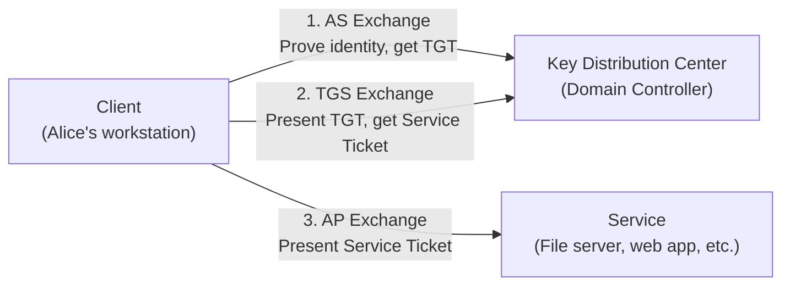

# How Kerberos Works

This section explains the Kerberos authentication protocol as implemented in Microsoft Active Directory. By the end, you will understand how clients prove their identity, how tickets move through the system, and why passwords never cross the network.

---

## What Kerberos Does

Kerberos is an **authentication** protocol. It answers one question: *"Are you really who you claim to be?"*

It does **not** handle authorization -- the separate question of *"What are you allowed to do?"* A Kerberos ticket proves your identity the same way a passport proves your citizenship. The passport does not decide whether you can enter a building; a guard with an access list does that. In Active Directory, authorization happens after authentication, using security groups, access control lists (ACLs), and the Privilege Attribute Certificate (PAC) embedded in tickets.

!!! info "Authentication vs. Authorization"
    **Authentication** = proving identity ("I am Alice").
    **Authorization** = granting access ("Alice may read this file").
    Kerberos handles the first part. Windows authorization mechanisms handle the second.

---

## The Three-Party Model

Kerberos is named after the three-headed dog of Greek mythology, and the protocol involves three parties:

Client
:   The user or computer that wants to access a service. For example, a workstation where Alice types her password.

Service (Application Server)
:   The resource the client wants to reach -- a file share, a web application, a database, a print server.

Key Distribution Center (KDC)
:   The trusted third party that vouches for identities. In Active Directory, the KDC runs on every Domain Controller and consists of two logical services:

    - **Authentication Service (AS)** -- verifies the client's identity and issues a Ticket-Granting Ticket (TGT).
    - **Ticket-Granting Service (TGS)** -- accepts a TGT and issues service tickets for specific services.

The core idea is simple: the client never sends a password to any service. Instead, the KDC acts as a mutually trusted intermediary. Both the client and the service trust the KDC, so when the KDC issues a ticket, both sides accept it as proof of identity.

---

## A Brief History

The Kerberos protocol was born out of a practical need: how do you let thousands of students share networked services without sending passwords over the wire?

| Year | Event |
|------|-------|
| 1983 | MIT launches **Project Athena** to build a campus-wide distributed computing environment. The project needs a network authentication system. |
| 1989 | **Kerberos V4** is publicly released. It works but relies exclusively on DES encryption and has limited extensibility. |
| 1993 | **Kerberos V5** is published as [RFC 1510]. It adds support for multiple encryption types, cross-realm authentication, and extensible message formats. |
| 2000 | **Microsoft adopts Kerberos V5** as the default authentication protocol in Windows 2000 and Active Directory, replacing NTLM. Microsoft adds extensions defined in [MS-KILE], including the Privilege Attribute Certificate (PAC) for carrying authorization data. |
| 2005 | [RFC 4120] supersedes RFC 1510, clarifying and tightening the v5 specification. This is the current authoritative standard. |

!!! tip "NTLM is still around"
    Although Kerberos replaced NTLM as the default, Windows still falls back to NTLM when Kerberos is unavailable -- for example, when a client cannot reach a Domain Controller, when accessing a resource by IP address instead of hostname, or when communicating with systems that do not support Kerberos.

---

## Why Kerberos Matters

Passwords never cross the network
:   The user's password is converted into a cryptographic key on the local machine. Only encrypted data derived from that key is ever transmitted. Even the KDC never receives the password -- it stores a copy of the derived key and uses it to verify encrypted timestamps.

Mutual authentication
:   Not only does the server verify the client, but the client can also verify the server. This prevents an attacker from impersonating a legitimate service.

Single Sign-On (SSO)
:   A user types a password once at login. From that point forward, the workstation uses cached tickets to authenticate to file shares, printers, email, web apps, and any other Kerberos-enabled service -- all without prompting for credentials again.

Delegation
:   A front-end service can act on behalf of a user when talking to a back-end service. For example, a web application can request data from a SQL server using the logged-in user's identity, not a shared account identity.

Time-limited credentials
:   Tickets expire (default: 10 hours for a TGT). Even if an attacker captures a ticket, it becomes useless after expiration.

---

## Authentication Methods

Kerberos supports three fundamentally different ways for a client to prove its identity during pre-authentication. Understanding which method is in use matters because each has different attack surfaces, key material, and detection characteristics.

### 1. Key-Based (Symmetric)

The standard Kerberos authentication method, in use since Windows 2000. The client derives a secret key from the user's password using a key derivation function specific to the encryption type. Both the client and the KDC share this key (the KDC stores a copy derived from the password hash in Active Directory).

During pre-authentication, the client encrypts the current timestamp with the shared key (`PA-ENC-TIMESTAMP`) and sends it in the AS-REQ. The KDC decrypts the timestamp with its copy of the key -- if the timestamp is valid, the client has proven knowledge of the password.

Supported encryption types (in order of strength):

| Encryption Type | Key Derivation | Status |
|----------------|---------------|--------|
| DES-CBC-MD5 | Direct from password | Disabled by default since Windows 7 / Server 2008 R2 |
| RC4-HMAC | MD4 hash of the password (identical to the NT hash) | Supported but deprecated; targeted by Overpass-the-Hash |
| AES128-CTS-HMAC-SHA1-96 | PBKDF2 with per-user salt from the KDC | Supported |
| AES256-CTS-HMAC-SHA1-96 | PBKDF2 with per-user salt from the KDC | Preferred; default on modern DCs |

### 2. Certificate from a Certificate Authority (PKINIT)

X.509 certificates issued by Active Directory Certificate Services (AD CS) or another trusted CA can be used for Kerberos pre-authentication via the PKINIT extension ([RFC 4556]). Instead of encrypting a timestamp with a symmetric key, the client sends a `PA-PK-AS-REQ` containing the certificate and a timestamp signed with the corresponding private key. The KDC validates the certificate chain and the signature.

PKINIT is used for:

- **Smart card logon** -- the private key lives on a physical smart card or hardware token
- **Windows Hello for Business (certificate trust)** -- the private key is stored in a TPM and bound to a certificate issued by AD CS

### 3. Certificate from KeyCredentialLink (WHfB Key Trust / Shadow Credentials)

The `msDS-KeyCredentialLink` attribute on an AD user or computer account stores a public key. During pre-authentication, the client proves possession of the matching private key. This mechanism does not require a certificate authority -- the public key is written directly to the AD attribute.

This is used by:

- **Windows Hello for Business (key trust deployment)** -- the device writes its public key to the user's `msDS-KeyCredentialLink` during enrollment
- **Shadow Credentials** -- an attacker with write access to an account's `msDS-KeyCredentialLink` can add their own public key, then authenticate as that account using the matching private key

!!! note "Scope of this site"
    This site focuses on **key-based (symmetric) authentication** -- the password-derived secret keys (DES, RC4, AES) and the attacks that target them: password spraying, AS-REP roasting, Kerberoasting, overpass-the-hash, pass-the-key, Golden Tickets, and Silver Tickets. Certificate-based authentication (PKINIT, KeyCredentialLink) and the attacks that target it -- shadow credentials, pass-the-certificate, UnPAC the Hash, AD CS exploitation -- will be covered in a separate guide.

---

## Reading Order

This section walks through the protocol from the ground up. Each page builds on the one before it:

1. **[Active Directory Components](active-directory.md)** -- Domains, forests, Domain Controllers, and how the KDC fits into AD.
2. **[Principals and Realms](principals.md)** -- How users, computers, and services are named and identified.
3. **[Protocol Overview](overview.md)** -- The three exchanges (AS, TGS, AP), key types, timestamps, and dependencies.
4. **[AS Exchange](as-exchange.md)** -- Step-by-step: how a client proves its identity and obtains a TGT.
5. **[TGS Exchange](tgs-exchange.md)** -- Step-by-step: how a client trades a TGT for a service ticket.
6. **[AP Exchange](ap-exchange.md)** -- How the client presents a service ticket to the target service.

Later pages cover [ticket structure](tickets.md), [pre-authentication](preauth.md), [encryption types](encryption.md), [cross-realm authentication](cross-realm.md), and [delegation](delegation.md).

!!! info "Spec References"
    Throughout this section, references like "[RFC 4120 &sect;3.1]" point to the authoritative Kerberos V5 specification. References like "[MS-KILE &sect;3.3.5]" point to Microsoft's Kerberos Protocol Extensions documentation.
