# Protocol Overview

This page provides a bird's-eye view of how the Kerberos protocol works in Active Directory. It covers the three core exchanges, the types of cryptographic keys involved, the role of timestamps, and the infrastructure dependencies. Subsequent pages break down each exchange in detail.

---

## The Three Exchanges

Every Kerberos authentication flows through three message exchanges, each serving a distinct purpose:

| Exchange | Messages | Purpose | Runs Between |
|----------|----------|---------|-------------|
| **AS** (Authentication Service) | KRB-AS-REQ / KRB-AS-REP | Client proves identity, receives a Ticket-Granting Ticket (TGT) | Client and KDC |
| **TGS** (Ticket-Granting Service) | KRB-TGS-REQ / KRB-TGS-REP | Client presents TGT, receives a Service Ticket for a specific service | Client and KDC |
| **AP** (Application Protocol) | KRB-AP-REQ / KRB-AP-REP | Client presents Service Ticket, authenticates to the target service | Client and Service |

The AS exchange typically happens once -- when the user logs in. The TGS exchange happens each time the user accesses a new service. The AP exchange happens each time the client connects to the service.

!!! info "The KDC speaks AS and TGS"
    Although AS and TGS are described as separate services, in practice they run as different protocol entry points within the same KDC process on the Domain Controller. Per [RFC 4120 &sect;1.1], in practice the AS and TGS are implemented as different protocol entry points within a single Kerberos server.

---

## Why Passwords Never Cross the Network

This is the central security property of Kerberos. Here is how it works:

1. The user types a password on the local workstation.
2. The workstation converts the password into a cryptographic **secret key** using a one-way function called **string-to-key** (defined in [RFC 3961]). This function takes the password plus a salt value (typically `REALM` + `username` for AES key types) and produces a fixed-length key.
3. Only the resulting key (or data encrypted with it) is used in network communication. The plaintext password is never transmitted.
4. The KDC has its own copy of the same key, derived from the same password when it was originally set and stored in the AD database.
5. Both sides can encrypt and decrypt data with the shared key -- proving they both know the password -- without the password itself ever appearing on the wire.

```
                    Password: "Tr0ub4dor&3"
                             |
                     string-to-key(password, salt)
                             |
                         Secret Key
                        /          \
            Client uses it       KDC has a stored copy
            to encrypt            to decrypt and verify
            a timestamp           the timestamp
```

!!! warning "The password-derived key is the crown jewel"
    If an attacker obtains the secret key (for example, by dumping it from memory or from the AD database), they can impersonate the user without knowing the password. This is the basis of pass-the-key attacks. Protect Domain Controllers and workstation memory accordingly.

---

## Symmetric Key Cryptography

Kerberos uses **symmetric key cryptography** for nearly all operations. Symmetric means the same key encrypts and decrypts data. If Alice encrypts a timestamp with her secret key, and the KDC can successfully decrypt it using its copy of the same key, then both sides have proven they share the secret.

Per [RFC 4120 &sect;1.1]: "Kerberos performs authentication under these conditions as a trusted third-party authentication service by using conventional (shared secret key) cryptography."

---

## Types of Keys

Three categories of keys appear throughout the protocol:

### Secret Keys (Long-Term Keys)

These are derived from passwords using the string-to-key function and persist until the password changes.

| Key | Derived From | Used By |
|-----|-------------|---------|
| **User key** | User's password + salt | Client workstation and KDC |
| **Computer key** | Computer account's password + salt | Domain-joined machine and KDC |
| **Service key** | Target account's password + salt | Service host and KDC |
| **KRBTGT key** | krbtgt account's password + salt | KDC only (encrypts all TGTs) |
| **Inter-realm key** | Trust password + salt | KDCs on both sides of a trust |

The **KRBTGT key** deserves special attention. It is used to encrypt every TGT issued in the domain. Since only the KDC knows this key, no client or service can forge or tamper with a TGT. The krbtgt account's password is set when the domain is created and is never changed automatically -- administrators must rotate it manually.

### Session Keys (Short-Term Keys)

Session keys are random, short-lived keys generated by the KDC for each exchange. They avoid reusing long-term keys for ongoing communication.

| Session Key | Generated During | Shared Between | Purpose |
|-------------|-----------------|----------------|---------|
| **TGT Session Key** | AS exchange | Client and KDC | Encrypt authenticators in TGS requests |
| **Service Session Key** | TGS exchange | Client and Service | Encrypt authenticators in AP requests; optionally encrypt application data |

Session keys are embedded inside the tickets themselves (encrypted so that only the intended recipient can extract them) and also sent to the client in encrypted form.

### How Keys Flow Through the Protocol

```
AS Exchange:
  Client's secret key    --> encrypts pre-auth timestamp, decrypts AS-REP encrypted part
  KRBTGT key             --> encrypts the TGT (client cannot read it)
  TGT Session Key        --> embedded in TGT and in AS-REP encrypted part

TGS Exchange:
  TGT Session Key        --> encrypts the Authenticator, decrypts TGS-REP encrypted part
  Service's secret key   --> encrypts the Service Ticket (client cannot read it)
  Service Session Key    --> embedded in Service Ticket and in TGS-REP encrypted part

AP Exchange:
  Service Session Key    --> encrypts the Authenticator, optionally encrypts AP-REP
  Service's secret key   --> decrypts the Service Ticket (service extracts session key)
```

---

## Timestamps and Replay Protection

Kerberos uses timestamps in two ways to prevent attacks:

**Replay protection**: Every Authenticator (the structure the client sends alongside a ticket) contains a timestamp. The receiving party checks that the timestamp is recent and has not been seen before. If an attacker captures and replays an Authenticator, the duplicate timestamp causes rejection.

**Clock skew tolerance**: By default, the KDC and services reject messages with timestamps more than **5 minutes** off from their own clock. This is configurable via Group Policy (`Maximum tolerance for computer clock synchronization`), but the default 5-minute window is the standard per [RFC 4120 &sect;1.6] and [MS-KILE &sect;1.5].

!!! warning "Time sync is not optional"
    If a client's clock drifts more than 5 minutes from the Domain Controller, all Kerberos authentication fails. Active Directory uses the Windows Time Service (W32Time) to synchronize clocks. The PDC Emulator in the forest root domain is the authoritative time source. Broken time sync is one of the most common causes of Kerberos failures.

---

## Network Transport

Kerberos communication (AS and TGS exchanges) uses **port 88** on the Domain Controller.

| Protocol | Port | Usage |
|----------|------|-------|
| UDP | 88 | Default for small messages |
| TCP | 88 | Used when messages exceed the UDP size threshold (typically when tickets contain large PACs or many group memberships) |

Per [MS-KILE &sect;2.1], KILE uses UDP by default and switches to TCP if the message size exceeds a configurable threshold. The AP exchange does not use port 88 -- it is carried within the application protocol itself (e.g., inside HTTP headers, SMB negotiation, LDAP bind).

---

## Infrastructure Dependencies

Kerberos does not work in isolation. It depends on several services, and failures in any of them break authentication:

| Dependency | Why Kerberos Needs It |
|-----------|----------------------|
| **Active Directory** | The KDC's account database. Stores user/computer/service keys, group memberships, SPNs, and account flags. Kerberos does not work for local accounts. |
| **TCP/IP** | Network connectivity between client, DC, and target service. |
| **DNS** | Clients locate KDCs via SRV records. SPNs contain hostnames that must resolve. Kerberos does not work with bare IP addresses (the client cannot construct an SPN from an IP). |
| **Time synchronization** | Clocks must be within 5 minutes. Uses W32Time / NTP. |
| **Service Principal Names** | The KDC looks up SPNs in AD to find which account's key to use for encrypting service tickets. Missing or duplicate SPNs cause authentication failure. |

### Windows Kerberos Architecture Components

On Windows, the Kerberos implementation is split across several system binaries. These are
internal implementation details, but knowing them helps when troubleshooting (e.g., identifying
which component is logging errors or consuming resources):

| Component | Role |
|---|---|
| **Kerberos.dll** | The Kerberos Security Support Provider (SSP). Loaded by LSASS on clients and servers to handle Kerberos authentication via SSPI. User-mode applications interact with Kerberos through this DLL (via Secur32.dll). |
| **Kdcsvc.dll** | The KDC service. Runs inside LSASS on every Domain Controller and implements both the AS and TGS protocol entry points. |
| **Ksecdd.sys** | The kernel-mode security device driver. Kernel-mode components (e.g., SMB server, RPC) use this driver to communicate with LSASS for authentication, rather than going through Secur32.dll. |
| **Lsasrv.dll** | The LSA Server service. Acts as the security package manager and enforces security policies. Loads and coordinates the SSPs including Kerberos.dll. |
| **Secur32.dll** | The user-mode SSPI dispatcher. Routes application authentication calls to the appropriate SSP (Kerberos, NTLM, Negotiate). |

---

## End-to-End Flow

The following diagram shows the complete Kerberos authentication flow -- all three exchanges in sequence. Alice logs in to her workstation and then accesses a file share on a server.

```mermaid
sequenceDiagram
    participant A as Alice's Workstation
    participant KDC as KDC (Domain Controller)
    participant S as File Server (CIFS)

    Note over A: Alice types username + password.<br/>Workstation derives secret key from password.

    rect rgb(40, 40, 80)
    Note over A,KDC: AS Exchange (Authentication Service)
    A->>KDC: KRB-AS-REQ (username, realm, supported etypes)
    KDC-->>A: KRB-ERROR (pre-auth required, salt, accepted etypes)
    Note over A: Encrypt timestamp with secret key
    A->>KDC: KRB-AS-REQ + PA-ENC-TIMESTAMP
    Note over KDC: Decrypt timestamp, validate clock skew.<br/>Generate TGT Session Key.<br/>Build TGT (encrypted with KRBTGT key).
    KDC-->>A: KRB-AS-REP (TGT + encrypted part with TGT Session Key)
    Note over A: Decrypt encrypted part with secret key.<br/>Extract TGT Session Key. Cache TGT.
    end

    rect rgb(40, 80, 40)
    Note over A,KDC: TGS Exchange (Ticket-Granting Service)
    Note over A: Build Authenticator (encrypted with TGT Session Key)
    A->>KDC: KRB-TGS-REQ (target SPN: CIFS/fileserver.corp.local,<br/>TGT + Authenticator)
    Note over KDC: Decrypt TGT with KRBTGT key.<br/>Extract TGT Session Key.<br/>Decrypt Authenticator, validate timestamp.<br/>Look up SPN in AD.<br/>Generate Service Session Key.<br/>Build Service Ticket (encrypted with file server's key).
    KDC-->>A: KRB-TGS-REP (Service Ticket + encrypted part with Service Session Key)
    Note over A: Decrypt encrypted part with TGT Session Key.<br/>Extract Service Session Key. Cache Service Ticket.
    end

    rect rgb(80, 40, 40)
    Note over A,S: AP Exchange (Application Protocol)
    Note over A: Build Authenticator (encrypted with Service Session Key)
    A->>S: KRB-AP-REQ (Service Ticket + Authenticator)
    Note over S: Decrypt Service Ticket with own secret key.<br/>Extract Service Session Key.<br/>Decrypt Authenticator, validate timestamp.<br/>Read client identity and PAC from ticket.
    S-->>A: KRB-AP-REP (optional, for mutual authentication)
    Note over A,S: Authenticated session established.
    end
```



After this flow completes:

- Alice's password was used only on her local workstation to derive a key. It was never sent over the network.
- The TGT is cached and reused for subsequent TGS requests (default lifetime: 10 hours, renewable for 7 days).
- The Service Ticket is cached and reused for subsequent connections to the same service.
- The file server never contacted the KDC -- it validated the ticket using only its own secret key.

The next pages break down each exchange in detail: the [AS Exchange](as-exchange.md), the [TGS Exchange](tgs-exchange.md), and the [AP Exchange](ap-exchange.md).
