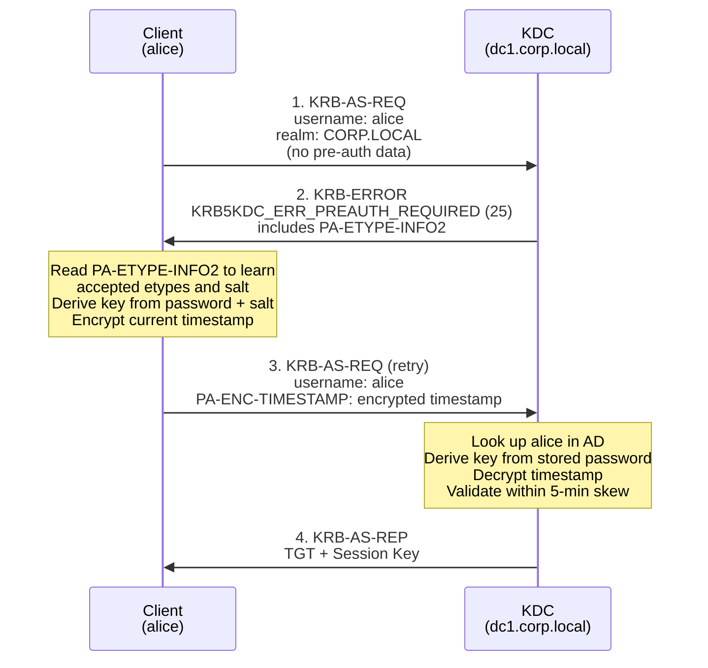
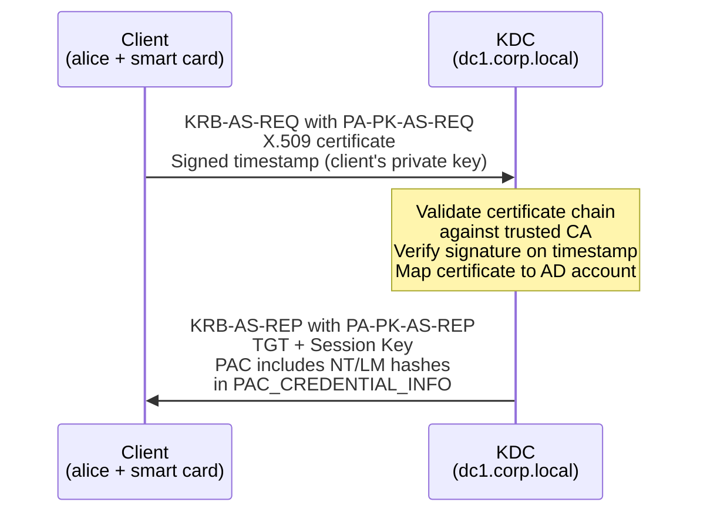

---
---

# Pre-Authentication

How the KDC verifies client identity before issuing tickets.

Pre-authentication is a security mechanism that forces the client to prove it knows the correct
password **before** the KDC issues a TGT. Without pre-authentication, anyone could request an
AS-REP for any user account and attempt to crack the encrypted session key offline.

Active Directory requires pre-authentication by default for all accounts.

---

## Why Pre-Authentication Exists

In the original Kerberos V5 design (before pre-authentication became standard), the AS Exchange
worked like this:

1. Client sends `KRB-AS-REQ` with just a username -- no proof of identity
2. KDC looks up the user, generates a TGT and session key, encrypts the session key with the
   user's secret key, and returns the `KRB-AS-REP`
3. If the client knows the password, it can decrypt the session key and proceed

The problem: **step 1 requires no credentials**. An attacker could request an AS-REP for any user
account. The AS-REP contains data encrypted with the user's key (derived from their password).
The attacker could then perform an offline dictionary or brute-force attack against this encrypted
data to recover the password.

!!! warning "AS-REP Roasting"
    This is exactly how the [AS-REP Roasting](../attacks/roasting/asrep-roasting.md) attack works. If an
    account has pre-authentication disabled, an attacker with no credentials can request a TGT for
    that account and crack the encrypted portion of the AS-REP offline.

    Per [RFC 4120 &sect;10]: "Unless pre-authentication options are required by the policy of a
    realm, the KDC will not know whether a request for authentication succeeds. An attacker can
    request a reply with credentials for any principal."

Pre-authentication solves this by requiring the client to encrypt a timestamp with its secret key
**before** the KDC returns any encrypted material.

---

## PA-ENC-TIMESTAMP -- Password-Based Pre-Authentication

`PA-ENC-TIMESTAMP` (pre-authentication type 2) is the most common form of pre-authentication in
Active Directory. The client encrypts the current timestamp with the key derived from its password.

### How the Flow Works



### Step by Step

**Step 1 -- Initial AS-REQ (no pre-auth)**

The client sends a `KRB-AS-REQ` containing:

- Client principal name (`cname`: `alice`)
- Realm (`CORP.LOCAL`)
- List of supported encryption types
- Requested ticket properties

No password material is included. This first request is essentially a probe.

**Step 2 -- KDC responds with PREAUTH_REQUIRED error**

The KDC does not issue a TGT. Instead, it returns `KRB-ERROR` with error code
`KRB5KDC_ERR_PREAUTH_REQUIRED` (25). This error includes critical metadata:

`PA-ETYPE-INFO2`
:   A list of encryption types the KDC will accept for pre-authentication, along with the **salt**
    value for each. The salt is used in key derivation -- for AES encryption types, the salt is
    typically `REALM` + principal name (e.g., `CORP.LOCALalice`).

    This tells the client: "I need you to prove your identity. Here are the encryption algorithms
    I accept and the salt values to use."

**Step 3 -- Client re-sends AS-REQ with encrypted timestamp**

The client:

1. Reads the accepted encryption types and salt from `PA-ETYPE-INFO2`
2. Derives a key from the user's password using the appropriate algorithm and salt (see
   [Encryption Types](encryption.md) for how key derivation works)
3. Encrypts the current timestamp (`PA-ENC-TS-ENC` structure) with the derived key
4. Sends a new `KRB-AS-REQ` with the `PA-ENC-TIMESTAMP` field in the `padata` section

**Step 4 -- KDC validates and issues the TGT**

The KDC:

1. Looks up the user's account in Active Directory
2. Derives the same key from the stored password hash and the salt
3. Decrypts the timestamp from `PA-ENC-TIMESTAMP`
4. Validates the timestamp is within the acceptable clock skew (default: 5 minutes)
5. If valid, the KDC is satisfied that the client knows the password and proceeds with the
   normal [AS Exchange](as-exchange.md) -- generating a session key and TGT

!!! tip "Clock synchronization is critical"
    The 5-minute tolerance for timestamps means all machines in the domain must have synchronized
    clocks. Active Directory uses the Windows Time Service (W32Time) to keep domain members in sync
    with domain controllers. If a client's clock drifts too far, pre-authentication will fail with
    `KRB_AP_ERR_SKEW`.

---

## PA-ETYPE-INFO2 -- Encryption Type Negotiation

The `PA-ETYPE-INFO2` structure in the `KRB5KDC_ERR_PREAUTH_REQUIRED` error tells the client
which encryption types the KDC accepts. Per [RFC 4120 &sect;5.2.7.5], it contains:

| Field | Description |
|---|---|
| `etype` | Encryption type number (e.g., `18` for AES-256, `17` for AES-128, `23` for RC4) |
| `salt` | The salt string for key derivation |
| `s2kparams` | Optional string-to-key parameters (e.g., iteration count for PBKDF2) |

The client should select the strongest encryption type it supports from this list. In modern AD
environments, this will typically be AES-256.

### Salt Values

The salt ensures that users with the same password end up with different encryption keys.
RC4-HMAC does not use a salt (the key is simply the NT hash), which is one reason it is weaker.
AES keys use a salt constructed from the realm and principal name -- see
[Encryption Types — Salt Composition](encryption.md#salt-composition) for the format and
examples.

---

## DONT_REQUIRE_PREAUTH -- Disabling Pre-Authentication

The `DONT_REQUIRE_PREAUTH` flag is bit `0x400000` (4194304) in the `userAccountControl` attribute
of an Active Directory account.

When this bit is set on an account, the KDC **skips** the pre-authentication check entirely. On
receiving an AS-REQ for this account, the KDC immediately returns an AS-REP with the TGT and
encrypted session key -- no password proof required.

### Where to Find It

In Active Directory Users and Computers, open the account properties and go to the **Account**
tab. Under "Account options", the checkbox is labeled:

> **Do not require Kerberos preauthentication**

You can also query it with LDAP:

```
(&(objectClass=user)(userAccountControl:1.2.840.113556.1.4.803:=4194304))
```

Or with PowerShell:

```powershell
Get-ADUser -Filter 'DoesNotRequirePreAuth -eq $true' -Properties DoesNotRequirePreAuth
```

!!! warning "Security risk"
    Accounts with this flag enabled are vulnerable to [AS-REP Roasting](../attacks/roasting/asrep-roasting.md).
    An attacker who knows the username (no password needed) can request a TGT and crack the
    encrypted portion of the AS-REP offline.

    **Very few legitimate scenarios require this flag.** It was originally added for compatibility
    with certain legacy applications that could not perform the pre-authentication handshake. In
    modern environments, it should almost never be set.

    Audit regularly:
    ```powershell
    Get-ADUser -Filter 'DoesNotRequirePreAuth -eq $true' `
      -Properties DoesNotRequirePreAuth |
      Select-Object Name, SamAccountName, Enabled
    ```

---

## PKINIT -- Certificate-Based Pre-Authentication

PKINIT (Public Key Cryptography for Initial Authentication in Kerberos) replaces the
password-based `PA-ENC-TIMESTAMP` with an X.509 certificate and public key signature. It uses
pre-authentication types `PA-PK-AS-REQ` and `PA-PK-AS-REP`.

### When PKINIT Is Used

- **Smart card logon** -- the user inserts a smart card and enters a PIN. The smart card holds a
  private key and certificate.
- **Windows Hello for Business** -- uses a TPM-backed key pair instead of a physical smart card.
- **Certificate-based authentication** -- any scenario where the client authenticates with a
  certificate instead of a password.

### How PKINIT Works



**Step 1 -- Client sends PA-PK-AS-REQ**

The client sends an AS-REQ with a `PA-PK-AS-REQ` pre-authentication data block containing:

- The client's X.509 certificate (issued by a trusted Certificate Authority)
- A timestamp signed with the client's **private key** (proving possession of the key)

**Step 2 -- KDC validates and responds**

The KDC:

1. Validates the certificate chain up to a trusted root CA
2. Verifies the signature on the timestamp using the certificate's public key
3. Maps the certificate to an Active Directory account (using the UPN in the certificate's
   Subject Alternative Name or the explicit certificate mapping)
4. Issues a TGT as normal

!!! info "PKINIT and the PAC"
    When PKINIT is used, the KDC includes the user's NT hash and LM hash in the
    `PAC_CREDENTIAL_INFO` structure within the TGT's PAC. This allows the client to fall back to
    NTLM authentication if a target service does not support Kerberos. Certificate-based attacks
    that exploit this mechanism are outside the scope of this guide.

---

## Pre-Authentication Error Codes

These error codes appear during the pre-authentication process:

| Error Code | Name | Meaning |
|---|---|---|
| 25 | `KRB5KDC_ERR_PREAUTH_REQUIRED` | Pre-authentication is required but was not provided. Normal -- the client should retry with pre-auth data. |
| 24 | `KDC_ERR_PREAUTH_FAILED` | The pre-authentication data was invalid (wrong password, bad timestamp). |
| 14 | `KDC_ERR_ETYPE_NOSUPP` | The KDC does not support any of the encryption types requested by the client. Common when RC4 is disabled but the account only has RC4 keys. |
| 6 | `KDC_ERR_C_PRINCIPAL_UNKNOWN` | The client principal was not found in the KDC's database. |
| 18 | `KDC_ERR_CLIENT_REVOKED` | The account is locked out or disabled. |

!!! tip "User enumeration via error codes"
    The difference between `KRB5KDC_ERR_PREAUTH_REQUIRED` (user exists, pre-auth needed) and
    `KDC_ERR_C_PRINCIPAL_UNKNOWN` (user does not exist) allows attackers to enumerate valid
    usernames without any credentials. See [User Enumeration](../attacks/credential-theft/user-enumeration.md).

---

## Summary

- Pre-authentication prevents unauthenticated users from obtaining encrypted material they could
  crack offline
- `PA-ENC-TIMESTAMP` is the standard mechanism: encrypt a timestamp with the password-derived key
- The flow always starts with an error (`PREAUTH_REQUIRED`) that tells the client which encryption
  types and salts to use
- `DONT_REQUIRE_PREAUTH` disables this protection and enables AS-REP Roasting -- audit accounts
  with this flag
- PKINIT provides certificate-based pre-authentication for smart cards and Windows Hello for
  Business
- Clock synchronization within 5 minutes is essential for pre-authentication to work
