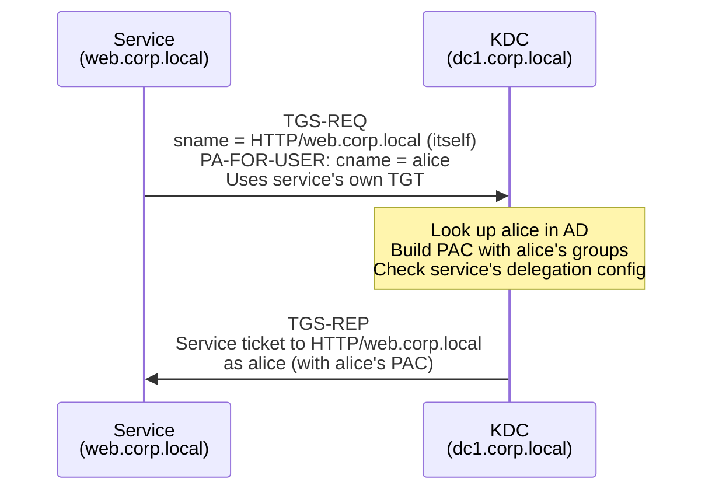
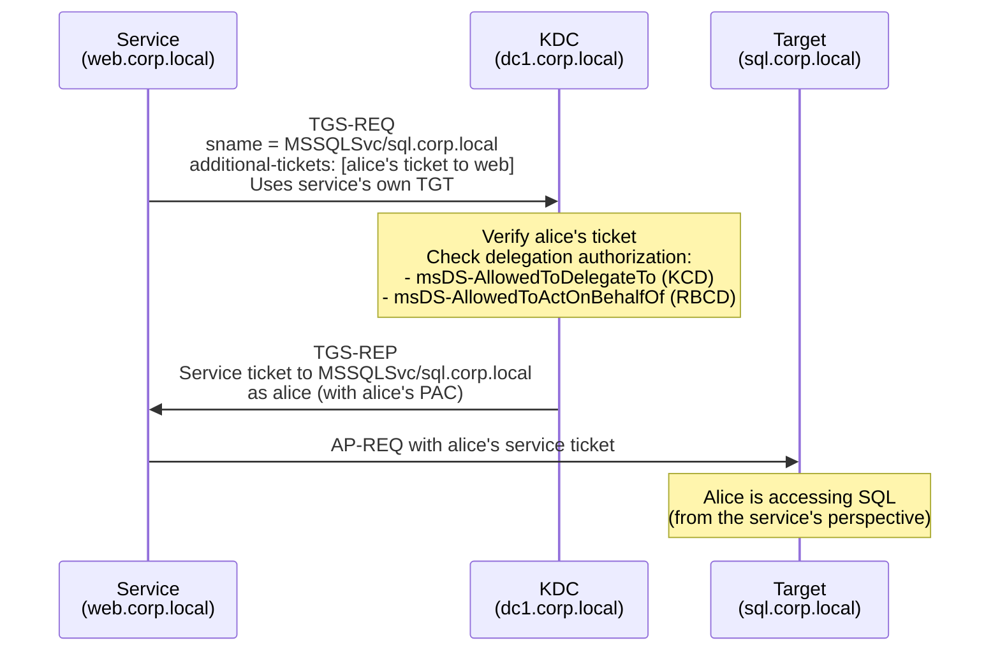
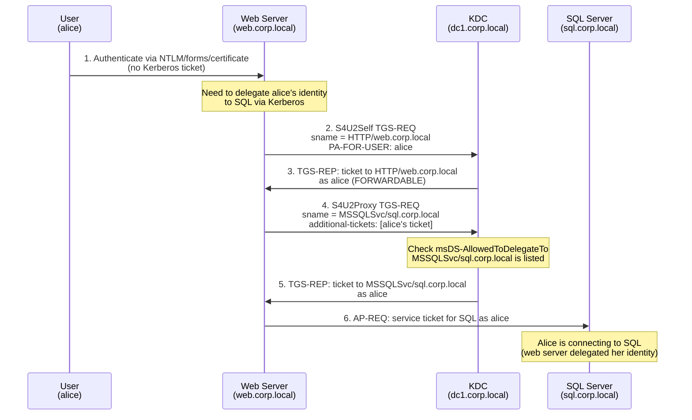

---
---

# S4U Extensions

S4U2Self and S4U2Proxy: how services request tickets on behalf of users.

The Service for User (S4U) extensions, defined in [MS-SFU], add two sub-protocols to Kerberos
that allow a service to obtain service tickets **on behalf of a user** without possessing the
user's TGT or password. These extensions are the foundation of
[constrained delegation](delegation.md#constrained-delegation-s4u) and
[resource-based constrained delegation](delegation.md#resource-based-constrained-delegation-rbcd),
and they are central to several [delegation attacks](../attacks/delegation/delegation-attacks.md).

---

## S4U2Self (Service for User to Self)

S4U2Self allows a service to request a service ticket **to itself** on behalf of any user. The
resulting ticket contains the user's PAC (with real group memberships from Active Directory) as
if the user had directly requested a service ticket for that service through the normal
[TGS Exchange](tgs-exchange.md).

### Why It Exists

Consider a web server that authenticates users via forms-based login or client certificates --
mechanisms that produce a username but not a Kerberos ticket. If the web server needs to delegate
that user's identity to a back-end service via [S4U2Proxy](#s4u2proxy-service-for-user-to-proxy),
it first needs a Kerberos service ticket representing the user. S4U2Self bridges this gap: the
service says to the KDC, "give me a ticket to myself, as if this user had authenticated to me
via Kerberos." This process is called **protocol transition** -- converting a non-Kerberos
authentication into a Kerberos ticket that can participate in delegation.

### Protocol Flow

### Request Structure

The S4U2Self request is a standard TGS-REQ with two additions per [MS-SFU &sect;2.2.1]:

1. **PA-FOR-USER** (`padata` type 129) -- identifies the user being impersonated. Contains
   the user's principal name and realm, plus an HMAC checksum over those fields using the
   service's session key.
2. The **sname** in `req-body` is the service's **own SPN** -- the service is requesting a
   ticket to itself.

!!! warning "PA-FOR-USER is being replaced by PA-S4U-X509-USER (CVE-2026-20849)"
    MS-SFU 260330 (March 2026) introduces the `PhaseOutOldStyleS4U` KDC flag. When set, the
    KDC requires `PA-S4U-X509-USER` (`padata` type 130, per [MS-SFU &sect;2.2.2]) instead of
    `PA-FOR-USER`. `PA-S4U-X509-USER` binds the request to the service's certificate and is
    more resistant to relay attacks. Pre-patch Windows DCs still accept `PA-FOR-USER`, but
    patched environments will require tools to support the newer padata type.

The TGS-REQ is authenticated with the service's own TGT, proving the service's identity.

### FORWARDABLE Flag

The FORWARDABLE flag on the resulting S4U2Self ticket determines whether it can be used in
a subsequent S4U2Proxy request:

| Account Configuration | FORWARDABLE Set? | Can Be Used for S4U2Proxy? |
|---|---|---|
| `TRUSTED_TO_AUTH_FOR_DELEGATION` (protocol transition enabled) | Yes | Yes -- constrained delegation works |
| Constrained delegation without protocol transition ("Kerberos only") | No | No -- S4U2Proxy requires a FORWARDABLE ticket for traditional constrained delegation |
| No delegation configured | No | Not for constrained delegation; **yes for RBCD** (RBCD does not require FORWARDABLE) |

!!! info "RBCD relaxes the FORWARDABLE requirement"
    For resource-based constrained delegation, the KDC does **not** require the S4U2Self ticket
    to be FORWARDABLE. This is a key difference from traditional constrained delegation and is
    why RBCD abuse is possible from any computer account -- even one with no delegation configured.
    Per [MS-SFU &sect;3.2.5.2.3], the KDC checks the target's
    `msDS-AllowedToActOnBehalfOfOtherIdentity` instead of the FORWARDABLE flag.

### Who Can Use S4U2Self

Any account with an SPN can perform S4U2Self. In practice, this means:

- **Computer accounts** -- every domain-joined computer has SPNs (`HOST/<hostname>`,
  `RestrictedKrbHost/<hostname>`) registered at join time
- **User accounts with SPNs** -- user service accounts with manually registered SPNs
- **Microsoft Virtual Accounts** -- `NT AUTHORITY\NETWORK SERVICE`, `defaultapppool`,
  `NT SERVICE\MSSQLSERVER`, etc. authenticate to the KDC as the computer account

This is why S4U2Self is exploitable for [local privilege escalation](../attacks/delegation/s4u2self-abuse.md):
any code running as a virtual account on a domain-joined machine can request a ticket as Domain
Admin to the machine itself.

---

## S4U2Proxy (Service for User to Proxy)

S4U2Proxy allows a service to present a user's service ticket (obtained through S4U2Self or
through the user's actual Kerberos authentication) and request a **new service ticket for a
different target service** on behalf of that user.

### Why It Exists

S4U2Proxy is the delegation step. The front-end service already has a ticket proving the user's
identity (from S4U2Self or from the user's AP-REQ). Now it needs to access a back-end service
**as that user**. S4U2Proxy asks the KDC: "I have a ticket from alice to me; give me a ticket
from alice to the SQL server."

### Protocol Flow

### Request Structure

The S4U2Proxy request is a TGS-REQ with per [MS-SFU &sect;2.2.2]:

1. **additional-tickets** -- contains the user's service ticket (the "evidence ticket") proving
   the user authenticated to the front-end service
2. **sname** in `req-body` -- the SPN of the **target** service (e.g., `MSSQLSvc/sql.corp.local`)
3. **cname** -- inferred from the evidence ticket; the user being impersonated
4. The request is authenticated with the service's own TGT

### KDC Authorization Check

The KDC performs different authorization checks depending on the delegation type:

**Constrained Delegation (KCD):**

Per [MS-SFU &sect;3.2.5.2.1], the KDC checks whether the target SPN appears in the requesting
service's `msDS-AllowedToDelegateTo` attribute. If the SPN is not listed, the request is rejected
with `KDC_ERR_BADOPTION`.

Additionally, for KCD without protocol transition ("Kerberos only"), the evidence ticket must
have the FORWARDABLE flag set.

**Resource-Based Constrained Delegation (RBCD):**

The KDC checks whether the requesting service's SID appears in the **target** service's
`msDS-AllowedToActOnBehalfOfOtherIdentity` attribute. The FORWARDABLE flag on the evidence
ticket is **not** required.

| Check | Constrained Delegation | RBCD |
|---|---|---|
| **Attribute checked** | `msDS-AllowedToDelegateTo` on the requesting service | `msDS-AllowedToActOnBehalfOfOtherIdentity` on the target service |
| **Who configures it** | Domain Admins (`SeEnableDelegationPrivilege`) | Anyone with write access to the target's AD object |
| **FORWARDABLE required** | Yes (for KCD without protocol transition) | No |
| **Cross-domain** | No | Yes |

### Protected Users and Delegation-Sensitive Accounts

Certain accounts cannot be impersonated through S4U2Proxy:

- Accounts in the **Protected Users** group -- their tickets are issued as non-delegatable
- Accounts with the **"Account is sensitive and cannot be delegated"** flag set
  (`NOT_DELEGATED`, UAC bit `0x100000`)

When S4U2Self is used for these accounts, the resulting ticket does **not** have the
FORWARDABLE flag. For constrained delegation, this blocks S4U2Proxy. For RBCD, the ticket
is still usable because RBCD does not check FORWARDABLE.

!!! warning "Protected Users does not fully protect against RBCD"
    Because RBCD does not require the evidence ticket to be FORWARDABLE, accounts in Protected
    Users can still be impersonated through RBCD in certain scenarios. The defense against RBCD
    abuse is controlling write access to `msDS-AllowedToActOnBehalfOfOtherIdentity`, not relying
    on Protected Users.

---

## Combined S4U Flow

The most common delegation pattern chains S4U2Self and S4U2Proxy together. This is the full
flow for a web server performing protocol transition and constrained delegation to a SQL server:

---

## S4U2Self + U2U (User-to-User)

A variant of S4U2Self combines it with the User-to-User (U2U) Kerberos extension. In standard
S4U2Self, the resulting ticket is encrypted with the service's long-term key. In the U2U variant,
the resulting ticket is encrypted with the service's **session key** from its TGT instead.

This combination is used in the [Sapphire Ticket](../attacks/forgery/sapphire-ticket.md) attack:
the attacker uses S4U2Self+U2U to request a ticket on behalf of a high-privilege user, obtaining
a ticket that contains a **legitimate PAC** for that user. The PAC is then extracted and
transplanted into a forged TGT.

The U2U variant is also useful for extracting a user's NT hash through the UnPAC-the-Hash
technique: the decrypted S4U2Self+U2U ticket's PAC contains the `PAC_CREDENTIAL_INFO` structure,
which holds the user's encrypted NTLM hash.

---

## Security Implications

S4U2Self and S4U2Proxy are fundamental building blocks in delegation, but they introduce
significant attack surface:

| Attack | S4U Sub-protocol | Description |
|---|---|---|
| [S4U2Self Abuse](../attacks/delegation/s4u2self-abuse.md) | S4U2Self | Local privilege escalation via service ticket impersonation |
| [Constrained Delegation Abuse](../attacks/delegation/delegation-attacks.md#constrained) | S4U2Self + S4U2Proxy | Lateral movement through compromised delegating accounts |
| [RBCD Abuse](../attacks/delegation/delegation-attacks.md#rbcd) | S4U2Self + S4U2Proxy | Privilege escalation via writable computer objects |
| [SPN-jacking](../attacks/delegation/spn-jacking.md) | S4U2Proxy | Redirect delegation to attacker-controlled accounts by moving SPNs |
| [Sapphire Ticket](../attacks/forgery/sapphire-ticket.md) | S4U2Self + U2U | Obtain legitimate PAC for forged ticket construction |

---

## Summary

- **S4U2Self** allows a service to get a ticket to itself on behalf of any user, enabling
  protocol transition from non-Kerberos authentication to Kerberos delegation
- **S4U2Proxy** allows a service to exchange a user's evidence ticket for a new ticket to a
  target service, enabling the actual delegation hop
- For **constrained delegation**, the KDC checks `msDS-AllowedToDelegateTo` on the requesting
  service and requires FORWARDABLE evidence tickets
- For **RBCD**, the KDC checks `msDS-AllowedToActOnBehalfOfOtherIdentity` on the target and
  does **not** require FORWARDABLE evidence tickets
- S4U2Self is available to any account with an SPN (all computer accounts), making it exploitable
  for [local privilege escalation](../attacks/delegation/s4u2self-abuse.md)
- The S4U2Self+U2U variant produces tickets with legitimate PACs, enabling the
  [Sapphire Ticket](../attacks/forgery/sapphire-ticket.md) attack
