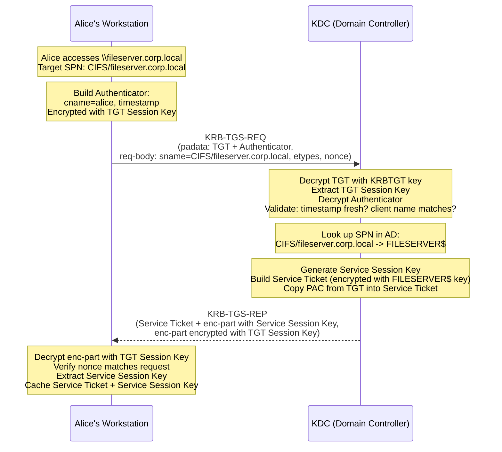

# TGS Exchange (Ticket-Granting Service)

The TGS exchange is the second step in the Kerberos authentication flow. Having already obtained a TGT through the [AS exchange](as-exchange.md), the client now uses that TGT to request a **Service Ticket** for a specific target service -- all without typing a password again. This is Single Sign-On in action.

Per [RFC 4120 &sect;3.3]: "The TGS exchange between a client and the Kerberos TGS is initiated by a client when it seeks to obtain authentication credentials for a given server."

---

## Purpose

The TGS exchange accomplishes two things:

1. **The client proves it owns the TGT** by constructing an Authenticator encrypted with the TGT Session Key.
2. **The KDC issues a Service Ticket** encrypted with the target service's secret key, along with a new Service Session Key that the client and service will share.

After this exchange, the client holds a sealed credential (the Service Ticket) that it can present directly to the target service -- without the service ever contacting the KDC.

---

## Step-by-Step: TGS Exchange

Continuing the example from the AS exchange, Alice now wants to access a file share at `\\fileserver.corp.local`. Her workstation determines the SPN is `CIFS/fileserver.corp.local` and begins the TGS exchange.

### Step 1: Client composes KRB-TGS-REQ

The workstation builds a `KRB-TGS-REQ` message. This message has two main sections:

**Request body** (`req-body`):

| Field | Value | Description |
|-------|-------|-------------|
| `sname` | `CIFS/fileserver.corp.local` | The SPN of the target service |
| `realm` | `CORP.LOCAL` | The realm where the service should be found |
| `etype` | `[18, 17, 23, ...]` | Encryption types the client supports |
| `nonce` | (random) | A random number to bind request and response |

**Pre-authentication data** (`padata`):

The padata contains a `KRB-AP-REQ` structure -- effectively an AP exchange directed at the TGS itself. It includes:

| Field | Value | Description |
|-------|-------|-------------|
| `ticket` | Alice's TGT | The TGT obtained from the AS exchange, still encrypted with the KRBTGT key |
| `authenticator` | (encrypted blob) | An Authenticator encrypted with the **TGT Session Key** |

### Step 2: Client builds the Authenticator

The **Authenticator** is a freshly generated structure that proves the client actually possesses the TGT Session Key -- and is not just replaying a stolen TGT. It contains:

| Authenticator Field | Value | Description |
|--------------------|-------|-------------|
| `crealm` | `CORP.LOCAL` | Client's realm |
| `cname` | `alice` | Client's principal name |
| `ctime` / `cusec` | Current timestamp | Current time (seconds and microseconds) |
| `cksum` | Checksum of req-body | Integrity check over the request body |
| `subkey` | (optional) | A sub-session key the client may propose |

The entire Authenticator is encrypted with the **TGT Session Key** that Alice received from the AS exchange. Only someone who successfully decrypted the AS-REP could know this key.

!!! info "Why the Authenticator matters"
    The TGT alone is not enough. Tickets can be copied -- if an attacker captures Alice's TGT from the network, they have the ticket. But they cannot create a valid Authenticator without the TGT Session Key, which was never sent in the clear. The Authenticator's timestamp also ensures it cannot be replayed: the KDC tracks recent timestamps and rejects duplicates.

### Step 3: KDC decrypts the TGT

The KDC receives the `KRB-TGS-REQ` and processes the padata:

1. It identifies the ticket as a TGT for its own realm (`krbtgt/CORP.LOCAL`).
2. It decrypts the TGT using the **KRBTGT key** (the secret key of the `krbtgt` account).
3. From the decrypted TGT, it extracts:
    - The **TGT Session Key**
    - The **client name** (`alice`) and **realm** (`CORP.LOCAL`)
    - The **ticket flags** and **timestamps**
    - The **PAC** (authorization data)

### Step 4: KDC decrypts and validates the Authenticator

Using the TGT Session Key extracted from the TGT, the KDC decrypts the Authenticator and performs several checks:

| Check | Validation |
|-------|-----------|
| **Decryption** | If decryption fails, the client does not possess the correct session key. Return `KRB_AP_ERR_BAD_INTEGRITY`. |
| **Client name match** | The `cname` and `crealm` in the Authenticator must match those in the TGT. |
| **Timestamp freshness** | The Authenticator's timestamp must be within the clock skew window (default 5 minutes). |
| **Replay check** | The timestamp must not match a recently seen Authenticator from the same client. |
| **Checksum** | The checksum over the request body must verify correctly. |
| **TGT expiration** | The TGT must not have expired (`endtime` must be in the future). |

### Step 5: KDC looks up the SPN in Active Directory

The KDC takes the requested service name (`CIFS/fileserver.corp.local`) and searches Active Directory for an account that has this SPN registered in its `servicePrincipalName` attribute.

In this example, the KDC finds the computer account `FILESERVER$` with the SPN `CIFS/fileserver.corp.local` registered.

If the SPN is not found, the KDC returns `KDC_ERR_S_PRINCIPAL_UNKNOWN`.

!!! warning "Missing SPNs are a common source of failures"
    If a service does not have its SPN registered, or if the SPN is registered on the wrong account, the KDC cannot issue a service ticket. The symptom is usually an NTLM fallback or an authentication failure. Use `setspn -Q */hostname` to check SPN registrations. See [Principals and Realms](principals.md) for SPN details.

### Step 6: KDC generates a new Service Session Key

The KDC generates a random **Service Session Key**. This short-lived key will be shared between the client (Alice) and the target service (the file server) for the duration of the service session.

### Step 7: KDC builds the Service Ticket

The KDC constructs the **Service Ticket**, which has the same structure as a TGT but is encrypted with the **target service's secret key** (in this case, the key derived from the `FILESERVER$` computer account's password):

| Service Ticket Field | Value | Description |
|---------------------|-------|-------------|
| `tkt-vno` | `5` | Ticket format version |
| `realm` | `CORP.LOCAL` | Issuing realm |
| `sname` | `CIFS/fileserver.corp.local` | The service principal |
| `enc-part` | (encrypted blob) | All fields below, encrypted with **FILESERVER$'s key** |
| &nbsp;&nbsp;`flags` | `forwardable`, `renewable`, `pre-authent` | Ticket flags (carried forward from TGT where applicable) |
| &nbsp;&nbsp;`key` | Service Session Key | The session key for client-service communication |
| &nbsp;&nbsp;`crealm` | `CORP.LOCAL` | Client's realm |
| &nbsp;&nbsp;`cname` | `alice` | Client's principal name |
| &nbsp;&nbsp;`authtime` | `2026-04-03T08:00:00Z` | Original authentication time (from TGT) |
| &nbsp;&nbsp;`starttime` | `2026-04-03T09:15:00Z` | When the service ticket becomes valid |
| &nbsp;&nbsp;`endtime` | `2026-04-03T18:00:00Z` | Expiration (cannot exceed TGT endtime) |
| &nbsp;&nbsp;`authorization-data` | PAC | User's SID, group SIDs, logon info -- carried from the TGT |

The PAC is copied from the TGT into the Service Ticket. This is how the file server knows which groups Alice belongs to, without querying the Domain Controller. Per [MS-KILE &sect;3.3.5.3], the KDC generates the PAC during the AS exchange and carries it forward into service tickets during the TGS exchange.

### Step 8: KDC sends KRB-TGS-REP

The KDC sends the `KRB-TGS-REP` message, which contains two parts:

| Part | Encrypted With | Contains |
|------|---------------|----------|
| **Ticket** (the Service Ticket) | FILESERVER$'s secret key | Client name, session key, timestamps, PAC, flags. The client **cannot** decrypt this. |
| **Encrypted part** (enc-part) | TGT Session Key | Service Session Key, nonce, timestamps, ticket flags. The client **can** decrypt this. |

Note the parallel with the AS exchange:

- In the AS exchange, the encrypted part was protected with the user's secret key.
- In the TGS exchange, the encrypted part is protected with the **TGT Session Key** -- because the client no longer needs to use its password-derived key.

### Step 9: Client processes the response

The workstation decrypts the encrypted part using the **TGT Session Key** and extracts:

- The **Service Session Key** (needed for the upcoming AP exchange)
- The **nonce** (verified against the nonce in the request)
- **Timestamps** and **flags**

Both the Service Ticket and the Service Session Key are stored in the **ticket cache**. Alice's workstation is now ready to authenticate to the file server.

---

## The Client Cannot Decrypt the Service Ticket

Just as with the TGT, the Service Ticket is opaque to the client. It is encrypted with the service's secret key, which only the service (and the KDC) know.

| Data | Can the client see it? | Why |
|------|----------------------|-----|
| Service Session Key | Yes | Encrypted with the TGT Session Key in the TGS-REP encrypted part |
| Service Ticket contents (client name, PAC, flags) | No | Encrypted with the service's secret key |
| Nonce and timestamps | Yes | Part of the TGS-REP encrypted part |

The client carries the Service Ticket as a sealed envelope. When it connects to the file server, it hands over this envelope (along with an Authenticator) in the [AP exchange](ap-exchange.md).

---

## PAC Inclusion

The **Privilege Attribute Certificate (PAC)** is a Microsoft extension to the Kerberos ticket. It contains authorization data that the target service uses to build the user's security token:

| PAC Component | Description |
|--------------|-------------|
| User SID | `S-1-5-21-...-1013` -- uniquely identifies Alice |
| Group SIDs | SIDs of all security groups Alice belongs to (domain local, global, universal) |
| Logon information | Account name, full name, logon count, password timestamps |
| Client claims | AD attribute-based claims for dynamic access control |

The PAC is initially built by the KDC during the AS exchange and embedded in the TGT. During the TGS exchange, the KDC copies the PAC from the TGT into the new Service Ticket. Per [MS-KILE &sect;3.3.5.7], the KDC may also update certain PAC structures (such as adding the server's checksum).

!!! tip "Pentester note"
    The PAC is protected by two signatures: one using the service's key and one using the KRBTGT key. In a Silver Ticket attack (forging a service ticket with a compromised service key), the attacker can forge the service's PAC signature but not the KRBTGT signature. Whether the service validates the KRBTGT signature depends on configuration -- by default, most services do not verify it with the KDC, which is why Silver Tickets work.

---

## Sequence Diagram

---

## Key Takeaways

- The TGS exchange proves TGT ownership through the **Authenticator**, not by re-entering a password. This is why Single Sign-On works.
- The **Authenticator** binds the TGT to the client -- a stolen TGT is useless without the TGT Session Key.
- The KDC finds the target account by **looking up the SPN** in Active Directory. Missing or duplicate SPNs cause failures.
- The **Service Ticket** is encrypted with the target service's key. The client cannot read or modify it.
- The **PAC** travels from the TGT into the Service Ticket, carrying the user's group memberships and SIDs so the service can make authorization decisions without contacting the DC.
- The Service Ticket's expiration time cannot exceed the TGT's expiration time.

Next: the [AP Exchange](ap-exchange.md), where the client presents the Service Ticket to the target service and the session is established.
