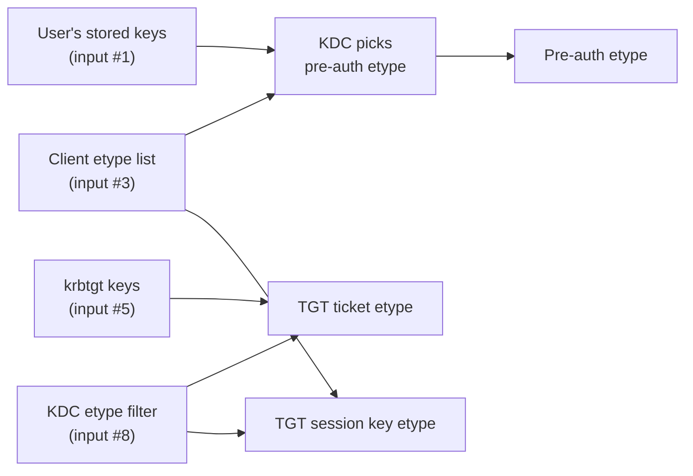
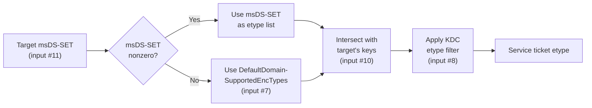
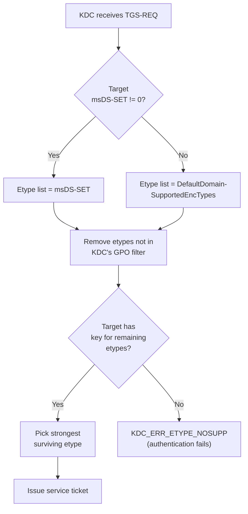

---
---

# How Encryption Types Are Chosen

A single Kerberos ticket involves a dozen inputs spread across AD attributes, registry
keys, GPO settings, and stored keys.  This page maps every input and shows exactly how
they combine at each stage of the authentication process.

If you have already read [Encryption Type Negotiation](etype-negotiation.md), this page
is the companion reference -- less "how the KDC works" and more "where do I look when
something is wrong."

---

## All the Inputs

Every input that can influence which etype appears in a Kerberos ticket:

| # | Input | Where It Lives | What It Does | Who Sets It |
|---|---|---|---|---|
| 1 | **User account keys** | `ntds.dit` (replicated across DCs) | Determines which etypes the user *can* use for pre-auth.  If no AES keys exist, AES pre-auth is impossible. | Generated automatically on password set/reset.  AES keys require DFL >= 2008. |
| 2 | **User `msDS-SupportedEncryptionTypes`** | AD attribute on the user object | Declares which etypes the user account supports.  Affects service tickets *to* this user (if the user is also a user service account).  Does **not** affect the user's own TGT etype. | Admin sets via PowerShell, ADUC, or GPO (for computer accounts). |
| 3 | **Client `SupportedEncryptionTypes`** (registry) | `HKLM\...\Policies\System\Kerberos\Parameters` | Controls what etypes the Kerberos client advertises in AS-REQ and TGS-REQ. | Group Policy. |
| 4 | **Client computer `msDS-SupportedEncryptionTypes`** | AD attribute on the computer account | Auto-updated by the machine's Kerberos subsystem after the GPO writes the registry (input #3).  Used by the KDC when issuing service tickets *to* this computer. | Two-step: GPO writes registry → machine updates its own AD attribute.  Only standard etype bits (0-4) are written; high bits like "Future encryption types" are stripped. |
| 5 | **`krbtgt` account keys** | `ntds.dit` | Determines the TGT ticket encryption etype.  On DFL >= 2008, krbtgt always has AES256 keys, so TGTs are always AES256. | Generated on krbtgt password set.  Rarely changed manually (see [KRBTGT rotation](mitigations.md#priority-9-krbtgt-password-rotation)). |
| 6 | **`krbtgt` `msDS-SupportedEncryptionTypes`** | AD attribute on the krbtgt account | Usually **0** (not set).  When 0, the KDC uses krbtgt's available keys directly.  Setting this is rare and not recommended. | Not typically set. |
| 7 | **DC `DefaultDomainSupportedEncTypes`** | `HKLM\SYSTEM\CurrentControlSet\Services\KDC` | Sets the **assumed** etypes for any account with `msDS-SupportedEncryptionTypes = 0`.  Only consulted during TGS processing.  Per-DC, not replicated. | Manual registry edit or Group Policy Preferences.  **Not set by any GPO.** |
| 8 | **DC `SupportedEncryptionTypes`** (GPO policy cache) | `HKLM\Software\Microsoft\Windows\CurrentVersion\Policies\System\Kerberos\Parameters` | Hard filter: the KDC will not issue tickets with etypes absent from this value.  Also controls the DC's own Kerberos client behavior. | Group Policy (*Configure encryption types allowed for Kerberos*). |
| 9 | **DC computer `msDS-SupportedEncryptionTypes`** | AD attribute on the DC's computer account (e.g., `DC01$`) | Auto-updated by the DC's Kerberos subsystem after the GPO writes the registry (input #8).  Used when issuing service tickets *to* the DC itself (e.g., LDAP, CIFS services on the DC). | Two-step: GPO writes registry → DC updates its own AD attribute.  Verified: GPO = `0x7fffffff` → DC01$ AD attribute = 31 (`0x1F`). |
| 10 | **Target account keys** | `ntds.dit` | The KDC can only encrypt a service ticket with a key that exists.  If the account has no AES keys, AES tickets are impossible regardless of `msDS-SupportedEncryptionTypes`. | Generated on password set/reset.  AES keys require the account's password to have been set at DFL >= 2008. |
| 11 | **Target account `msDS-SupportedEncryptionTypes`** | AD attribute on the target account | **The primary control** for service ticket etype.  When set and nonzero, overrides `DefaultDomainSupportedEncTypes`.  The KDC picks the strongest etype in this bitmask that it also has keys for. | Admin sets via PowerShell, ADUC, or script. |
| 12 | **Target computer `SupportedEncryptionTypes`** (registry) | Same paths as input #3, on the target server | Controls the target server's Kerberos client.  The machine then auto-updates its own computer account's `msDS-SupportedEncryptionTypes` in AD (same two-step as input #4). | Group Policy on the target server → machine updates AD. |
| 13 | **`KdcUseRequestedEtypesForTickets`** | `HKLM\SYSTEM\CurrentControlSet\Services\Kdc` | When set to `1`, the KDC honors the client's etype preference list for **ticket** etype selection instead of picking the strongest.  Default (`0` or not set) = KDC picks strongest.  Only affects the TGT ticket etype in practice (service ticket etype is driven by the target account). | Manual registry edit.  Leave at default in most environments. |

---

## Step 1: Getting a TGT (AS Exchange)

When a user logs in, the client sends an AS-REQ and the KDC returns a TGT.

### Which inputs matter



| Component | Determined by | Notes |
|---|---|---|
| **Pre-authentication etype** | Intersection of the client's etype list (#3) and the user's stored keys (#1).  Strongest common etype wins. | If the user has no AES keys, pre-auth falls back to RC4 regardless of policy. |
| **TGT ticket encryption** | krbtgt's keys (#5) + KDC etype filter (#8). | Always AES256 on DFL >= 2008.  The client never decrypts the TGT. |
| **TGT session key** | Intersection of client's etype list (#3) and KDC's allowed etypes (#8).  Strongest common etype wins. | Post-Nov 2022, defaults to AES256 when the client supports it. |

**Key point**: The user's `msDS-SupportedEncryptionTypes` (#2) does **not** determine TGT
etype.  It determines what keys the user *has* (indirectly, by controlling what gets
generated on password change) and what service tickets *to* that user look like.  Your TGT
is always encrypted with krbtgt's key.

---

## Step 2: Getting a Service Ticket (TGS Exchange)

The client presents its TGT and requests a service ticket for a specific SPN.

### Which inputs matter



| Component | Determined by | Notes |
|---|---|---|
| **Service ticket encryption** | Target account's `msDS-SupportedEncryptionTypes` (#11) -- or `DefaultDomainSupportedEncTypes` (#7) if the attribute is 0 -- intersected with the target's available keys (#10) and the KDC's etype filter (#8).  Strongest surviving etype wins. | **This is the etype that matters for Kerberoasting.**  The client's etype preference is NOT consulted for ticket encryption. |
| **Service ticket session key** | Intersection of client's etype list (#3), target's `msDS-SupportedEncryptionTypes` (#11), and KDC's allowed etypes (#8). | Post-Nov 2022, the AES-SK bit (`0x20`) can force AES session keys even when the ticket itself is RC4. |
| **TGS-REP encrypted part** | Same etype as the TGT session key. | The client decrypts this with its TGT session key. |

**Key point**: The client's etype preference has **no effect** on the service ticket
encryption etype.  A Kerberoasting attacker cannot force RC4 on a properly configured
account by requesting RC4 in their TGS-REQ.

---

## Step 3: Using the Service Ticket (AP Exchange)

The client sends the service ticket to the target service.  The service decrypts the
ticket's `enc-part` with its own long-term key.

The only requirement: the service must possess the key for whatever etype the KDC chose.
If the KDC issued an AES256 ticket, the service needs its AES256 key.  This is normally
automatic -- if the account has AES keys and `msDS-SupportedEncryptionTypes` includes AES,
the KDC and the service will agree.

Problems arise when:

- The KDC picks an etype that the service doesn't have a key for (misconfiguration).
- The service's keytab is stale and doesn't contain the current key.
- A password change generated new keys but the service hasn't restarted to pick them up.

---

## The Precedence Ladder

When the KDC selects the etype for a **service ticket**, it evaluates in this order:

1. **Target account `msDS-SupportedEncryptionTypes`** (input #11) -- if set and nonzero,
   this is the etype list.  Overrides everything below.
2. **DC `DefaultDomainSupportedEncTypes`** (input #7) -- if the target has no
   `msDS-SupportedEncryptionTypes`, the KDC substitutes this value as the assumed etype
   list.
3. **KDC etype filter** (input #8, from GPO) -- hard filter.  The KDC will **not** issue a
   ticket with an etype absent from this list, even if step 1 or 2 selected it.
4. **Available keys on the target account** (input #10) -- the KDC cannot use an etype if
   the key does not exist.  An account with `msDS-SupportedEncryptionTypes = 0x18` but no
   AES keys (password never reset after DFL 2008) will fail, not fall back to RC4.



---

## The AES-SK Split: When Ticket and Session Key Differ

Since the November 2022 update (CVE-2022-37966), the **ticket etype** and **session key
etype** can differ.  This is driven by the AES-SK bit (`0x20`) in
`DefaultDomainSupportedEncTypes`.

### How it works

When the KDC processes a TGS-REQ for an account with `msDS-SupportedEncryptionTypes = 0`
(not set), it substitutes `DefaultDomainSupportedEncTypes`.  The post-November 2022 built-in
default is `0x27`:

| Bit | Value | Meaning |
|---|---|---|
| 0 | `0x01` | DES-CBC-CRC |
| 1 | `0x02` | DES-CBC-MD5 |
| 2 | `0x04` | RC4-HMAC |
| 5 | `0x20` | **AES session key** (the SK flag) |

Note that bits 3 and 4 (AES128, AES256) are **not** set in `0x27`.  This means the KDC uses
RC4 for the **ticket** (because RC4 is the strongest standard etype in the bitmask).  But the
`0x20` bit tells the KDC: "use AES for the **session key** if the client supports it."

The result is a **split etype** ticket:

```
KerbTicket Encryption Type: RSADSI RC4-HMAC(NT)       ← RC4 (from bits 0-4)
Session Key Type:           AES-256-CTS-HMAC-SHA1-96   ← AES (from 0x20 flag)
```

### When AES-SK applies

The AES-SK split only happens when **all three** conditions are met:

1. The target account has `msDS-SupportedEncryptionTypes = 0` (not set), so the KDC falls
   back to `DefaultDomainSupportedEncTypes`.
2. `DefaultDomainSupportedEncTypes` includes the `0x20` (AES-SK) bit (true by default).
3. The **client** advertises AES in its TGS-REQ etype list.

If any condition is missing, the session key matches the ticket etype:

- Account has explicit `msDS-SupportedEncryptionTypes` (even RC4-only) → no AES-SK, because
  `DefaultDomainSupportedEncTypes` is not consulted.
- Client only advertises RC4 → no AES session key, because the KDC cannot negotiate AES with
  a client that does not support it.

### Why it matters

The AES-SK split protects the **live session** (the session key encrypts application data
between client and service) but does **not** protect against Kerberoasting.  The ticket
itself is still RC4, and an attacker cracks the ticket's `enc-part`, not the session key.

AES-SK is a stopgap.  The real fix is setting `msDS-SupportedEncryptionTypes = 0x18` on the
account so the ticket itself uses AES.

---

## Common Mistakes

### 1. "I set AES-only GPO on DCs but services still get RC4 tickets"

The GPO writes `SupportedEncryptionTypes` (the policy cache path), which acts as the KDC's
**etype filter**.  But the KDC first determines what the account wants using
`msDS-SupportedEncryptionTypes` or `DefaultDomainSupportedEncTypes`.

If `DefaultDomainSupportedEncTypes` still includes RC4 (the default `0x27`) and the service
account has no `msDS-SupportedEncryptionTypes`, the KDC thinks the account wants RC4.  The
GPO filter then **blocks** RC4, and the result is an authentication failure -- not an AES
ticket.

**Fix**: Set `DefaultDomainSupportedEncTypes = 0x18` on every DC, *and* set
`msDS-SupportedEncryptionTypes = 0x18` on each SPN-bearing account.

### 2. "I set `msDS-SupportedEncryptionTypes = 0x18` on a service but still see RC4 tickets"

The account's password was never reset after the domain functional level was raised to 2008
(or higher).  The account has no AES keys in `ntds.dit`.  The KDC sees `msDS-SET = 0x18`,
looks for AES keys, finds none, and either falls back to RC4 or fails entirely.

**Fix**: Reset the account's password to generate AES keys.  For accounts that
predate DFL 2008, you may need to reset the password **twice** -- see
[The Double-Reset Problem](algorithms.md#the-double-reset-problem).

### 3. "Why is my TGT always AES256 even when my account only has RC4 configured?"

The TGT ticket etype is determined by **krbtgt's keys**, not your account's
`msDS-SupportedEncryptionTypes`.  Your `msDS-SET` affects service tickets *to* you (if you
are also a user service account), not your own TGT.

On any domain with DFL >= 2008 and a krbtgt password set after AES was introduced, krbtgt
has AES256 keys and the TGT ticket is always AES256.

### 4. "Does the GPO update `msDS-SupportedEncryptionTypes`?"

Yes, but only for the **computer account** of the machine the GPO is applied to.  When
applied to a DC, the DC auto-updates its own computer account (e.g., `DC01$`) in AD.

The GPO does **not** update:

- User accounts
- SPN-bearing accounts (even those running on that machine)
- The `krbtgt` account
- `DefaultDomainSupportedEncTypes` (a completely different registry key)

### 5. "I see `KDC_ERR_ETYPE_NOSUPP` after enabling AES-only on the DC GPO"

The GPO filter now blocks RC4, but the target account either:

- Has `msDS-SupportedEncryptionTypes = 0` and `DefaultDomainSupportedEncTypes` includes
  only RC4 (the KDC's assumed etype list has no overlap with the filter), or
- Has `msDS-SupportedEncryptionTypes = 0x04` (RC4-only, explicitly), or
- Has no AES keys (password never reset).

**Fix**: Work through the [RC4 deprecation checklist](rc4-deprecation.md) to identify every
account that lacks AES keys or explicit AES etype configuration before enforcing AES-only on
DCs.

---

## Putting It All Together

For the step-by-step operational guide to standardizing AES across your domain, see
[Standardization Guide](aes-standardization.md).

---

## Worked Examples

Every example below was validated against a live Windows Server 2022 domain controller
(Build 20348.3207, January 2025 CU) using `kw-roast` and `kw-tgt`.  The test client
advertised **AES256** in TGS-REQ etype lists, matching a standard Windows client.

Lab DC state:

- GPO `SupportedEncryptionTypes` = `0x7fffffff` (all types allowed)
- `DefaultDomainSupportedEncTypes` = **not set** (KDC defaults to `0x27` internally)
- `DC01$` `msDS-SupportedEncryptionTypes` = 31 (`0x1F`)
- `krbtgt` `msDS-SupportedEncryptionTypes` = 0

---

### Example 1: User account, default etype (no `msDS-SET`)

**Target**: `svc_krb_01` -- SPN `HTTP/svc01.evil.corp`, `msDS-SupportedEncryptionTypes` = not set

The KDC sees `msDS-SET = 0` and substitutes `DefaultDomainSupportedEncTypes`.  Since the
registry key is not set, the KDC uses the post-November 2022 built-in default: `0x27`
(DES + RC4 + AES-SK).  The KDC picks the strongest etype in `0x27` that it has keys for.
Despite the AES-SK bit, the **ticket** etype comes from the non-SK bits, and RC4 is the
strongest non-DES non-SK type in `0x27`.

| Component | Etype | Reason |
|---|---|---|
| **Service ticket** | RC4-HMAC (0x17) | Default `0x27` → RC4 is the strongest standard etype in that bitmask |
| **Session key** | AES256 (0x12) | AES-SK bit (`0x20`) in `0x27` + client advertised AES256 → split etype |

**Event 4769 (abridged):**

```text title="Event 4769 — default etype, AES-SK split"
Service Name:                     svc_krb_01
MSDS-SupportedEncryptionTypes:    0x27 (DES, RC4, AES-Sk)
Available Keys:                   AES-SHA1, RC4
Advertized Etypes:                AES256-CTS-HMAC-SHA1-96
Ticket Encryption Type:           0x17
Session Encryption Type:          0x12
```

This is the **AES-SK split** in action.  The ticket is RC4 (because `0x27` does not include
the AES128/AES256 bits), but the session key is AES256 (because `0x27` includes the AES-SK
bit and the client supports AES256).

!!! warning "The account has AES keys but gets an RC4 ticket"
    Note "Available Keys: AES-SHA1, RC4" -- the account *has* AES keys.  But because
    `msDS-SupportedEncryptionTypes` is 0, the KDC falls back to `0x27`, which does not
    include the AES128/AES256 bits (only AES-SK).  **Having AES keys is necessary but not
    sufficient** -- the msDS-SET or DefaultDomainSupportedEncTypes must also include AES.
    The AES session key protects the live session but the RC4 ticket is still crackable.

---

### Example 2: User account, explicit RC4-only

**Target**: `svc_krb_02` -- SPN `HTTP/svc02.evil.corp`, `msDS-SupportedEncryptionTypes` = 4 (`0x04`, RC4 only)

| Component | Etype | Reason |
|---|---|---|
| **Service ticket** | RC4-HMAC (0x17) | msDS-SET = RC4 only, KDC uses RC4 |
| **Session key** | RC4-HMAC (0x17) | msDS-SET = RC4 only; AES-SK does not apply (explicit msDS-SET overrides default) |

**Event 4769:**

```text title="Event 4769 — explicit RC4-only configuration"
Service Name:                     svc_krb_02
MSDS-SupportedEncryptionTypes:    0x4 (RC4)
Available Keys:                   AES-SHA1, RC4
Ticket Encryption Type:           0x17
Session Encryption Type:          0x17
```

Both ticket and session key are RC4.  The account has AES keys ("Available Keys: AES-SHA1,
RC4") but gets RC4 for everything because the explicit `msDS-SupportedEncryptionTypes = 0x4`
overrides `DefaultDomainSupportedEncTypes`.  The AES-SK bit in the default `0x27` is **not**
consulted because the account has an explicit msDS-SET value.

---

### Example 3: User account, AES-only (AES128 + AES256)

**Target**: `svc_krb_03` -- SPN `HTTP/svc03.evil.corp`, `msDS-SupportedEncryptionTypes` = 24 (`0x18`, AES128 + AES256)

| Component | Etype | Reason |
|---|---|---|
| **Service ticket** | AES256 (0x12) | msDS-SET includes AES256; KDC picks strongest |
| **Session key** | AES256 (0x12) | Client advertised AES256; service msDS-SET includes AES256; intersection = AES256 |

**Event 4769:**

```text title="Event 4769 — AES-only configuration, both ticket and session key AES256"
Service Name:                     svc_krb_03
MSDS-SupportedEncryptionTypes:    0x18 (AES128-SHA96, AES256-SHA96)
Available Keys:                   AES-SHA1, RC4
Ticket Encryption Type:           0x12
Session Encryption Type:          0x12
```

Both ticket and session key are AES256.  When the account's `msDS-SupportedEncryptionTypes`
includes AES and the client advertises AES, everything aligns to AES.  No split etype needed.

---

### Example 4: User account, AES256-only

**Target**: `svc_krb_04` -- SPN `HTTP/svc04.evil.corp`, `msDS-SupportedEncryptionTypes` = 16 (`0x10`, AES256 only)

| Component | Etype | Reason |
|---|---|---|
| **Service ticket** | AES256 (0x12) | Only AES256 declared, KDC uses it |
| **Session key** | AES256 (0x12) | Client advertised AES256; service declares AES256; intersection = AES256 |

**Event 4769:**

```text title="Event 4769 — AES256-only configuration"
Service Name:                     svc_krb_04
MSDS-SupportedEncryptionTypes:    0x10 (AES256-SHA96)
Available Keys:                   AES-SHA1, RC4
Ticket Encryption Type:           0x12
Session Encryption Type:          0x12
```

---

### Example 5: User account, AES128-only

**Target**: `svc_krb_05` -- SPN `HTTP/svc05.evil.corp`, `msDS-SupportedEncryptionTypes` = 8 (`0x08`, AES128 only)

| Component | Etype | Reason |
|---|---|---|
| **Service ticket** | AES128 (0x11) | Only AES128 declared |
| **Session key** | AES128 (0x11) | Intersection of client + service; AES128 is the only common AES etype (a Windows client advertising AES256 + AES128 + RC4 would match on AES128) |

This confirms the KDC respects the specific AES variant.  If only AES128 is declared, the
ticket uses AES128 even though the account also has AES256 keys.  The session key also uses
AES128 because that is the strongest etype common to both client and service.

!!! note "Client etype list matters for session key"
    If a client advertises **only** AES256 (and not AES128), the session key for this account
    would fall back to RC4 -- the only remaining common etype.  A standard Windows client
    advertises both AES256 and AES128, so this edge case is rare in practice.

---

### Example 6: User account, RC4 + AES (strongest wins)

**Target**: `svc_krb_06` -- SPN `HTTP/svc06.evil.corp`, `msDS-SupportedEncryptionTypes` = 28 (`0x1C`, RC4 + AES128 + AES256)

| Component | Etype | Reason |
|---|---|---|
| **Service ticket** | AES256 (0x12) | msDS-SET includes AES256; KDC picks strongest |
| **Session key** | AES256 (0x12) | Client advertised AES256; service msDS-SET includes AES256; intersection = AES256 |

**Event 4769:**

```text title="Event 4769 — RC4 + AES configuration, KDC picks strongest etype"
Service Name:                     svc_krb_06
MSDS-SupportedEncryptionTypes:    0x1C (RC4, AES128-SHA96, AES256-SHA96)
Available Keys:                   AES-SHA1, RC4
Ticket Encryption Type:           0x12
Session Encryption Type:          0x12
```

When an account supports both RC4 and AES, the KDC picks the **strongest** etype for the
ticket (AES256), not the weakest.  A Kerberoasting attacker cannot downgrade this to RC4 by
requesting RC4 in their TGS-REQ -- the client's preference does not affect ticket encryption.
The session key is also AES256 because both client and service support it.

---

### Example 7: Computer account, AES-only

**Target**: `LAB-PC-03$` -- SPN `HOST/LAB-PC-03.evil.corp`, `msDS-SupportedEncryptionTypes` = 24 (`0x18`)

| Component | Etype | Reason |
|---|---|---|
| **Service ticket** | AES256 (0x12) | Computer account's msDS-SET = AES only |
| **Session key** | AES256 (0x12) | Client advertised AES256; service msDS-SET includes AES256 |

Computer accounts follow the exact same precedence as user accounts.  The only difference is
that computer accounts typically have their `msDS-SupportedEncryptionTypes` auto-set by GPO,
whereas user service accounts must be configured manually.

---

### Example 8: Computer account, RC4-only

**Target**: `LAB-SRV-03$` -- SPN `HOST/LAB-SRV-03.evil.corp`, `msDS-SupportedEncryptionTypes` = 4 (`0x04`, RC4 only)

| Component | Etype | Reason |
|---|---|---|
| **Service ticket** | RC4-HMAC (0x17) | Computer's msDS-SET declares RC4 only |
| **Session key** | RC4-HMAC (0x17) | msDS-SET = RC4 only; AES-SK does not apply (explicit msDS-SET) |

This simulates a legacy server that has been explicitly configured (or misconfigured) for
RC4.  Even though the computer account has AES keys, the ticket is RC4 because the msDS-SET
restricts to RC4.

**Takeaway**: When the etype GPO is applied to a server, it auto-updates that server's
computer account `msDS-SupportedEncryptionTypes` in AD.  If the GPO includes AES, the
computer account will get AES tickets.  If someone manually overrides the AD attribute
to RC4-only *after* the GPO runs, the manual value wins until the next GPO refresh.

---

### Example 9: Protected Users member with SPN (default etype)

**Target**: `u_prot_03` -- SPN `HTTP/prot03.evil.corp`, `msDS-SupportedEncryptionTypes` = not set, **member of Protected Users**

| Component | Etype | Reason |
|---|---|---|
| **Service ticket** | RC4-HMAC (0x17) | msDS-SET = 0 → falls back to default `0x27` → RC4 |
| **Session key** | AES256 (0x12) | AES-SK bit in `0x27` + client advertised AES256 → split etype |

**Event 4769:**

```text title="Event 4769 — Protected Users member with no msDS-SET (service ticket still RC4)"
Service Name:                     u_prot_03
MSDS-SupportedEncryptionTypes:    0x27 (DES, RC4, AES-Sk)
Available Keys:                   AES-SHA1, RC4
Ticket Encryption Type:           0x17
Session Encryption Type:          0x12
```

!!! warning "Protected Users does NOT protect the service ticket"
    Protected Users group membership affects the **member's own authentication** (AS exchange:
    AES-only pre-auth, 4-hour TGT).  It does **not** affect service tickets issued **for**
    the member's SPN.  A Kerberoasting attacker requesting a ticket for `HTTP/prot03.evil.corp`
    gets an RC4 ticket, regardless of `u_prot_03`'s group membership.

    To protect this account's service tickets, set `msDS-SupportedEncryptionTypes = 0x18`
    on the account itself.

---

### Example 10: User account, RC4-only with SPN (edge case)

**Target**: `u_edge_07` -- SPN `HTTP/edge07.evil.corp`, `msDS-SupportedEncryptionTypes` = 4 (`0x04`, RC4 only)

| Component | Etype | Reason |
|---|---|---|
| **Service ticket** | RC4-HMAC (0x17) | Explicit RC4-only configuration |
| **Session key** | RC4-HMAC (0x17) | msDS-SET = RC4 only; AES-SK does not apply (explicit msDS-SET) |

**Event 4769:**

```text title="Event 4769 — explicit RC4-only, no AES-SK split"
Service Name:                     u_edge_07
MSDS-SupportedEncryptionTypes:    0x4 (RC4)
Available Keys:                   AES-SHA1, RC4
Ticket Encryption Type:           0x17
Session Encryption Type:          0x17
```

---

### Example 11: Default account with MSSQLSvc SPN (common real-world case)

**Target**: `svc_krb_07` -- SPN `MSSQLSvc/sql01.evil.corp:1433`, `msDS-SupportedEncryptionTypes` = not set

This is the most common Kerberoasting scenario in the wild: a SQL Server user service account
created by a DBA, with a password set by a human, and no etype configuration.

| Component | Etype | Reason |
|---|---|---|
| **Service ticket** | RC4-HMAC (0x17) | Default `0x27` → RC4 |
| **Session key** | AES256 (0x12) | AES-SK bit in `0x27` + client advertised AES256 → split etype |

**Event 4769:**

```text title="Event 4769 — MSSQLSvc account with no msDS-SET, common Kerberoasting scenario"
Service Name:                     svc_krb_07
MSDS-SupportedEncryptionTypes:    0x27 (DES, RC4, AES-Sk)
Available Keys:                   AES-SHA1, RC4
Ticket Encryption Type:           0x17
Session Encryption Type:          0x12
```

**Why this is dangerous**: The account has AES keys, the DC supports AES, but nobody set
`msDS-SupportedEncryptionTypes` on the account.  The default `0x27` includes RC4, so
the ticket is RC4 and crackable at full speed.  A simple `Set-ADUser svc_krb_07 -Replace
@{'msDS-SupportedEncryptionTypes' = 24}` would have made this ticket AES256.

---

### Example 12: AES-configured MSSQLSvc account

**Target**: `svc_krb_11` -- SPN `MSSQLSvc/sql02.evil.corp:1433`, `msDS-SupportedEncryptionTypes` = 24 (`0x18`)

| Component | Etype | Reason |
|---|---|---|
| **Service ticket** | AES256 (0x12) | msDS-SET = AES128 + AES256 → strongest wins |
| **Session key** | AES256 (0x12) | Client advertised AES256; service msDS-SET includes AES256 |

The identical service type (MSSQLSvc) but with `msDS-SupportedEncryptionTypes = 0x18`.  The
difference in cracking difficulty is ~800x.

---

### Example 13: TGT etype verification

**Requesting user**: `lmuser`, `msDS-SupportedEncryptionTypes` = not set

| Component | Etype | Reason |
|---|---|---|
| **TGT ticket encryption** | AES256 (0x12) | krbtgt has AES256 keys, DFL >= 2008 |
| **TGT session key** | AES256 (0x12) | Intersection of client + KDC; both support AES256 |

The TGT is **always** AES256 on this domain, regardless of the requesting user's
configuration.  The `krbtgt` account's `msDS-SupportedEncryptionTypes` is 0 (not set), but
the KDC uses krbtgt's actual stored keys (which include AES256).

This is why Mistake #3 above is so common -- people see their TGT is AES256 and assume
they are "AES-only," but service tickets *to* other accounts may still be RC4.

---

### Example 14: GPO → `msDS-SupportedEncryptionTypes` auto-update

**Machine**: DC01 (domain controller)

| Setting | Value |
|---|---|
| GPO `SupportedEncryptionTypes` (registry) | `0x7fffffff` (all types + future) |
| DC01$ `msDS-SupportedEncryptionTypes` (AD) | 31 (`0x1F` = all 5 standard etype bits) |
| `krbtgt` `msDS-SupportedEncryptionTypes` (AD) | 0 (unchanged) |
| `DefaultDomainSupportedEncTypes` (registry) | **not set** |

The GPO value `0x7fffffff` includes the "Future encryption types" checkbox (high bits).
The auto-update stripped the high bits and set only the 5 standard etype bits (0-4) in the
AD attribute: `0x1F = 31 = DES_CRC + DES_MD5 + RC4 + AES128 + AES256`.

The GPO did **not** create or modify `DefaultDomainSupportedEncTypes` -- that key does not
exist in the DC's registry.  The GPO also did not modify `krbtgt`'s attribute (still 0).

---

### Summary Table

| # | Target | Type | `msDS-SET` | Has AES Keys | Ticket Etype | Session Etype | AES-SK Split? |
|---|---|---|---|---|---|---|---|
| 1 | svc_krb_01 | User | (default) | Yes | RC4 (0x17) | AES256 (0x12) | Yes |
| 2 | svc_krb_02 | User | 4 (RC4) | Yes | RC4 (0x17) | RC4 (0x17) | No (explicit msDS-SET) |
| 3 | svc_krb_03 | User | 24 (AES) | Yes | AES256 (0x12) | AES256 (0x12) | N/A (both AES) |
| 4 | svc_krb_04 | User | 16 (AES256) | Yes | AES256 (0x12) | AES256 (0x12) | N/A (both AES) |
| 5 | svc_krb_05 | User | 8 (AES128) | Yes | AES128 (0x11) | AES128 (0x11) | N/A (both AES) |
| 6 | svc_krb_06 | User | 28 (all) | Yes | AES256 (0x12) | AES256 (0x12) | N/A (both AES) |
| 7 | LAB-PC-03$ | Computer | 24 (AES) | Yes | AES256 (0x12) | AES256 (0x12) | N/A (both AES) |
| 8 | LAB-SRV-03$ | Computer | 4 (RC4) | Yes | RC4 (0x17) | RC4 (0x17) | No (explicit msDS-SET) |
| 9 | u_prot_03 | User (PU) | (default) | Yes | RC4 (0x17) | AES256 (0x12) | Yes |
| 10 | u_edge_07 | User | 4 (RC4) | Yes | RC4 (0x17) | RC4 (0x17) | No (explicit msDS-SET) |
| 11 | svc_krb_07 | User | (default) | Yes | RC4 (0x17) | AES256 (0x12) | Yes |
| 12 | svc_krb_11 | User | 24 (AES) | Yes | AES256 (0x12) | AES256 (0x12) | N/A (both AES) |

**Pattern**: The AES-SK split (RC4 ticket + AES session key) occurs **only** for accounts
with no `msDS-SupportedEncryptionTypes` set (examples 1, 9, 11).  Accounts with explicit
`msDS-SupportedEncryptionTypes` -- even RC4-only -- do not benefit from AES-SK because the
KDC does not consult `DefaultDomainSupportedEncTypes` for them.

"Has AES Keys" = Yes for all accounts in this lab because all passwords were set after DFL
was raised to 2008.  In production, accounts with passwords predating the DFL raise may
lack AES keys -- check the "Available Keys" field in Event 4769.
