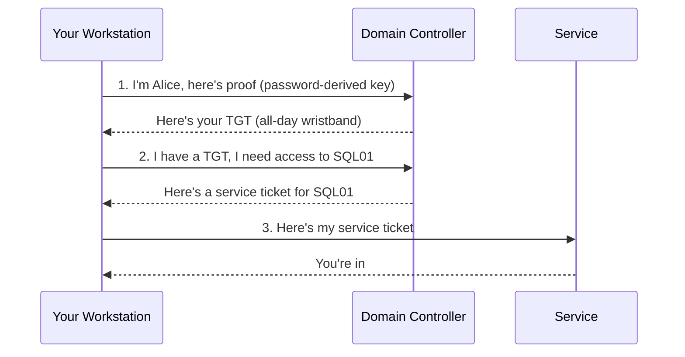
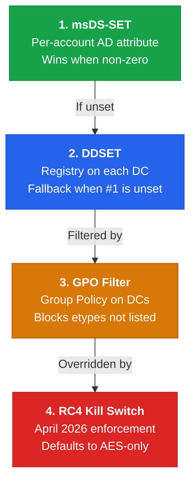
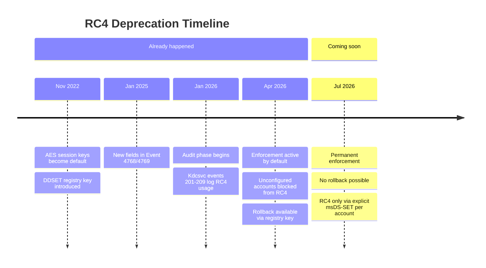
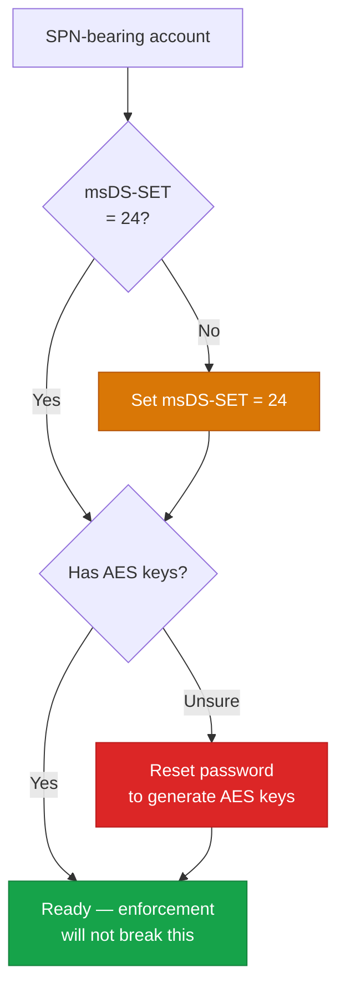

# Kerberos Encryption: The Short Version

This is the 5-minute version. No protocol specs, no packet traces, no 14-step decision guides.
Just the big picture, what's changing, and what you need to do about it.

Need the full deep-dive? Head to the [Security overview](index.md). Already know the deal and just
want the migration playbook? Jump to the [Standardization Guide](aes-standardization.md).

---

!!! tldr "The 30-Second Version"

    - Every Kerberos ticket is encrypted. The encryption type matters.
    - **RC4** has been the default for 25 years. It's weak and it's gone.
    - **AES** is the replacement. Available since Server 2008.
    - **April 2026 already happened.** The switch flipped. Accounts without explicit encryption
      settings are now blocked from RC4 tickets. If your services broke, this is why.
    - **Your move**: set `msDS-SupportedEncryptionTypes = 24` on every SPN-bearing account and
      `DefaultDomainSupportedEncTypes = 24` on every DC. That's 90% of the work.

---

## How Kerberos Authentication Works

You log in. Your workstation talks to the Domain Controller (the KDC) and gets a
**Ticket-Granting Ticket** (TGT). Think of the TGT as an all-day wristband at an amusement
park -- it proves you already showed your ID at the gate.

When you need to access a service (file share, SQL server, web app), your workstation shows the
TGT to the DC and gets a **service ticket** for that specific service. Think of service tickets
as ride tickets -- one per ride, and each one is locked with the service account's encryption key.

The service ticket is encrypted with the service account's key. That's the part that matters for
this page -- because the encryption type determines how hard that ticket is to crack if someone
grabs it off the wire.



!!! info "Why does the encryption type matter?"
    Any authenticated domain user can request a service ticket for any SPN. An attacker grabs
    the ticket and tries to crack it offline. With RC4, that takes hours. With AES, it takes
    centuries. That's the whole game -- see [Kerberoasting](../attacks/roasting/kerberoasting.md)
    for the attack details.

---

## Why RC4 Is a Problem

RC4 has been the implicit default for user service accounts since Windows 2000. Here's why
that's bad:

| | RC4 | AES |
|---|---|---|
| **Key derivation** | MD4 hash of password (one pass, no salt) | PBKDF2 with salt + 4,096 iterations |
| **Key = NTLM hash?** | Yes -- same key, same attack surface | No -- completely separate key |
| **Cracking speed** | ~800x faster than AES | Baseline |
| **Rainbow tables** | Work (no salt) | Don't work (salted per account) |
| **Status** | Deprecated, being removed | Current standard |

The bottom line: if a service account uses RC4 and an attacker grabs its ticket, they can crack
weak passwords in minutes. With AES, even mediocre passwords hold up much longer. Full algorithm
comparison at [Algorithms & Keys](algorithms.md).

---

## The 4 Controls That Decide Encryption

There are exactly four settings that determine which encryption a Kerberos service ticket uses.
They have a strict pecking order -- the one at the top always wins.



1. **msDS-SupportedEncryptionTypes** -- an AD attribute on each SPN-bearing account (service
   accounts, computers, gMSAs). If it's set, the KDC uses it. End of story. Target: `24`
   (`0x18` = AES128 + AES256). [Full reference](msds-supported.md)

2. **DefaultDomainSupportedEncTypes (DDSET)** -- a registry key on each DC. This is the fallback
   for accounts that don't have #1 set. Takes effect immediately, no restart needed. Target: `24`.
   [Full reference](registry.md#defaultdomainsupportedenctypes)

3. **SupportedEncryptionTypes (GPO)** -- a Group Policy setting applied to DCs. Acts as a hard
   filter on top of #1 and #2. If it says "AES only," the KDC won't issue RC4 tickets even if
   the account asks for them. Requires a KDC restart. [Full reference](group-policy.md)

4. **RC4DefaultDisablementPhase** -- enforcement state since April 2026. Absent or set to 2
   means enforcement is active. Set to 0 or 1 for temporary rollback until July 2026.
   Removed entirely in July 2026 (permanent enforcement).
   [Full reference](rc4-deprecation.md#phase-behavior-what-the-registry-setting-actually-does)

!!! warning "The GPO does NOT set DDSET"
    This trips everyone up. The Kerberos GPO and the DefaultDomainSupportedEncTypes registry key
    are two separate things. Setting the GPO does not populate DDSET, and setting DDSET does not
    require a GPO. They work independently. See [Registry Settings](registry.md) for the details.

!!! info "The source client does not control the service ticket etype"
    The KDC picks the service ticket encryption type from the **target account's** msDS-SET,
    not from what the client requested. A modern Windows 11 workstation connecting to a legacy
    service with `msDS-SET = 28` (RC4+AES) will receive an RC4 service ticket and handle it
    without any special configuration on the client side. You only need to configure the DC GPO
    and the target service account.

---

## The RC4 Deprecation Timeline



!!! danger "Enforcement is already active"
    Since April 2026, any SPN-bearing account with `msDS-SupportedEncryptionTypes` blank or 0
    is blocked from RC4 tickets. If those accounts also lack AES keys, authentication fails
    entirely. If your services broke in April 2026, this is the cause.

    Rollback is available until July 2026 — set `RC4DefaultDisablementPhase = 1` on DCs and
    restart the KDC service. After July 2026, rollback is gone.

    Full timeline and event reference at [RC4 Deprecation](rc4-deprecation.md).

---

## What You Need to Do



### Step 1: Find all SPN-bearing accounts

These are the accounts that service tickets get encrypted with. Five types exist: user service
accounts, computer accounts, gMSA, MSA, and dMSA.

```powershell
Get-ADObject -LDAPFilter '(servicePrincipalName=*)' `
  -Properties objectClass, 'msDS-SupportedEncryptionTypes' |
  Select-Object Name, objectClass, 'msDS-SupportedEncryptionTypes'
```

For a grouped summary by account type, see the [full SPN overview query](msds-supported.md).

### Step 2: Check their encryption type settings

Look at the `msDS-SupportedEncryptionTypes` value. You want `24` (AES128 + AES256). Common
values you'll see:

| Value | Meaning | Action needed? |
|-------|---------|----------------|
| `0` or blank | Not set — RC4 **blocked** since April 2026. AES tickets only (if AES keys exist). | **Yes** — set to 24 |
| `4` | RC4 only | **Yes** -- set to 24 |
| `7` | DES + RC4 | **Yes** -- set to 24 |
| `24` (`0x18`) | AES128 + AES256 | No -- you're good |
| `60` (`0x3C`) | RC4 + AES128 + AES256 + AES256-SK | Recommended transitional value |
| `28` (`0x1C`) | RC4 + AES128 + AES256 | Transitional without AES-SK; prefer `0x3C` |

Use the [Encryption Type Calculator](etype-calculator.md) to decode any value you find.

### Step 3: Set msDS-SET = 24 on all SPN-bearing accounts

```powershell
# User service accounts
Get-ADUser -Filter 'servicePrincipalName -like "*"' |
  Set-ADUser -Replace @{'msDS-SupportedEncryptionTypes' = 24}
```

For gMSA, MSA, and dMSA bulk scripts, see the [Standardization Guide](aes-standardization.md).
Computer accounts are handled automatically by GPO -- don't set them manually.

### Step 4: Make sure accounts have AES keys

An account only gets AES keys when its password is set (or reset) at domain functional level 2008
or higher. If the account password hasn't been changed since before that, it only has RC4 keys.
Setting `msDS-SET = 24` on an account without AES keys = authentication failure.

```powershell
# Find accounts with passwords older than AES key availability
$AESdate = (Get-ADGroup -Filter * -Properties SID, WhenCreated |
  Where-Object { $_.SID -like '*-521' }).WhenCreated

Get-ADUser -Filter 'Enabled -eq $true' -Properties passwordLastSet |
  Where-Object { $_.passwordLastSet -lt $AESdate }
```

For definitive key auditing (not just date-based), see
[Auditing Kerberos Keys](account-key-audit.md).

### Step 5: Set DDSET = 24 on every DC

A safety net for any SPN-bearing account you missed or that gets created with `msDS-SET = 0`.
Since April 2026, enforcement already defaults unconfigured accounts to AES-only behavior,
but setting DDSET explicitly ensures consistent behavior across patch levels and makes
auditing easier.

```powershell
# Run on every DC, or push via GPO preferences
Set-ItemProperty -Path 'HKLM:\SYSTEM\CurrentControlSet\Services\KDC' `
  -Name 'DefaultDomainSupportedEncTypes' -Value 24 -Type DWord
```

Takes effect immediately. No restart needed.

### Step 6 (optional): Go further

- **Apply an AES-only GPO** to your DC OU to hard-filter RC4 at the KDC level.
  See [Group Policy](group-policy.md). Requires a KDC restart.
- **Migrate to gMSA** wherever possible. 240-character auto-rotating passwords, impossible to
  crack. See [Mitigations](mitigations.md).
- **Monitor Kdcsvc events 201-209** in the System event log on DCs — these identify accounts
  that are generating RC4 requests and would benefit from remediation.

---

## Common Gotchas

- **Three registry paths, only two work.** There are multiple places in the registry where
  "SupportedEncryptionTypes" appears. Only two of them actually affect ticket issuance. Setting
  the wrong one does nothing. The [Registry Audit](registry-audit.md) page maps which paths are
  functional and which are dead ends.

- **GPO and DDSET are separate things.** The Kerberos GPO creates a *filter* (blocks certain
  etypes). DDSET sets a *default* (what etypes to use when the account doesn't specify). They
  stack independently. Setting one does not set the other.

- **Old accounts might not have AES keys.** If a user service account's password was last set
  before the domain was raised to functional level 2008, the account only has RC4 keys stored
  in AD. Telling the KDC "give me AES" for an account with no AES keys = failure. Reset the
  password first.

- **Computer accounts take care of themselves.** When you apply the Kerberos GPO to computers,
  they auto-update their own `msDS-SupportedEncryptionTypes` in AD. You don't need to manually
  set it on computer accounts.

!!! danger "Never set KdcUseRequestedEtypesForTickets = 1"
    This registry key tells the KDC to ignore the target account's `msDS-SupportedEncryptionTypes`
    and use whatever the *client* asks for instead. It completely defeats per-account AES
    enforcement. An attacker can request RC4 tickets for any account, regardless of its settings.
    See [Registry Settings](registry.md#kdcuserequestedetypesfortickets) for the details.

!!! tip "Emergency rollback (April - July 2026)"
    If enforcement breaks something, you can roll back to audit-only mode until July 2026:
    ```powershell
    Set-ItemProperty -Path 'HKLM:\SOFTWARE\Microsoft\Windows\CurrentVersion\Policies\System\Kerberos\Parameters' `
      -Name 'RC4DefaultDisablementPhase' -Value 1 -Type DWord
    # Restart the KDC service
    Restart-Service KDC
    ```
    After July 2026, this key is removed and rollback is no longer possible.

---

## Quick Reference

| Setting | Where | Target value | Takes effect | Details |
|---------|-------|-------------|--------------|---------|
| msDS-SupportedEncryptionTypes | AD attribute on each SPN account | `24` (`0x18`) | Immediately | [msDS-SET reference](msds-supported.md) |
| DefaultDomainSupportedEncTypes | Registry on each DC (`Services\KDC`) | `24` (`0x18`) | Immediately | [Registry reference](registry.md#defaultdomainsupportedenctypes) |
| SupportedEncryptionTypes (GPO) | Group Policy on DC OU | AES128 + AES256 | After KDC restart | [GPO reference](group-policy.md) |
| RC4DefaultDisablementPhase | Registry on DCs (`Policies\...\Kerberos`) | absent or `2` = enforcement; `1` = rollback to audit; `0` = full rollback | After KDC restart | [RC4 deprecation](rc4-deprecation.md) |

---

## What's Next

- **[AES Standardization Guide](aes-standardization.md)** -- the full operational AES migration
  playbook, step by step
- **[RC4 Deprecation](rc4-deprecation.md)** -- complete timeline, event IDs, and enforcement
  details
- **[Encryption Type Calculator](etype-calculator.md)** -- interactive tool to decode and build
  msDS-SET / DDSET / GPO bitmask values
- **[Event Decoder](event-decoder.md)** -- paste a raw Windows event and get a human-readable
  breakdown
- **[Etype Decision Guide](etype-decision-guide.md)** -- the full 12-input decision logic with
  worked examples (for when you really want to understand *why*)
