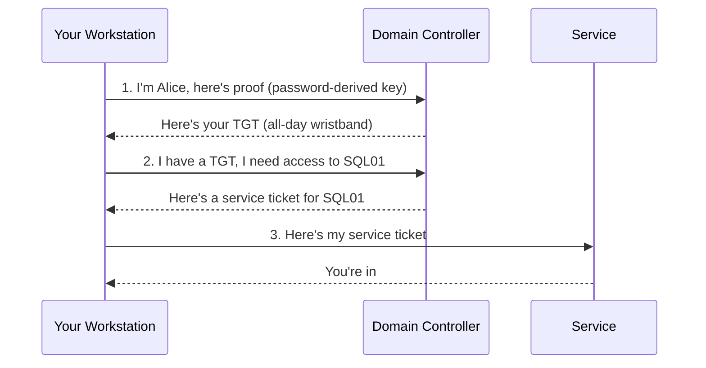
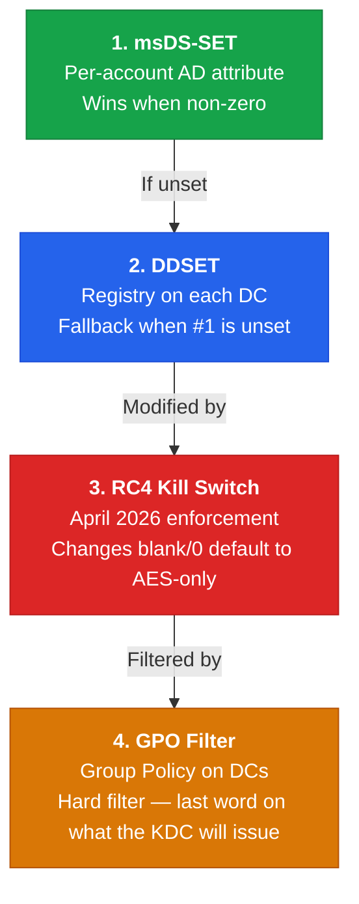
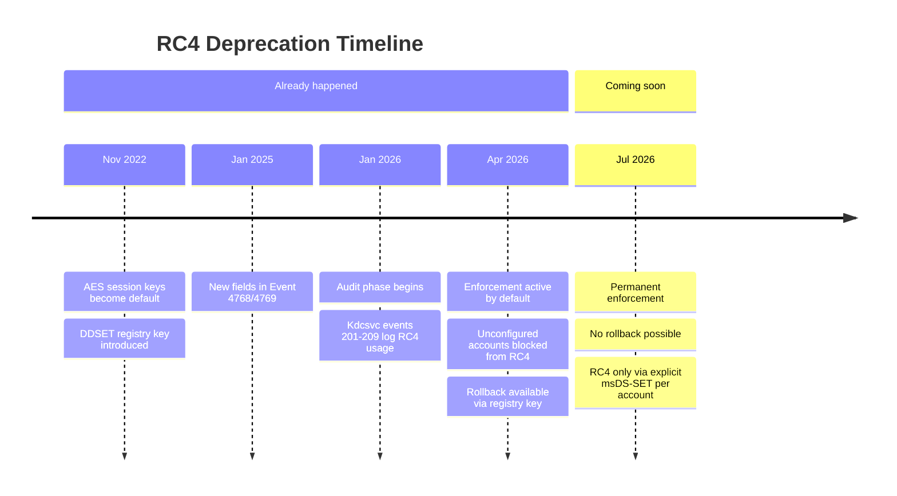

# Kerberos Encryption: The Short Version

This is the 5-minute version. No protocol specs, no packet traces, no 14-step decision guides.
Just the big picture, what's changing, and what you need to do about it.

Need the full deep-dive? Head to the [Security overview](index.md). Already know the deal and just
want the migration playbook? Jump to the [Standardization Guide](aes-standardization.md).

---

!!! tldr "The 30-Second Version"

    - Every Kerberos ticket is encrypted. The encryption type matters.
    - **RC4** has been the default for 25 years. It's weak and it's gone.
    - **AES** is the replacement. Available since Server 2008.
    - **April 2026 already happened.** The switch flipped. Accounts without explicit encryption
      settings are now blocked from RC4 tickets. If your services broke, this is why.
    - **Your move**: set `msDS-SupportedEncryptionTypes = 24` on every SPN-bearing account and
      `DefaultDomainSupportedEncTypes = 24` on every DC. That's 90% of the work.

---

## How Kerberos Authentication Works

You log in. Your workstation talks to the Domain Controller (the KDC) and gets a
**Ticket-Granting Ticket** (TGT). Think of the TGT as an all-day wristband at an amusement
park -- it proves you already showed your ID at the gate.

When you need to access a service (file share, SQL server, web app), your workstation shows the
TGT to the DC and gets a **service ticket** for that specific service. Think of service tickets
as ride tickets -- one per ride, and each one is locked with the service account's encryption key.

The service ticket is encrypted with the service account's key. That's the part that matters for
this page -- because the encryption type determines how hard that ticket is to crack if someone
grabs it off the wire.



!!! info "Why does the encryption type matter?"
    Any authenticated domain user can request a service ticket for any SPN and attempt to crack
    it offline. This works against both RC4 and AES tickets — but the speed difference is
    enormous. RC4 cracks at roughly **800x the speed of AES**. A weak password on an RC4
    account falls in hours. The same password on an AES account can take centuries. See
    [Kerberoasting](../attacks/roasting/kerberoasting.md) for the full attack details.

---

## Why RC4 Is a Problem

RC4 has been the implicit default for user service accounts since Windows 2000. Here's why
that's bad:

| | RC4 | AES |
|---|---|---|
| **Key derivation** | MD4 hash of password (one pass, no salt) | PBKDF2 with salt + 4,096 iterations |
| **Key = NTLM hash?** | Yes -- same key, same attack surface | No -- completely separate key |
| **Cracking speed** | ~800x faster than AES | Baseline |
| **Rainbow tables** | Work (no salt) | Don't work (salted per account) |
| **Status** | Deprecated, being removed | Current standard |

The bottom line: **both RC4 and AES service tickets can be Kerberoasted** — any domain user
can request one and take it offline. The difference is time. With RC4, a weak password falls
in minutes. With AES, even a mediocre password can hold up for years. AES doesn't close the
attack surface, it makes exploitation orders of magnitude harder. Full algorithm comparison at
[Algorithms & Keys](algorithms.md).

---

## The 4 Controls That Decide Encryption

There are exactly four settings that determine which encryption a Kerberos service ticket uses.
They have a strict pecking order -- the one at the top always wins.



1. **msDS-SupportedEncryptionTypes** -- an AD attribute on each SPN-bearing account (service
   accounts, computers, gMSAs). If it's set, the KDC uses it. End of story. Target: `24`
   (`0x18` = AES128 + AES256). [Full reference](msds-supported.md)

2. **DefaultDomainSupportedEncTypes (DDSET)** -- a registry key on each DC. This is the fallback
   for accounts that don't have #1 set. Takes effect immediately, no restart needed. Target: `24`.
   [Full reference](registry.md#defaultdomainsupportedenctypes)

3. **RC4DefaultDisablementPhase** -- enforcement state since April 2026. Absent or set to 2
   means enforcement is active and changes the blank/0 fallback to AES-only. Set to 0 or 1 for
   temporary rollback until July 2026. Removed entirely in July 2026 (permanent enforcement).
   [Full reference](rc4-deprecation.md#phase-behavior-what-the-registry-setting-actually-does)

4. **SupportedEncryptionTypes (GPO)** -- a Group Policy setting applied to DCs. Acts as a hard
   filter that is the final word on what the KDC will issue. If it says "AES only," no RC4
   tickets are issued regardless of what msDS-SET, DDSET, or enforcement says. Requires a KDC
   restart. [Full reference](group-policy.md)

!!! warning "The GPO does NOT set DDSET"
    This trips everyone up. The Kerberos GPO and the DefaultDomainSupportedEncTypes registry key
    are two separate things. Setting the GPO does not populate DDSET, and setting DDSET does not
    require a GPO. They work independently. See [Registry Settings](registry.md) for the details.

!!! info "The source client does not control the service ticket etype"
    The KDC picks the service ticket encryption type from the **target account's** msDS-SET,
    not from what the client requested. A modern Windows 11 workstation connecting to a legacy
    service with `msDS-SET = 28` (RC4+AES) will receive an RC4 service ticket and handle it
    without any special configuration on the client side. You only need to configure the DC GPO
    and the target service account.

---

## The RC4 Deprecation Timeline



!!! danger "Enforcement is already active"
    Since April 2026, any SPN-bearing account with `msDS-SupportedEncryptionTypes` blank or 0
    is blocked from RC4 tickets. If those accounts also lack AES keys, authentication fails
    entirely. If your services broke in April 2026, this is the cause.

    Rollback is available until July 2026 — set `RC4DefaultDisablementPhase = 1` on DCs and
    restart the KDC service. After July 2026, rollback is gone.

    Full timeline and event reference at [RC4 Deprecation](rc4-deprecation.md).

---

## What You Need to Do

### Step 1: Find all SPN-bearing accounts

Service tickets are encrypted with the **target account's** key, so the accounts that hold
SPNs are the ones that matter. Five types can have SPNs: user service accounts, computer
accounts, gMSA, MSA, and dMSA.

```powershell
Get-ADObject -LDAPFilter '(servicePrincipalName=*)' `
  -Properties objectClass, 'msDS-SupportedEncryptionTypes' |
  Select-Object Name, objectClass, 'msDS-SupportedEncryptionTypes'
```

For a grouped summary by account type, see the [full SPN overview query](msds-supported.md).

### Step 2: Check their encryption type settings

Look at `msDS-SupportedEncryptionTypes` for each account. You want `24` (AES128 + AES256).

| Value | Meaning | What happens today |
|-------|---------|-------------------|
| `0` or blank | Not set | Enforcement defaults it to AES-only. If the account has no AES keys, **every connection to that service fails**. |
| `4` | RC4 only | RC4 tickets still issued (explicit config). Kerberoastable at ~800x the speed of AES. |
| `7` | DES + RC4 | Same as above, also includes broken DES. |
| `24` (`0x18`) | AES128 + AES256 | Correct. No action needed. |
| `60` (`0x3C`) | RC4 + AES + AES-SK | Transitional — RC4 still available for this account. |

Use the [Encryption Type Calculator](etype-calculator.md) to decode any value you find.

### Step 3: Verify and reset AES keys

`msDS-SupportedEncryptionTypes` only declares what the account supports — the keys must
actually exist in the database. AES keys are generated when a password is set while the
domain is at functional level 2008 or higher. Old passwords mean RC4-only keys.

**Why this matters:**

- **SPN-bearing account with no AES keys + msDS-SET = 24**: the service is broken. The KDC
  tries to issue an AES ticket, finds no AES key, and returns `KDC_ERR_ETYPE_NOSUPP`.
  Every client connecting to that service gets an error until the password is reset.

- **Regular user or computer account with no AES keys**: what breaks depends on the DC GPO:
    - **DC GPO blocks RC4**: the user cannot log in at all. The KDC cannot issue a TGT
      because it has no key to encrypt the AS-REP. No logon, no access to anything.
    - **DC GPO allows RC4**: the user logs in with an RC4-encrypted TGT. They can still
      reach AES-only services — service ticket encryption is determined by the target
      account's `msDS-SET`, not the user's own keys.

Find accounts with passwords that predate AES key generation:

```powershell
$AESdate = (Get-ADGroup -Filter * -Properties SID, WhenCreated |
  Where-Object { $_.SID -like '*-521' }).WhenCreated

Get-ADUser -Filter 'Enabled -eq $true' -Properties passwordLastSet |
  Where-Object { $_.passwordLastSet -lt $AESdate }
```

Reset the password on any account that shows up here before setting `msDS-SET = 24` on it.
For definitive key auditing, see [Auditing Kerberos Keys](account-key-audit.md).

### Step 4: Set msDS-SET = 24 on all SPN-bearing accounts

**User service accounts, gMSA, MSA** — must be set manually:

```powershell
Get-ADUser -Filter 'servicePrincipalName -like "*"' |
  Set-ADUser -Replace @{'msDS-SupportedEncryptionTypes' = 24}
```

For gMSA, MSA, and dMSA bulk scripts, see the [Standardization Guide](aes-standardization.md#step-3-set-msds-supportedencryptiontypes-on-manually-managed-spn-bearing-accounts).

**Computer accounts** — the Kerberos GPO handles these automatically. When the GPO
(*Network security: Configure encryption types allowed for Kerberos*) is applied to a
machine, the machine writes its own `msDS-SupportedEncryptionTypes` in AD at the next
`gpupdate`. Check for machines that haven't picked it up yet:

```powershell
Get-ADComputer -Filter * -Properties 'msDS-SupportedEncryptionTypes' |
  Where-Object { $_.'msDS-SupportedEncryptionTypes' -eq 0 } |
  Select-Object Name, LastLogonDate | Sort-Object LastLogonDate
```

Accounts still at 0 are typically offline machines, devices outside the GPO scope, or
non-Windows devices (NAS, printers, Linux hosts) — set those manually.

### Step 5: Set DDSET = 24 on every DC

`DefaultDomainSupportedEncTypes` is the fallback for any account whose `msDS-SET` is 0 or
blank. Set it to 24 on every DC so that accounts you missed, or new accounts created without
an explicit value, default to AES rather than whatever the internal default is.

```powershell
# Run on every DC, or push via GPO preferences
Set-ItemProperty -Path 'HKLM:\SYSTEM\CurrentControlSet\Services\KDC' `
  -Name 'DefaultDomainSupportedEncTypes' -Value 24 -Type DWord
```

Takes effect immediately. No restart needed.

### Step 6: Apply an AES-only GPO to the Domain Controllers OU

This is the hard enforcement step, and it is not optional for a secure AES-only environment.

The DC Kerberos GPO acts as a **hard filter at the KDC** — it is the final word on what
ticket types the KDC will issue, overriding msDS-SET, DDSET, and enforcement defaults. An
account configured for RC4 can still receive AES tickets if the DC GPO only allows AES.
Without this GPO, RC4 is still technically possible even if every account is set to 24.

In Group Policy Management, create or edit a GPO linked to the **Domain Controllers** OU:

**Computer Configuration → Policies → Windows Settings → Security Settings → Local
Policies → Security Options → Network security: Configure encryption types allowed for
Kerberos**

```
[ ] DES_CBC_CRC
[ ] DES_CBC_MD5
[ ] RC4_HMAC_MD5
[x] AES128_HMAC_SHA1
[x] AES256_HMAC_SHA1
[x] Future encryption types
```

Then restart the KDC service on every DC — the GPO filter is only read at service start:

```powershell
Restart-Service kdc
```

!!! warning "Do this last, and verify Steps 1-5 first"
    Applying an AES-only filter to DCs with accounts that still lack AES keys or still
    have `msDS-SET = 4` will break those services. Complete Steps 1-5 and confirm no
    Kdcsvc Event 203/208 errors before enabling this GPO.

See [Group Policy](group-policy.md) for the full reference including the RC4+AES variant
needed if any legacy accounts still require RC4.

---

## Enabling RC4 for Specific Accounts

After completing the steps above — or after July 2026 when rollback is gone — you may have
a legacy service that cannot be upgraded to AES yet. You can keep RC4 for individual
accounts without rolling back the whole domain.

**Both of these must be true for RC4 to work on a specific account:**

1. The target service account must include RC4 in its `msDS-SupportedEncryptionTypes`
2. The DC GPO must allow RC4 — if it's AES-only, no RC4 tickets are issued regardless of the account setting

**Set the account** (use 60/0x3C to keep AES as the preferred etype with RC4 as fallback):

```powershell
# User service account
Set-ADUser -Identity svc_legacy -Replace @{ 'msDS-SupportedEncryptionTypes' = 60 }

# Computer account — apply an RC4+AES GPO to the machine's OU instead of setting manually
```

**Update the DC GPO** to allow RC4 alongside AES:

```
[ ] DES_CBC_CRC
[ ] DES_CBC_MD5
[x] RC4_HMAC_MD5
[x] AES128_HMAC_SHA1
[x] AES256_HMAC_SHA1
[x] Future encryption types
```

Then restart the KDC on every DC.

**The client needs no changes.** The KDC picks the service ticket etype from the target
account — a modern Windows 11 client will receive and use an RC4 service ticket for a
legacy service without any local configuration.

!!! warning "All SPN accounts are Kerberoastable — RC4 just makes it trivial"
    Any domain user can request a service ticket for any SPN and attempt to crack it offline.
    With AES, that takes centuries on current hardware. With RC4, it takes hours. An account
    with RC4 in `msDS-SupportedEncryptionTypes` and a weak or guessable password is an open
    door. Use a 30+ character random password (or better, migrate to gMSA), treat any RC4
    exception as temporary, and set a review date. See [Mitigations](mitigations.md).

---

## Common Gotchas

- **Three registry paths, only two work.** There are multiple places in the registry where
  "SupportedEncryptionTypes" appears. Only two of them actually affect ticket issuance. Setting
  the wrong one does nothing. The [Registry Audit](registry-audit.md) page maps which paths are
  functional and which are dead ends.

- **GPO and DDSET are separate things.** The Kerberos GPO creates a *filter* (blocks certain
  etypes). DDSET sets a *default* (what etypes to use when the account doesn't specify). They
  stack independently. Setting one does not set the other.

- **Old accounts might not have AES keys.** If a user service account's password was last set
  before the domain was raised to functional level 2008, the account only has RC4 keys stored
  in AD. Telling the KDC "give me AES" for an account with no AES keys = failure. Reset the
  password first.

- **Computer accounts take care of themselves.** When you apply the Kerberos GPO to computers,
  they auto-update their own `msDS-SupportedEncryptionTypes` in AD. You don't need to manually
  set it on computer accounts.

!!! danger "Never set KdcUseRequestedEtypesForTickets = 1"
    This registry key tells the KDC to ignore the target account's `msDS-SupportedEncryptionTypes`
    and use whatever the *client* asks for instead. It completely defeats per-account AES
    enforcement. An attacker can request RC4 tickets for any account, regardless of its settings.
    See [Registry Settings](registry.md#kdcuserequestedetypesfortickets) for the details.

!!! tip "Emergency rollback (April - July 2026)"
    If enforcement breaks something, you can roll back to audit-only mode until July 2026:
    ```powershell
    Set-ItemProperty -Path 'HKLM:\SOFTWARE\Microsoft\Windows\CurrentVersion\Policies\System\Kerberos\Parameters' `
      -Name 'RC4DefaultDisablementPhase' -Value 1 -Type DWord
    # Restart the KDC service
    Restart-Service KDC
    ```
    After July 2026, this key is removed and rollback is no longer possible.

---

## Quick Reference

| Setting | Where | Target value | Takes effect | Details |
|---------|-------|-------------|--------------|---------|
| msDS-SupportedEncryptionTypes | AD attribute on each SPN account | `24` (`0x18`) | Immediately | [msDS-SET reference](msds-supported.md) |
| DefaultDomainSupportedEncTypes | Registry on each DC (`Services\KDC`) | `24` (`0x18`) | Immediately | [Registry reference](registry.md#defaultdomainsupportedenctypes) |
| SupportedEncryptionTypes (GPO) | Group Policy on DC OU | AES128 + AES256 | After KDC restart | [GPO reference](group-policy.md) |
| RC4DefaultDisablementPhase | Registry on DCs (`Policies\...\Kerberos`) | absent or `2` = enforcement; `1` = rollback to audit; `0` = full rollback | After KDC restart | [RC4 deprecation](rc4-deprecation.md) |

---

## What's Next

- **[AES Standardization Guide](aes-standardization.md)** -- the full operational AES migration
  playbook, step by step
- **[RC4 Deprecation](rc4-deprecation.md)** -- complete timeline, event IDs, and enforcement
  details
- **[Encryption Type Calculator](etype-calculator.md)** -- interactive tool to decode and build
  msDS-SET / DDSET / GPO bitmask values
- **[Event Decoder](event-decoder.md)** -- paste a raw Windows event and get a human-readable
  breakdown
- **[Etype Decision Guide](etype-decision-guide.md)** -- the full 12-input decision logic with
  worked examples (for when you really want to understand *why*)
